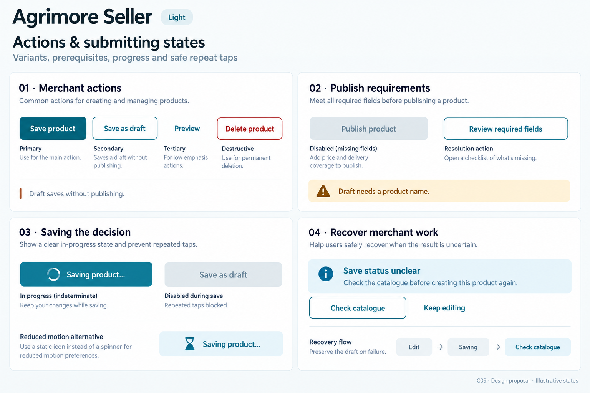
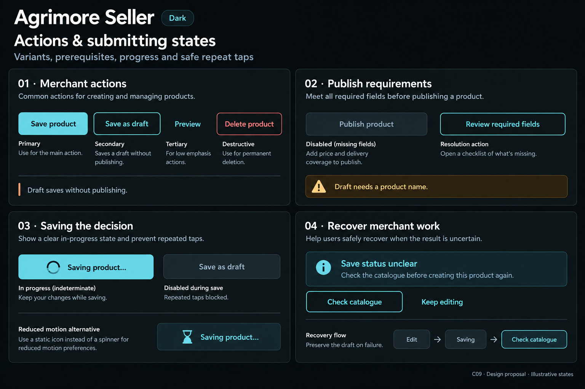

# Agrimore Seller — C09 actions and submitting states

**PROVISIONAL_DIRECTION / TARGET_IMPLEMENTATION · v1 · 2026-10-03.** C01 identity remains approved and locked. These static boards illustrate a target, not migrated application widgets.

Identity: Blue-teal with warm copper and cool neutral support.

| Theme | Board |
| --- | --- |
| Light | [Open light](agrimore-seller-actions-submitting-states-light.png) |
| Dark | [Open dark](agrimore-seller-actions-submitting-states-dark.png) |

[Exact prompts](prompts.md) · [Manifest](manifest.json) · [All five apps](../../../../../docs/design-system/ACTIONS_SUBMITTING_STATES_BOARDS_2026-10-03.md) · [Domain mapping](../../../../../docs/design-system/ACTIONS_SUBMITTING_STATES_DOMAIN_MAP_2026-10-03.md) · [C01 approval](../../../../../docs/design-system/COLOR_ROLES_THEME_IDENTITY_LOCK_2026-10-02.md).

## Current implementation

SellerButton has primary, secondary, tertiary, tonal, danger and dangerOutline variants, wraps labels, disables on loading and uses SellerSpinner. Product editor differentiates a name-only draft from full publish validation, disables both footer actions while saving and keeps error summaries. Product _saveProduct and order-detail _run do not have an early busy-return guard at entry. Seller order changes call sellerTransitionOrder; provider maps unpaid/already-moved/generic failures. Product creation uses Firestore auto-ID add followed by center mapping and list reload; a later failure does not prove the create was never committed.

## Target direction

Make merchant draft, publish/update and fulfilment commitments distinct. Keep invalid publishing available for validation when appropriate; any disabled gate needs an explanation. Add controller-level reentry protection in future implementation, beyond the widget callback gate, and reconcile an uncertain create before retry.

| Panel | Specimen intent |
| --- | --- |
| 01 · Merchant actions | Annotated variants: PRIMARY filled blue-teal 'Save product'; SECONDARY outline 'Save as draft'; TERTIARY text 'Preview'; DESTRUCTIVE outlined Error-colored 'Delete product'. Small caption 'Draft saves without publishing'. Copper used only in a small accent rule. |
| 02 · Publish requirements | Disabled neutral 'Publish product' SPECIMEN for a missing-field policy; helper 'Add price and delivery coverage to publish.' Enabled outline 'Review required fields'. Separate small note 'Draft needs a product name'. Do not show publishing as already completed. |
| 03 · Saving the decision | Filled primary button with spinner and exact label 'Saving product…'; adjacent secondary 'Save as draft' disabled neutral. Helper 'Keep your changes while saving.' Separate annotation 'Repeated taps blocked'. Tiny reduced-motion alternative with static hourglass and the same busy label. |
| 04 · Recover merchant work | Information callout 'Save status unclear'; body 'Check the catalogue before creating this product again.' Outline 'Check catalogue'; text action 'Keep editing'. Small flow 'Edit → Saving → Check catalogue'; caption 'Preserve the draft on failure'. No invented saved/published badge or success count. |

Source gaps and preservation rules:

- Retain SellerButton wrapping, loadingLabel, semanticLabel and reduced-motion spinner behavior.
- The publishing-disabled example is a target policy specimen: current editor performs full validation on tap; do not globally disable invalid forms and make errors undiscoverable.
- Add handler-level synchronous reentry guards and reliable cleanup, especially around confirmation sheets; a disabled widget is not a server duplicate guarantee.
- Saving a draft versus publishing has different prerequisites; do not require the full publication form for drafts.
- Unknown product-create results require reconciliation; server order-state enforcement is not universal product-create idempotency.

Keep one primary commitment per decision. Every disabled state has readable adjacent reasoning and a reachable resolution. Busy actions retain a meaningful label, block callbacks and need an early handler guard; this is separate from server replay protection. Reconcile unknown outcomes before a new commitment, preserve user inputs and reuse logical request identity where supported. Minimum 48px hit regions and growing label height are proposed. Reduced motion uses a static progress symbol with the same label. Actual accessibility, keyboard/input methods, rapid tapping, retry and process-death recovery require later runtime verification.

## Light

## Dark

