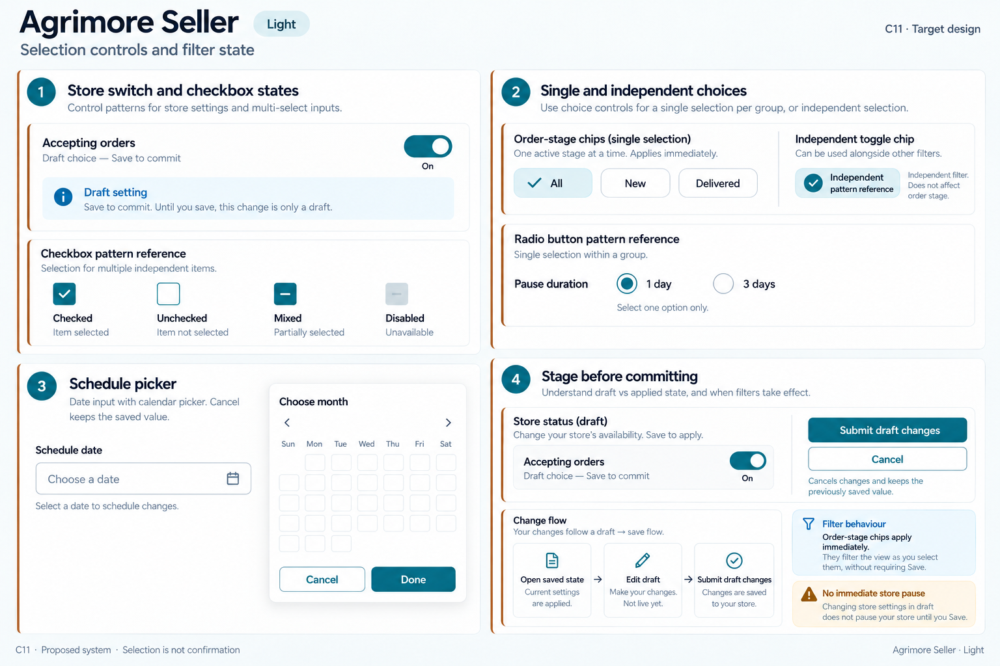
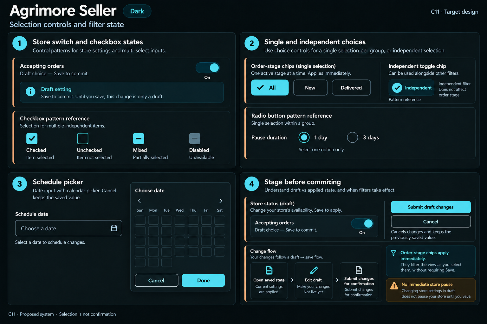

# Agrimore Seller — C11 selection controls and filter state

**PROVISIONAL_DIRECTION / TARGET_IMPLEMENTATION · v1 · 2026-10-03.** C01 remains approved and locked.

Compact blue-teal operational controls with copper section guidance and clear store-status commitments.

[All ten boards](../../../../../docs/design-system/SELECTION_CONTROLS_FILTER_STATE_BOARDS_2026-10-03.md) · [Domain map](../../../../../docs/design-system/SELECTION_CONTROLS_FILTER_STATE_DOMAIN_MAP_2026-10-03.md) · [Exact prompts](prompts.md) · [Manifest](manifest.json).

## Current source

SellerChip distinguishes filled single-choice tabs from checked independent toggles, includes selected semantics and 48dp outer hit area. SellerSwitchRow provides toggled semantics and shared focus tracking. StoreStatusSheet stages accepting-orders and pause duration, returning a new value only on Save/Pause; schedule screens open date/time pickers.

## Proposed direction

Reuse the seller controls, keep staged store availability distinct from immediate filter chips, make mixed/disabled checkbox atoms consistent, and keep picker cancellation and commit explicit.

| Panel | Intent |
| --- | --- |
| Store switch and checkbox states | Accepting orders switch ON and helper Draft setting — Save to commit. Checkbox atom strip marked Pattern reference: Checked, Unchecked, Mixed with dash, Disabled with helper Unavailable. No claim of bulk-product feature. |
| Single and independent choices | Order-stage chips All selected, New unselected, Delivered unselected; one active stage. Separate independent toggle chip B2B with check, no fabricated counts. Radio atom group Pause duration: 1 day selected, 3 days unselected; these are separate pattern specimens. |
| Schedule picker | Field Schedule date, empty hint Choose a date, calendar icon; compact popup picker-style surface with Choose date heading and Cancel / Done. No invented selected dates or opening times. Caption Cancel keeps the saved value. |
| Stage before committing | Store-status draft panel Accepting orders ON. Primary Save, secondary Cancel. Diagram Open saved state → Edit draft → Save. Separate small filter note Order-stage chips apply immediately. Explicit no immediate store pause on draft change. |

Preservation and gaps:

- Chip remove controls need a separately reachable labeled target; outer excludeSemantics and constrained remove size need runtime review.
- Preserve staged store status: toggling the draft switch does not immediately pause the server.
- Generic checkbox atoms are pattern proposals, not a new bulk-product feature. Preserve finite single-choice groups.

## Light

## Dark

