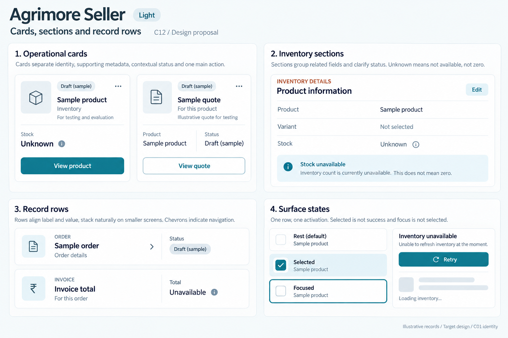
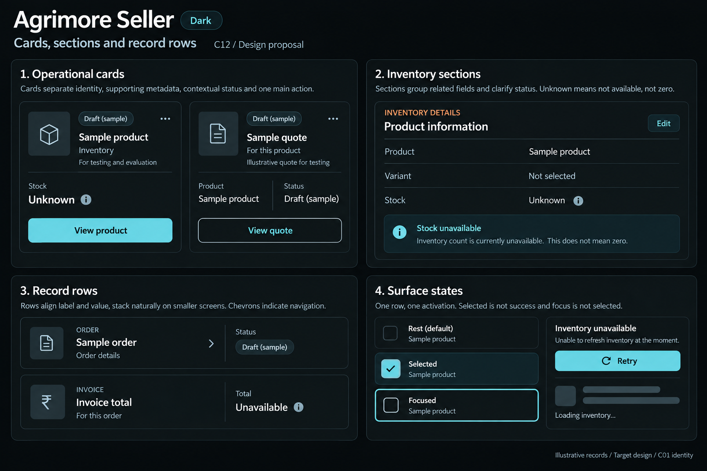

# Agrimore Seller — C12 cards, sections and record rows

**PROVISIONAL_DIRECTION / TARGET_IMPLEMENTATION · v1 · 2026-10-03.** C01 is approved and locked; C12 owner approval is pending.

Compact blue-teal operational cards, copper section cues, cool neutral grouped rows and precise inventory hierarchy.

[Ten-board gallery](../../../../../docs/design-system/CARDS_SECTIONS_RECORD_ROWS_BOARDS_2026-10-03.md) · [Codebase/domain map](../../../../../docs/design-system/CARDS_SECTIONS_RECORD_ROWS_DOMAIN_MAP_2026-10-03.md) · [Exact prompts](prompts.md) · [Manifest](manifest.json).

## Current source

SellerCard supplies tones, selected/focused outlines, optional interaction and semantics. SellerListRow, SellerMenuGroup and SellerKeyValueRow already provide reusable grouped and record layouts; list values stack at large text. These are reuse anchors rather than reasons to duplicate components.

## Target direction

Compose stock/product/order/RFQ summaries from existing Seller surfaces. Give each record a stable identity, status and one primary detail path; group key/value rows and keep unknown stock distinct from zero.

| Panel | Domain specimen |
| --- | --- |
| Operational cards | Structured Sample product card with box outline icon, Inventory subtitle, neutral Draft (sample) chip, Stock / Unknown, View product action. Beside it a small Sample quote summary marked Draft (sample), no money or approval claims. |
| Inventory sections | Copper eyebrow INVENTORY DETAILS; grouped label/value rows Product / Sample product, Variant / Not selected, Stock / Unknown. Comfortable blue-teal section title and hairline separators. Explain Unknown is not zero. |
| Record rows | Navigable Sample order row with Order details subtitle and chevron; adjacent static Invoice total / Unavailable row with no chevron. Narrow/large-text rendition puts long value below label. |
| Surface states | Small Rest, Selected, Focused specimens clearly distinct; Selected has check and tinted fill, Focused has 2px focus outline without a check. Separate scoped Inventory unavailable with Retry and loading skeleton. Note One row, one activation. |

Preservation and gaps:

- Retain existing independent selection/focus semantics and large-text stacking.
- Stock values must use validated domain data; do not turn malformed or missing stock into zero.
- An invoice or quote summary is distinct from payment confirmation.

## Light

## Dark

