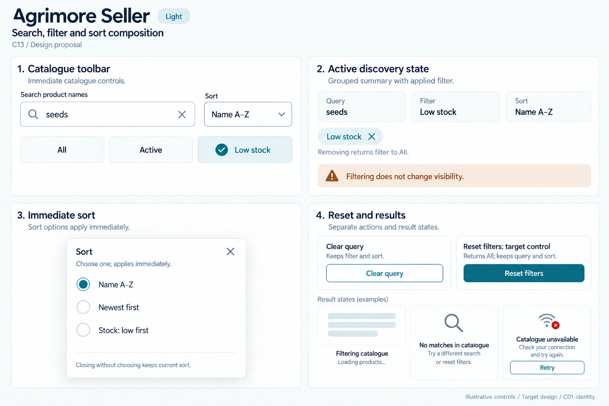
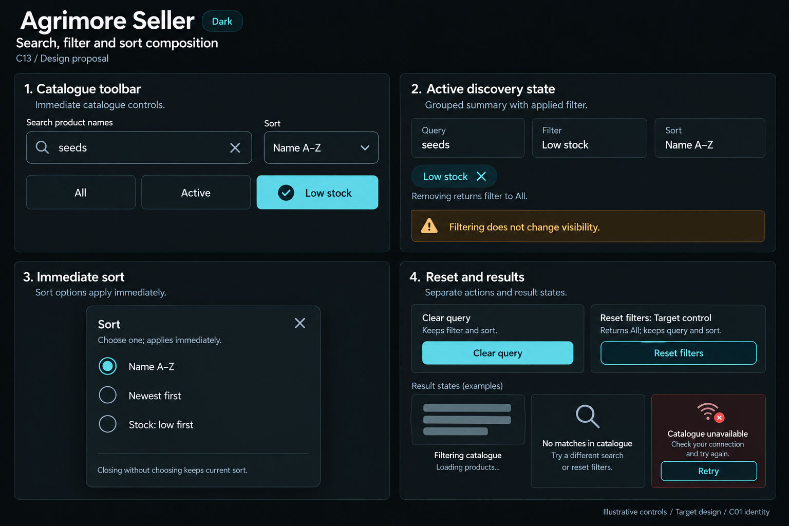

# Agrimore Seller — C13 search, filter and sort composition

**PROVISIONAL_DIRECTION / TARGET_IMPLEMENTATION · v1 · 2026-10-03.** C01 is approved and locked; C13 owner approval is pending.

Compact blue-teal catalogue discovery with copper guidance, cool-neutral inline state and operational sort controls.

[Ten-board gallery](../../../../../docs/design-system/SEARCH_FILTER_SORT_COMPOSITION_BOARDS_2026-10-03.md) · [Codebase/domain map](../../../../../docs/design-system/SEARCH_FILTER_SORT_COMPOSITION_DOMAIN_MAP_2026-10-03.md) · [Exact prompts](prompts.md) · [Manifest](manifest.json).

## Current source

SellerSearchField clears text through its callback and preserves other controls. SellerProductProvider immediately combines name query, exactly one ProductListFilter and ProductSort. ProductFilterBar exposes All/Active/Draft/Low stock/Out of stock/Inactive and counts scoped to allProducts, independently of text search; sort menu applies one choice when selected.

## Target direction

Keep immediate catalogue behavior, visibly compose name query, single status tab and sort. Add explicit filter-reset scope and active-state summaries as provisional enhancements; filter selection does not publish/hide records.

| Panel | Domain specimen |
| --- | --- |
| Catalogue toolbar | Compact Search product names field entered seeds with clear X, Sort: Name A–Z outlined control. Caption Immediate catalogue controls. Beneath single-choice tabs All unselected, Active unselected, Low stock selected with a check. No counts. |
| Active discovery state | Grouped summary Query / seeds; Filter / Low stock; Sort / Name A–Z. Removable applied chip Low stock with X; helper Removing returns filter to All. Copper note Filtering does not change visibility. No publish/hide action. |
| Immediate sort | Sort mini sheet single-choice radios Name A–Z selected, Newest first unselected, Stock: low first unselected. Helper Choose one; applies immediately. Small note Closing without choosing keeps current sort. No Apply button. |
| Reset and results | Two clearly separated actions Clear query with helper Keeps filter and sort; Reset filters with helper Returns All; keeps query and sort. Small state examples Filtering catalogue neutral skeleton; No matches in catalogue; Catalogue unavailable with Retry. Label Reset filters as Target control. No stock amounts or percentages. |

Preservation and gaps:

- Counts from countFor are filter-population counts without text-query composition; label scope if retained, never invent counts on boards.
- Target Reset filters returns All while keeping search and sort; no dedicated reset control is verified in the current catalogue.
- ProductSort ties use newest timestamp without an explicit stable-ID tiebreak; stable tie ordering is a future verification item.
- Sort comparator uses product stock fields; unknown raw stock presentation and domain parsing remain separate implementation concerns.

## Light

## Dark

