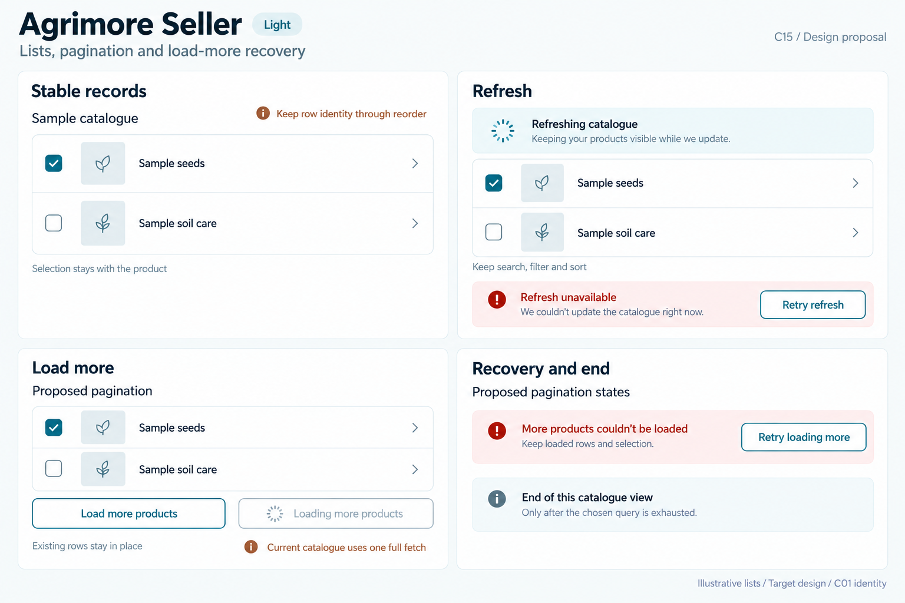
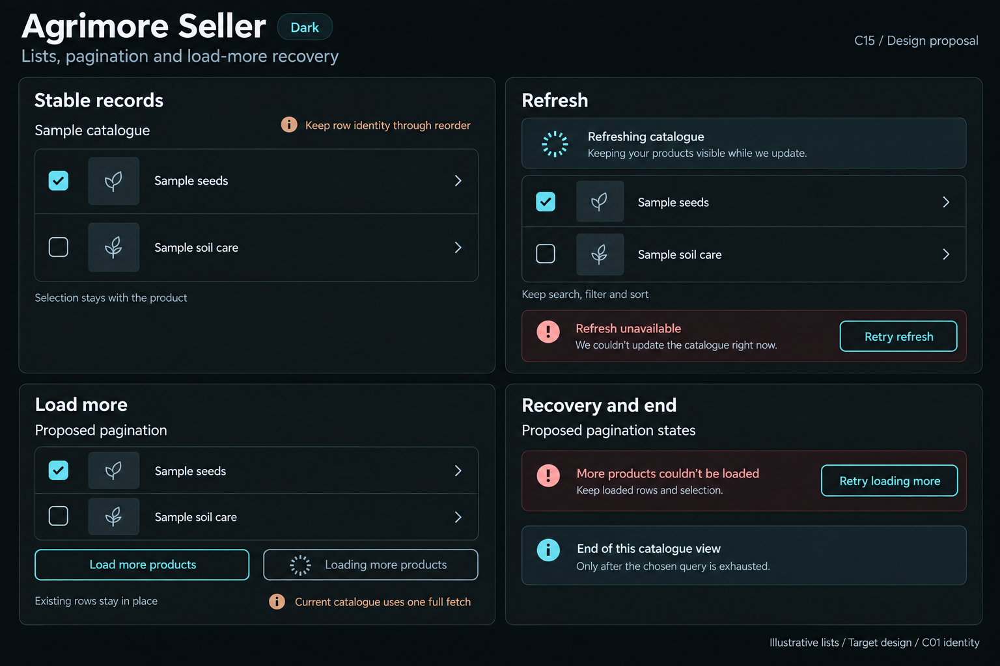

# Agrimore Seller — C15 lists, pagination and load-more recovery

**PROVISIONAL_DIRECTION / TARGET_IMPLEMENTATION · v1 · 2026-10-03.** C01 is approved and locked; C15 owner approval is pending.

Compact blue-teal catalogue rows, copper operational guidance and cool-neutral selection surfaces; current full-fetch behavior is distinguished from a proposed bounded catalogue.

[Ten-board gallery](../../../../../docs/design-system/LISTS_PAGINATION_LOAD_MORE_RECOVERY_BOARDS_2026-10-03.md) · [Codebase/domain map](../../../../../docs/design-system/LISTS_PAGINATION_LOAD_MORE_RECOVERY_DOMAIN_MAP_2026-10-03.md) · [Exact prompts](prompts.md) · [Manifest](manifest.json).

## Current source

SellerProductProvider fetches the seller’s product collection in one get, then applies local search/filter/sort. There is no catalogue cursor, hasMore or loadMore in the inspected provider/screen. SellerProductsScreen uses RefreshIndicator with existing rows when data remains, selected records are tracked in a Set of product IDs, and _ProductCard is built without an explicit per-record widget key. Refresh errors with retained products are not surfaced by the empty-data error branch.

## Target direction

Preserve stable identity/selection and add retained-row refresh failure feedback. Illustrate a clearly labelled proposed pagination footer without claiming a current backend or cursor implementation. Any future bounded query must deliberately preserve search/filter/sort semantics and population counts.

| Panel | Domain specimen |
| --- | --- |
| Stable records | Compact catalogue list labelled "Sample catalogue". Rows "Sample seeds" and "Sample soil care", neutral thumbnail blocks and square selection boxes; first row checked. Helper "Selection stays with the product". Copper annotation "Keep row identity through reorder". No selection count, stock or prices. |
| Refresh | Existing compact sample rows stay visible under a small "Refreshing catalogue" strip. Spinner plus text, no completion percent. Helper "Keep search, filter and sort". Separate thin failed-refresh example "Refresh unavailable" with OUTLINED "Retry refresh". No mutation buttons. |
| Load more | Make the panel explicitly labelled "Proposed pagination" at the top of the specimen. OUTLINED blue-teal action "Load more products", and a separate disabled outlined pending variant "Loading more products" with spinner. Copper annotation outside the UI specimen "Current catalogue uses one full fetch". Helper "Existing rows stay in place". Never imply this cursor backend is implemented. |
| Recovery and end | Explicit small "Proposed pagination states" caption. Separate page-failure block "More products couldn’t be loaded", helper "Keep loaded rows and selection", OUTLINED "Retry loading more". Separate end example "End of this catalogue view" with note "Only after the chosen query is exhausted". No fabricated counts, stock or product visibility changes. |

Preservation and gaps:

- Proposed pagination cannot simply page the current collection then pretend local filter/no-match/countFor describes the entire catalogue.
- Resolve server versus loaded-scope query/filter/sort strategy before adopting the illustrated Load more products control.
- Selection remains tied to product IDs across append/refresh; only confirmed deletion or access loss invalidates it, never an off-page absence alone.
- Refresh failure with existing rows needs inline recovery; do not retry create/update/delete mutations from a list footer.
- Stable row keys, deterministic tie handling, bounded fetch and request lifecycle guards are future work; no runtime component introduced here.

## Light

## Dark

