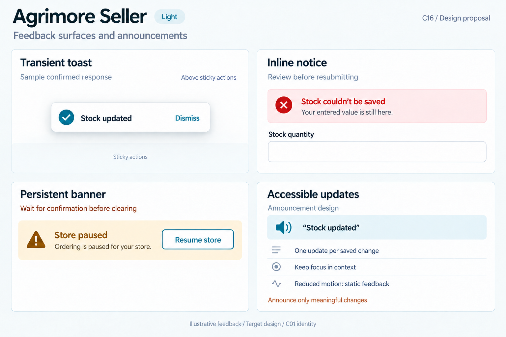
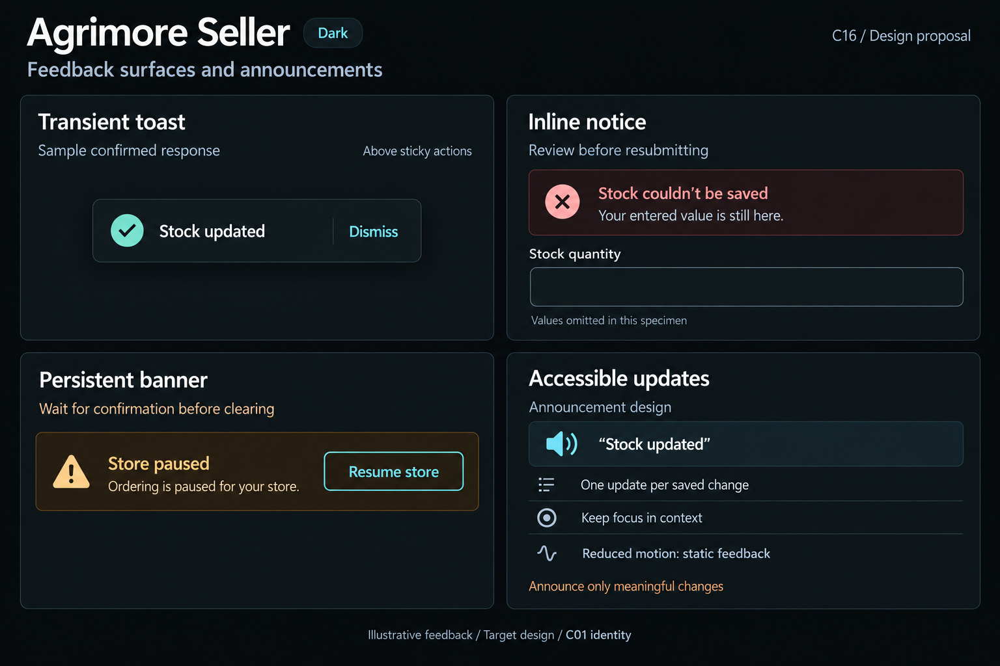

# Agrimore Seller — C16 feedback surfaces and announcements

**PROVISIONAL_DIRECTION / TARGET_IMPLEMENTATION · v1 · 2026-10-03.** C01 is approved and locked; C16 owner approval is pending.

Blue-teal operational feedback, copper guidance, compact cool-neutral surfaces and footer-aware floating toasts.

[Ten-board gallery](../../../../../docs/design-system/FEEDBACK_SURFACES_ANNOUNCEMENTS_BOARDS_2026-10-03.md) · [Codebase/domain map](../../../../../docs/design-system/FEEDBACK_SURFACES_ANNOUNCEMENTS_DOMAIN_MAP_2026-10-03.md) · [Exact prompts](prompts.md) · [Manifest](manifest.json).

## Current source

SellerToast replaces the current snackbar, offsets above SellerStickyFooter, provides close/action affordances, explicit liveRegion, excluded decorative icon and noAnimation for reduced motion. SellerBanner supports optional announce and dismiss callbacks. Stock success appears only when saved==true and the same user remains active. The stock sheet already includes a local error banner. Profile shows a paused-store warning banner wired to _resume.

## Target direction

Reuse existing toast/banner primitives with C01 tokens; keep stock errors in the sheet and the paused-store condition persistent. Resume is a deliberate existing mutation with pending guard and confirmed outcome, not a toast dismissal. Coalesce announcements per action/entity revision.

| Panel | Domain specimen |
| --- | --- |
| Transient toast | Floating blue-teal neutral-surface toast "Stock updated" with success icon and labelled "Dismiss" secondary text control. Caption "Sample confirmed response". Small note "Above sticky actions". Do not show stock numbers or Undo. |
| Inline notice | Stock-sheet notice with error icon, heading "Stock couldn’t be saved", body "Your entered value is still here." Nearby empty field labelled "Stock quantity". Small note "Review before resubmitting". No automatic Retry mutation or cleared input. |
| Persistent banner | Warning banner "Store paused", body "Ordering is paused for your store." OUTLINED blue-teal action "Resume store". Copper board note "Wait for confirmation before clearing". No fake countdown, end date or dismiss X. |
| Accessible updates | Explicit "Announcement design" area. Quoted sample "Stock updated" with small speaker icon. Rule rows "One update per saved change", "Keep focus in context", "Reduced motion: static feedback". Copper annotation "Announce only meaningful changes". |

Preservation and gaps:

- Explicit SellerToast liveRegion plus platform snackbar semantics requires real assistive-tech duplicate checks.
- SellerBanner announce is opt-in; repeated rebuilds should not repeat identical notices.
- Persistent store-state changes survive toast expiration; do not dismiss an unresolved pause just to clear the screen.
- Resume/stock retry must reconcile server outcome and block duplicates; no fictional Undo or blind mutation retry.
- Profile _resume awaits Firestore confirmation but has no explicit in-flight guard in the inspected handler; the proposed banner action needs duplicate-tap protection.

## Light

## Dark

