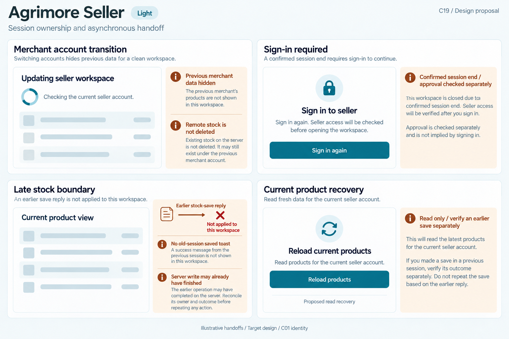
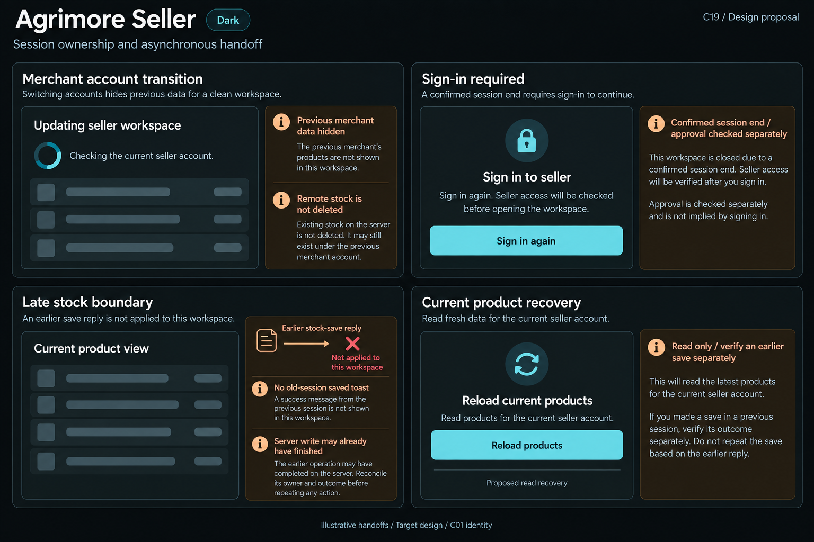

# Agrimore Seller — C19 session ownership and asynchronous handoff

**PROVISIONAL_DIRECTION / TARGET_IMPLEMENTATION · v1 · 2026-10-03.** C01 is approved and locked; C19 owner approval is pending.

Compact blue-teal merchant rebinding surfaces, copper save-outcome context, cool-neutral product rows and precise stock-reload controls.

[Ten-board gallery](../../../../../docs/design-system/SESSION_OWNERSHIP_ASYNCHRONOUS_HANDOFF_BOARDS_2026-10-03.md) · [Codebase/domain map](../../../../../docs/design-system/SESSION_OWNERSHIP_ASYNCHRONOUS_HANDOFF_DOMAIN_MAP_2026-10-03.md) · [Exact prompts](prompts.md) · [Manifest](manifest.json).

## Current source

SellerAuthProvider clears pending phone/Google identity and projection, renews session/access-read generations and rejects late reads/auth actions. SellerProductProvider loadSellerProducts and mutations write provider state after awaits without an explicit owner/generation guard in the inspected methods. SellerOrderProvider cancels old listener when loading but callbacks do not carry an explicit generation ticket. The stock editor caller DOES capture UID and checks it before initial read feedback, onSave and final toast; this is narrower than full provider or same-UID episode ownership. Auth gate/shell lifetime may dispose pages and reduce races; these reads alone do not prove a cross-account exposure.

## Target direction

Preserve existing stock caller UID checks and auth ownership while proposing explicit provider/route generations. Clear previous merchant records during account change; only the current merchant can receive save feedback or reload products. An old stock save may still have committed for its original owner; UI suppression is not rollback.

| Panel | Domain specimen |
| --- | --- |
| Merchant account transition | Card "Updating seller workspace", indeterminate spinner and text "Checking the current seller account." Empty product-row skeletons. Copper BOARD notes "Previous merchant data hidden" and "Remote stock is not deleted". No counts, product names or active-store status. |
| Sign-in required | Card "Sign in to seller", lock icon, body "Sign in again. Seller access will be checked before opening the workspace." blue-teal PRIMARY "Sign in again". Copper BOARD annotation "Confirmed session end / approval checked separately". No pending/approved/suspended badge fabricated from an expired session. |
| Late stock boundary | Neutral card "Current product view", EMPTY stock-row skeleton with no numeric value. Copper board diagram "Earlier stock-save reply" arrow crossed at "Not applied to this workspace". BOARD note "No old-session saved toast" and "Server write may already have finished". No Stock saved, reset stock, undo or Save again control. |
| Current product recovery | Card "Reload current products", body "Read products for the current seller account." PRIMARY "Reload products", caption "Proposed read recovery". Copper note "Read only / verify an earlier save separately". No product values, repeat-save, stock-zero result or assertion the earlier mutation failed. |

Preservation and gaps:

- Do not falsely say stock caller has only mounted checks: existing UID checks are evidenced and must stay.
- Provider-level state reads/listeners need current owner plus generation and disposal guards; canceled listener alone is not proof queued events cannot publish.
- Same UID after re-auth is a new episode for UI side effects; protect old sheets, captured product and return route.
- No blanket Stocks saved message or fresh save under another merchant after late response.
- Product reload is a read; unknown stock mutation outcome is reconciled under the original authorised merchant, not retried blindly.

## Light

## Dark

