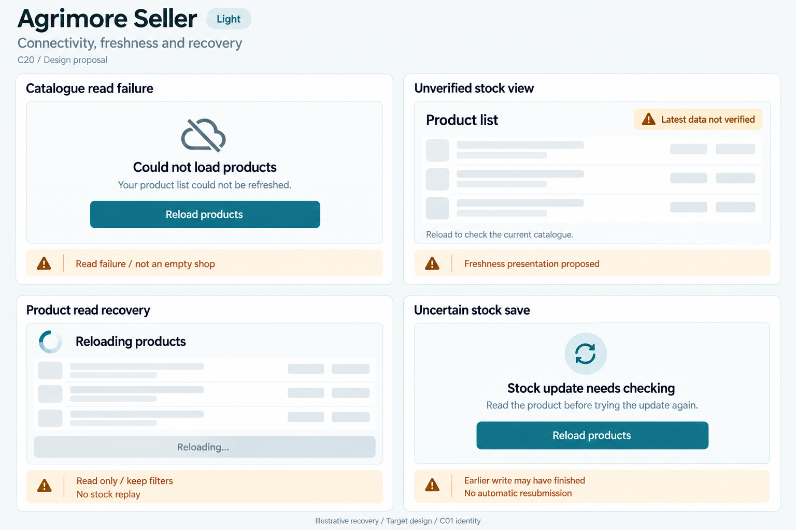
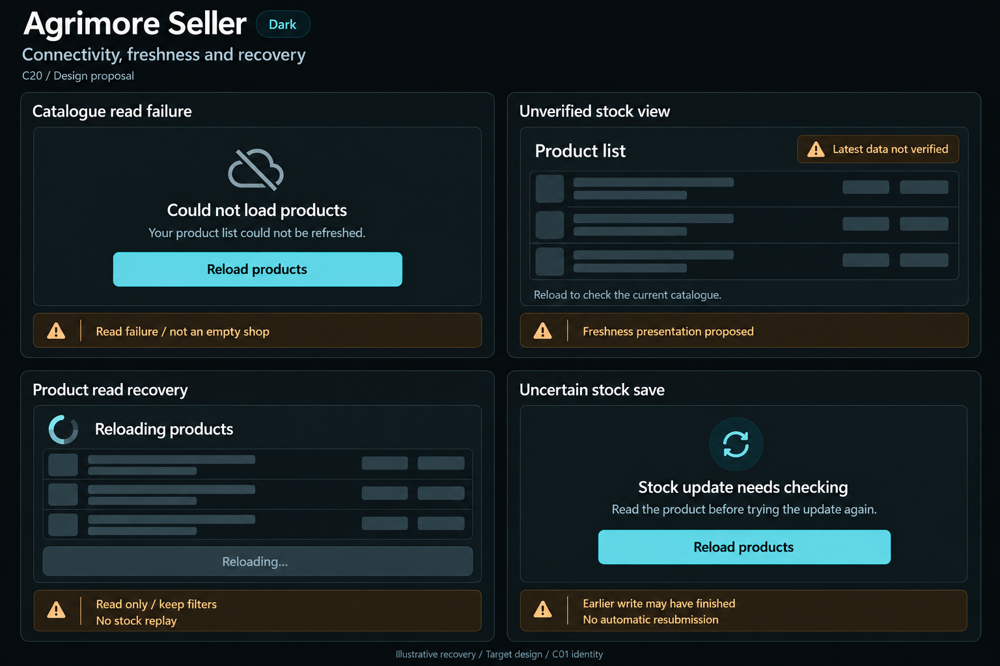

# Agrimore Seller — C20 connectivity, freshness and recovery

**PROVISIONAL_DIRECTION / TARGET_IMPLEMENTATION · v1 · 2026-10-03.** C01 is approved and locked; C20 owner approval is pending.

Compact blue-teal merchant recovery, copper stock-outcome guidance, cool-neutral catalogue rows and precise read refresh controls.

[Ten-board gallery](../../../../../docs/design-system/CONNECTIVITY_FRESHNESS_RECOVERY_BOARDS_2026-10-03.md) · [Codebase/domain map](../../../../../docs/design-system/CONNECTIVITY_FRESHNESS_RECOVERY_DOMAIN_MAP_2026-10-03.md) · [Exact prompts](prompts.md) · [Manifest](manifest.json).

## Current source

SellerProductProvider reads products through Firestore get, retains previous list on error, and reports loading/error; snapshot freshness metadata is not propagated in the inspected provider. SellerOrderProvider listens to seller orders but does not expose isFromCache/hasPendingWrites to its view. Product mutations use add/update/delete and then reload; no general durable stock mutation journal or offline replay UX is evidenced. Seller application step persistence and AI retryLast are separate domains, not universal stock recovery.

## Target direction

Use readable catalogue failure and latest-not-verified rows, read-only reload progress and a stock-outcome check. Keep old data useful only under the current seller and current filters; a failed refresh does not prove empty stock or failed save.

| Panel | Domain specimen |
| --- | --- |
| Catalogue read failure | Card "Could not load products", connection-slash icon, body "Your product list could not be refreshed." PRIMARY "Reload products". Copper BOARD note "Read failure / not an empty shop". No count or offline-online guarantee. |
| Unverified stock view | Card "Product list", copper caution chip "Latest data not verified", EMPTY product/stock row skeletons. Body "Reload to check the current catalogue." BOARD note "Freshness presentation proposed". No Cached badge, stock digits, fake timestamp or Saved badge. |
| Product read recovery | Card "Reloading products", indeterminate spinner, EMPTY row skeletons, muted DISABLED "Reloading…" control. Copper BOARD note "Read only / keep filters" and "No stock replay". No save-complete tick or percentage. |
| Uncertain stock save | Card "Stock update needs checking", body "Read the product before trying the update again." PRIMARY "Reload products". Copper BOARD note "Earlier write may have finished" and "No automatic resubmission". No Save again, stock-zero, guaranteed rollback or durable draft claim. |

Preservation and gaps:

- Do not label ordinary successful get as proven server-fresh; metadata/source must be propagated before claiming current/cache-specific UI.
- Do not show Saved/Synced when a write is pending or its outcome is unknown; current provider return paths are not a universal offline acknowledgement protocol.
- Check current authorised product state before reissuing stock mutation; no supported stock journal/autosync/resume promise in this proposal.
- Preserve existing stock caller UID checks and extend episode/provider/route checks where needed from C19.
- AI offline copy or an offline icon is not a global device connectivity service.

## Light

## Dark

