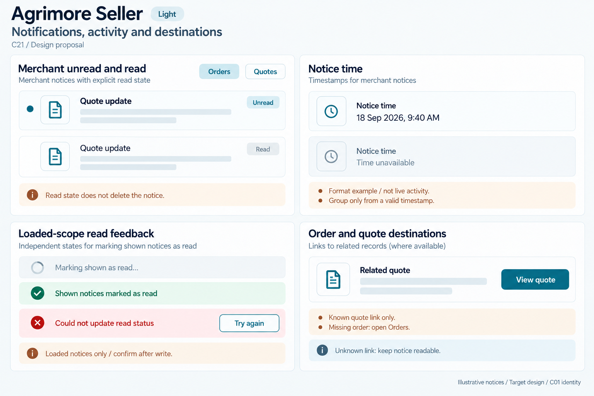
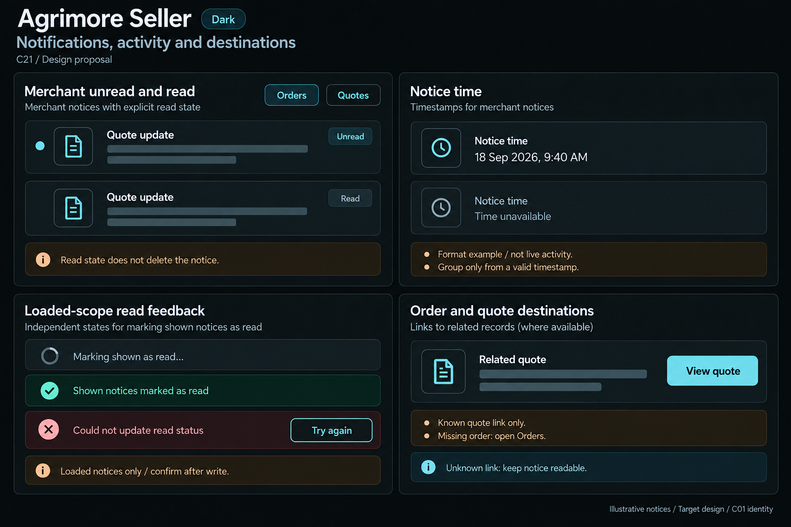

# Agrimore Seller — C21 notifications, activity and destinations

**PROVISIONAL_DIRECTION / TARGET_IMPLEMENTATION · v1 · 2026-10-03.** C01 is approved and locked; C21 owner approval is pending.

Compact blue-teal merchant inbox rows, copper chronology/read-scope annotations, cool-neutral grouped records and precise order/quote destinations.

[Ten-board gallery](../../../../../docs/design-system/NOTIFICATIONS_ACTIVITY_DESTINATIONS_BOARDS_2026-10-03.md) · [Codebase/domain map](../../../../../docs/design-system/NOTIFICATIONS_ACTIVITY_DESTINATIONS_DOMAIN_MAP_2026-10-03.md) · [Exact prompts](prompts.md) · [Manifest](manifest.json).

## Current source

Seller inbox normalizes unread/read/isRead legacy variants in InboxEntry, groups by IST calendar day and renders SellerFormat.dateTime. Bell queries unread==true capped at 100, while inbox rows normalize more conventions. Loaded list capped at 100; mark-all batches loaded unread entries, not full unseen inbox. Individual markRead catches/logs failure only; bulk failure uses action banner, no busy guard in inspected method. Tap marks read without awaiting and opens existing order if loaded else Orders tab, RFQ by ID, or Payments tab; InboxLink exact two-segment parser accepts order/rfq/payout only without leading slash normalization.

## Target direction

Keep category/row hierarchy and current navigation, add explicit individual/bulk operation feedback and truthful Mark shown as read scope until backend-wide action exists. Unknown/legacy payload gets a safe non-actionable notice rather than a guessed record; current merchant/entity access still required.

| Panel | Domain specimen |
| --- | --- |
| Merchant unread and read | Two synthetic rows titled "Quote update", EMPTY body skeletons, quote outline icons. First has teal dot, bold title and explicit "Unread"; second normal "Read", no dot. Small nonnumeric category chips "Orders" and "Quotes", no counts. Copper BOARD note "Read state does not delete the notice". |
| Merchant notice timestamps | Card "Notice time", exact fixed FORMAT EXAMPLE "18 Sep 2026, 9:40 AM", secondary "Time unavailable". Copper BOARD notes "Format example / not live activity" and "Group only from a valid timestamp". No fabricated Today label, age or live clock. |
| Loaded-scope read feedback | Three SMALL independent read-state feedback specimens: DISABLED neutral "Marking shown as read…" with indeterminate spinner; inline confirmation "Shown notices marked as read"; failure "Could not update read status" and SECONDARY "Try again". Copper BOARD annotation "Loaded notices only / confirm after write". No All caught up, cleared count or hidden older notices assertion. |
| Order and quote destinations | Card "Related quote", outline quote icon and EMPTY record context, PRIMARY "View quote". Copper BOARD notes "Known quote link only" and "Missing order: open Orders". Small muted "Unknown link: keep notice readable". No quote ID, order value, offer accepted or read-receipt claim. |

Preservation and gaps:

- Badge query and normalized legacy row interpretation can disagree; unify deliberately before claiming precise unread totals.
- Existing mark-all is limited to loaded entries; label the displayed scope or implement an explicitly tested whole-inbox operation.
- Individual read failure is currently log-only; propose visible retry and busy guard, not false success. Read marking does not delete row.
- IST Today grouping and dateTime local display need consistent timezone policy, midnight tests and invalid/future timestamps. Missing timestamp is not inferred current.
- Parser two-segment relative links can disagree with leading-slash payloads; map only allowed destinations, no generic external launcher.

## Light

## Dark

