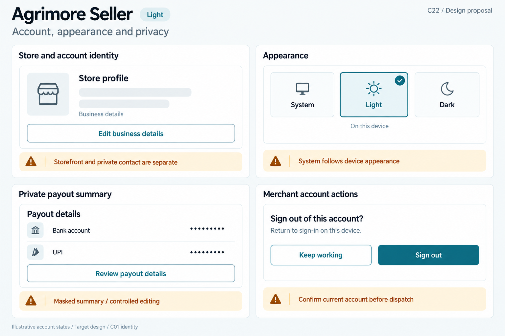
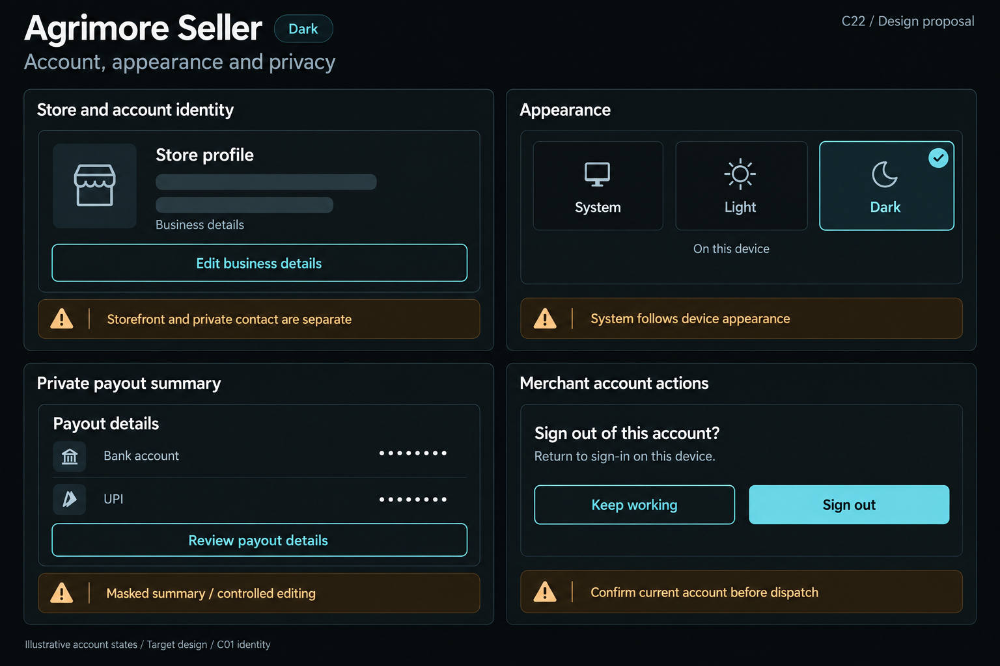

# Agrimore Seller — C22 account, appearance and privacy presentation

**PROVISIONAL_DIRECTION / TARGET_IMPLEMENTATION · v1 · 2026-10-03.** C01 is approved and locked; C22 owner approval is pending.

Compact merchant blue-teal surfaces, copper privacy/change guidance and cool-neutral structured business identity.

[Ten-board gallery](../../../../../docs/design-system/ACCOUNT_APPEARANCE_PRIVACY_PRESENTATION_BOARDS_2026-10-03.md) · [Codebase/domain map](../../../../../docs/design-system/ACCOUNT_APPEARANCE_PRIVACY_PRESENTATION_DOMAIN_MAP_2026-10-03.md) · [Exact prompts](prompts.md) · [Manifest](manifest.json).

## Current source

Seller profile separates storefront/business identity and payout details. SellerFormat masks phone, bank account and UPI summary (partial disclosure still exists); payout read failure is distinct from unavailable details. SellerSettingsProvider exposes/persists System/Light/Dark, applies before saving and catches/logs persistence failure. Profile sign-out confirms then calls auth without an explicit opening owner/epoch recheck in this caller. No seller account-deletion entry evidenced in these screens.

## Target direction

Preserve business versus private-account distinction, three appearance choices and masked payout summary. Add truthful preference persistence and guarded sign-out; no copied Marketplace deletion feature.

| Panel | Domain specimen |
| --- | --- |
| Store and account identity | Card "Store profile", generic outline storefront icon, EMPTY store-name skeleton, small neutral "Business details" label. SECONDARY "Edit business details". Copper BOARD note "Storefront and private contact are separate". No store name/address/photo/verified badge. |
| Appearance | Card "Appearance", THREE labelled choices "System", "Light", "Dark". Select the board theme exactly, System unselected. Below "On this device". Copper note "System follows device appearance". No saved/cloud-sync claim. |
| Private payout summary | Card "Payout details", two rows "Bank account" and "UPI", values ONLY "••••••••". SECONDARY "Review payout details". Copper BOARD note "Masked summary / controlled editing". No bank name/digits/UPI handle/verified badge/eye control. |
| Merchant account actions | Card "Sign out of this account?", body "Return to sign-in on this device." SECONDARY "Keep working" and PRIMARY "Sign out". Copper BOARD note "Confirm current account before dispatch". No deletion action or success result. |

Preservation and gaps:

- Masking is display minimization, not encryption; current masks retain some characters.
- Applied appearance is not proof disk persistence; surface save failure separately.
- Only sign-out action evidenced here; do not invent seller self-delete or verified payout-owner claims.

## Light

## Dark

