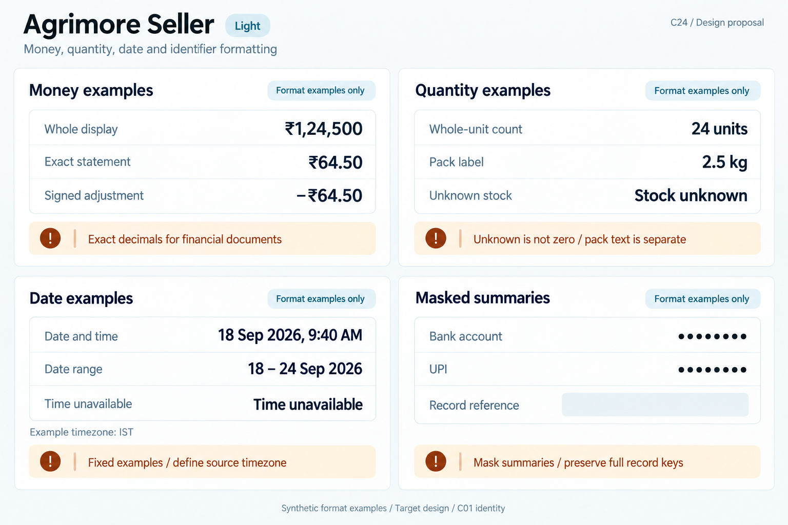
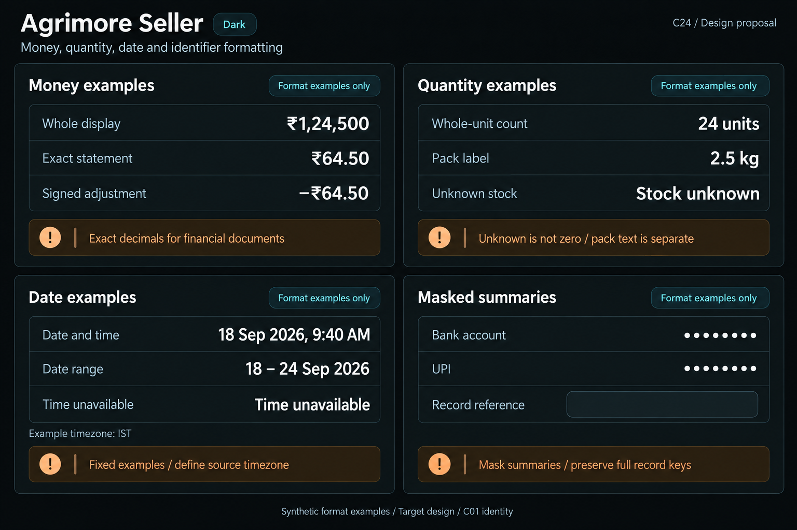

# Agrimore Seller — C24 money, quantity, date and identifier formatting

**PROVISIONAL_DIRECTION / TARGET_IMPLEMENTATION · v1 · 2026-10-03.** C01 is approved and locked; C24 owner approval is pending.

Compact blue-teal merchant monetary columns and stock units, copper precision/date provenance and cool-neutral identifier rows.

[Ten-board gallery](../../../../../docs/design-system/MONEY_QUANTITY_DATE_IDENTIFIER_FORMATTING_BOARDS_2026-10-03.md) · [Codebase/domain map](../../../../../docs/design-system/MONEY_QUANTITY_DATE_IDENTIFIER_FORMATTING_DOMAIN_MAP_2026-10-03.md) · [Exact prompts](prompts.md) · [Manifest](manifest.json).

## Current source

SellerFormat uses Indian grouping, money hides decimals when rounded paise are whole, moneyExact always two decimals, moneyWhole for rounded summaries and compact K/L/Cr notation. Signs use Unicode minus without spacing before rupee. Seller order/invoice screens currently often call money rather than moneyExact, so documented exact-invoice convention is not uniform. Dates have year/time/range helpers but no timezone conversion. Whole-stock parsing now rejects missing, non-finite, fractional, negative or unsafe raw counts; variant stockConfigured preserves unknown. Existing phone/account/UPI masks retain partial characters.

## Target direction

Preserve display/statement amount roles and signs, adopt exact invoice/statement decimals where required, keep whole stock and pack text separate, use full-year date provenance and conservative private summaries. Unknown stock is not zero/out-of-stock.

| Panel | Domain specimen |
| --- | --- |
| Merchant amount roles | Card "Money examples", independent rows "Whole display" = "₹1,24,500", "Exact statement" = "₹64.50", "Signed adjustment" = "−₹64.50". Copper BOARD note "Exact decimals for financial documents". No invoice total, fee, debt, settlement or paid/approved status. |
| Whole stock and measured packs | Card "Quantity examples", rows "Whole-unit count" = "24 units", "Pack label" = "2.5 kg", "Unknown stock" = "Stock unknown". Copper BOARD note "Unknown is not zero / pack text is separate". No out-of-stock/success badge or fractional stock operation. |
| Merchant date and range | Card "Date examples", "18 Sep 2026, 9:40 AM" and range "18 – 24 Sep 2026"; separate "Time unavailable". Small "Example timezone: IST". Copper BOARD note "Fixed examples / define source timezone". No invoice issue/paid deadline, Today or live time. |
| Private merchant identifiers | Card "Masked summaries", rows "Bank account" = "••••••••", "UPI" = "••••••••"; below EMPTY "Record reference" skeleton. Copper BOARD note "Mask summaries / preserve full record keys". No account digits, UPI suffix, merchant identity, eye or secure-storage claim. |

Preservation and gaps:

- Actual invoice call sites need adoption review before claiming all invoices use moneyExact.
- Seller compact suffixes differ from PriceFormatter and cannot be reused for exact reconciliation.
- Date/time formatting consumes supplied DateTime without converting zone; explicit IST policy needs implementation.
- Existing masks disclose tails/UPI domain; masking is display minimization, not authorization/encryption.

## Light

## Dark

