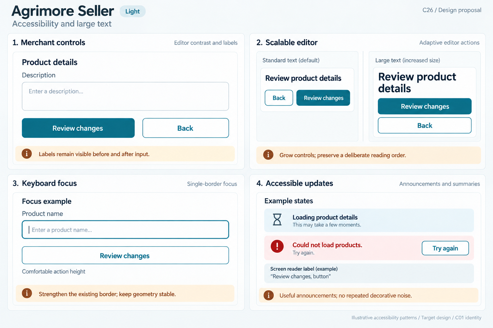
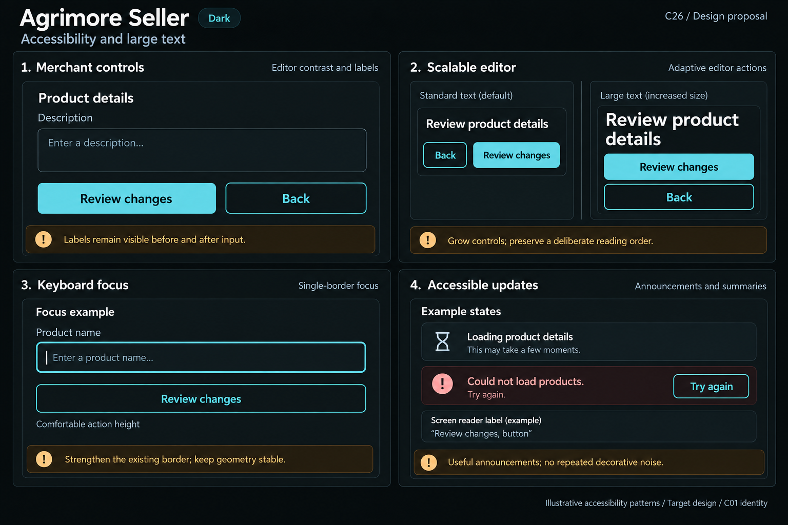

# Agrimore Seller — C26 accessibility and large text

**PROVISIONAL_DIRECTION / TARGET_IMPLEMENTATION · v1 · 2026-10-03.** C01 is approved and locked; C26 owner approval is pending.

Blue-teal editable merchant controls, copper focus/reflow guidance and cool-neutral readable form surfaces.

[Ten-board gallery](../../../../../docs/design-system/ACCESSIBILITY_LARGE_TEXT_BOARDS_2026-10-03.md) · [Codebase/domain map](../../../../../docs/design-system/ACCESSIBILITY_LARGE_TEXT_DOMAIN_MAP_2026-10-03.md) · [Exact prompts](prompts.md) · [Manifest](manifest.json).

## Current source

SellerFocusTracker distinguishes keyboard highlight and thickens existing inside border. SellerButton uses Material labels/roles or custom semanticLabel, wrapping content and minimum height; compact variants differ. SellerPage scrolls with safe sticky footer; SellerButtonBar stacks/reverses children at narrow or large text, which needs semantic/visual-order review. App bar scales actual font size but uses capped lines; largeText checks scale(1), an approximation for nonlinear scaling. Progress/banner/state helpers use live regions. Chart text painter follows scaler but some summaries clamp font scale.

## Target direction

Preserve single-border focus and label semantics, grow product-editor fields/actions, keep focus visible above footer/keyboard and reconcile responsive action ordering. Replace inaccessible chart-only meaning with readable descriptions/data where supported; no universal runtime pass inferred.

| Panel | Domain specimen |
| --- | --- |
| Editor contrast and labels | Panel "Merchant controls": title "Product details", field label "Description" above empty neutral field specimen; primary filled "Review changes", secondary outlined "Back". Copper note "Labels remain visible before and after input". No actual product, Save success, KYC/business data or publication claim. |
| Adaptive editor actions | Panel "Scalable editor": Standard text specimen has "Review product details" and side-by-side actions "Back" / "Review changes"; Large text specimen same title bigger/wrapped with actions STACKED full width in clear intentional order. Copper note "Grow controls; preserve a deliberate reading order". No numeric scale claim, clipped label or resized-down text. |
| Single-border focus | Panel "Keyboard focus": outline field "Product name" with one stronger own border; separate outlined "Review changes". Small "Focus example" and "Comfortable action height". Copper note "Strengthen the existing border; keep geometry stable". No outer focus ring/halo/double border. |
| Announcements and summaries | Panel "Accessible updates": neutral text-plus-hourglass "Loading product details" and independent error icon+text "Could not load products. Try again." with secondary "Try again". Caption "Example states"; external reading label example "Review changes, button". Copper note "Useful announcements; no repeated decorative noise". No spoken-AT-pass/compliance/payment/stock or published outcome. |

Preservation and gaps:

- Keyboard highlight implementation is present; actual Tab/Shift+Tab/Enter behavior and focus restoration still require interaction tests.
- SellerButtonBar changes child order when stacked; preserve intentional reading/action order rather than blindly copying last-first everywhere.
- scale(1) and chart clamps are not complete nonlinear text-scaling support.
- Live regions should announce meaningful change once, not every spinner rebuild. Existing Seller focus tests were inspected, not run.

## Light

## Dark

