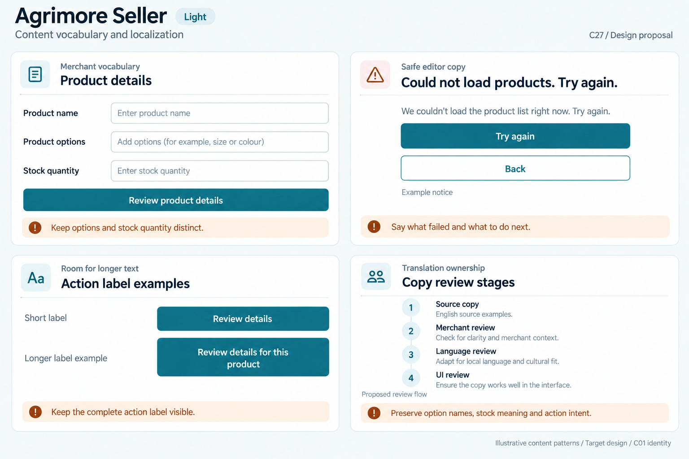
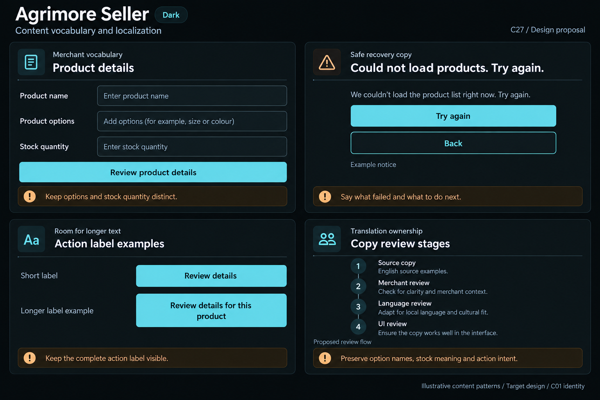

# Agrimore Seller — C27 content vocabulary and localization

**PROVISIONAL_DIRECTION / TARGET_IMPLEMENTATION · v1 · 2026-10-04.** C01 is approved and locked; C27 owner approval is pending.

Blue-teal merchant vocabulary, copper editing guidance and cool-neutral product-form surfaces.

[Ten-board gallery](../../../../../docs/design-system/CONTENT_VOCABULARY_LOCALIZATION_BOARDS_2026-10-04.md) · [Codebase/domain map](../../../../../docs/design-system/CONTENT_VOCABULARY_LOCALIZATION_DOMAIN_MAP_2026-10-04.md) · [Exact prompts](prompts.md) · [Manifest](manifest.json).

## Current source

Seller has l10n.yaml, one English ARB catalog and generated AppLocalizations wired into the root with Material/Widgets/Cupertino delegates. Product screens use localized catalogue, stock, option and safe-action messages; ARB has typed placeholders and ICU plurals. AuthErrorBanner maps typed errors but rate-limit/unavailable branches accept a provider string named serverMessage. The inspected provider supplies safe hardcoded English fallbacks, not verbatim transport text; localization coverage is therefore not complete.

## Target direction

Keep product, option and stock wording precise for merchants; catalogue/source messages own merchant editing semantics. Preserve whole-message placeholders and plural context, replace remaining safe English fallbacks through reviewed keys later, and keep form labels visible with longer copy.

| Panel | Domain specimen |
| --- | --- |
| Merchant vocabulary | Panel "Merchant vocabulary": title "Product details"; form labels "Product name", "Product options", "Stock quantity" with neutral empty field specimens; primary "Review product details". Copper note "Keep options and stock quantity distinct". No product, quantity, availability or save outcome. |
| Safe editor copy | Panel "Safe recovery copy": icon plus "Could not load products. Try again."; primary "Try again", secondary "Back", caption "Example notice". Copper note "Say what failed and what to do next". Read-only retry sample; no save/publish/approve claim. |
| Merchant label expansion | Panel "Room for longer text": "Short label" / "Longer label example" with same-role actions "Review details" and "Review details for this product". Longer wraps and grows, no ellipsis or compressed font. Copper note "Keep the complete action label visible". English illustration, not translated language. |
| Merchant copy review | Panel "Translation ownership": four readable stacked stages "Source copy", "Merchant review", "Language review", "UI review"; note "Preserve option names, stock meaning and action intent"; caption "Proposed review flow", "English source examples". No technical keys inside product form; no reviewer approval claim. |

Preservation and gaps:

- Only English is generated and supported; ARB presence is infrastructure, not multilingual delivery or every-string adoption.
- Stock and product options are distinct; do not treat a missing stock quantity as a confirmed stock state.
- Do not hand-edit generated localization Dart; later changes belong in source ARBs/config plus generator output.
- Keep saved/published/approved labels separated and backed by actual outcomes; safe banner transport mapping remains required.

## Light

## Dark

