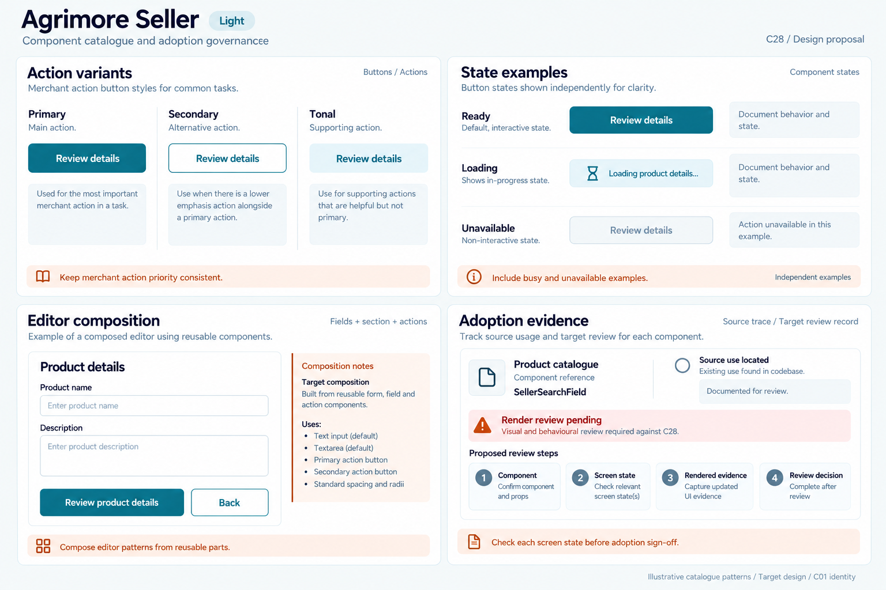
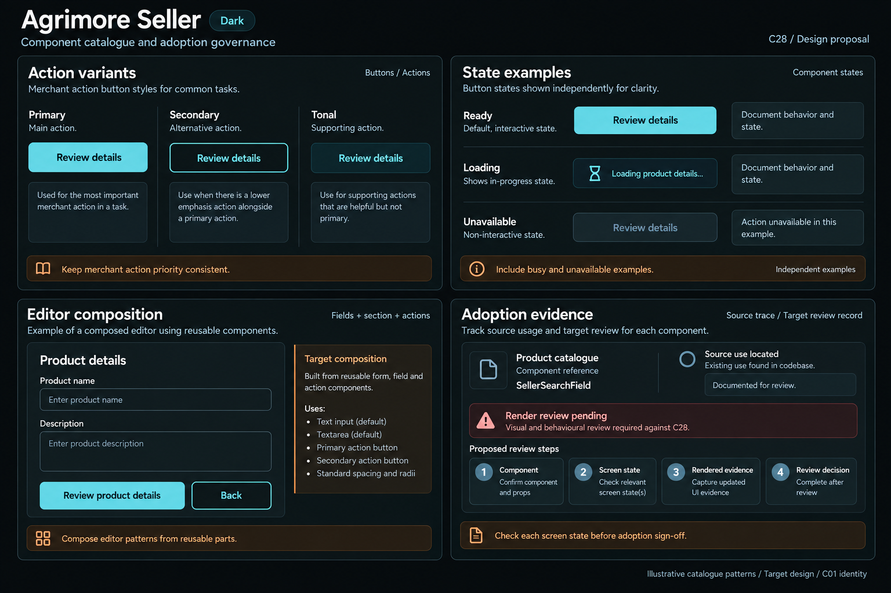

# Agrimore Seller — C28 component catalogue and adoption governance

**PROVISIONAL_DIRECTION / TARGET_IMPLEMENTATION · v1 · 2026-10-04.** C01 is approved and locked; C28 owner approval is pending.

Blue-teal merchant component library, copper catalogue notes and cool-neutral editor surfaces.

[Ten-board gallery](../../../../../docs/design-system/COMPONENT_CATALOGUE_ADOPTION_GOVERNANCE_BOARDS_2026-10-04.md) · [Codebase/domain map](../../../../../docs/design-system/COMPONENT_CATALOGUE_ADOPTION_GOVERNANCE_DOMAIN_MAP_2026-10-04.md) · [Exact prompts](prompts.md) · [Manifest](manifest.json).

## Current source

Seller owns app-local design_system barrel/tokens/theme and reusable components. SellerButton declares primary, secondary, tertiary, tonal, danger and dangerOutline, plus loading/compact/focus semantics. SellerProductsScreen composes SellerSearchField, SellerErrorState/SkeletonList/EmptyState and SellerButton variants. catalogue_visual_test is a product catalogue-screen test harness, not a standalone all-components Storybook application.

## Target direction

Catalogue merchant variants/states and product-edit composition with source ownership and per-screen evidence. Preserve own-border keyboard focus, reduced motion, loading guard and localization. A future seller package folder is an explicit ownership/migration target, not evidence that the current app-local library already lives there.

| Panel | Domain specimen |
| --- | --- |
| Merchant action variants | Panel "Action variants": labelled "Primary", "Secondary", "Tonal", each exact "Review details"; C01 filled, outlined and subtle selected-container specimens. Copper note "Keep merchant action priority consistent". No destructive/save/publish state. |
| Merchant component states | Panel "State examples": independent rows "Ready" with Review details, "Loading" with static hourglass and "Loading product details…", "Unavailable" disabled Review details with "Action unavailable in this example". Caption "Independent examples". Copper note "Include busy and unavailable examples". |
| Editor composition | Panel "Editor composition": title "Product details", visible labels "Product name" and "Description" above empty neutral fields; primary "Review product details", secondary "Back". External annotation "Fields + section + actions", "Target composition". Copper note "Compose editor patterns from reusable parts". No save outcome or real product. |
| Merchant source evidence | Panel "Adoption evidence": documentation record "Product catalogue" with "SellerSearchField"; rows "Source use located", "Render review pending"; proposed steps "Component", "Screen state", "Rendered evidence", "Review decision"; copper note "Check each screen state before adoption sign-off"; caption "Source trace / Target review record". No approval/tick/completion claim. |

Preservation and gaps:

- Product Catalogue as a business destination is different from a developer component catalogue.
- Native component tokens/geometry differ from C01 board tokens; docs must not claim the artwork was adopted in runtime.
- Danger/secondary/tonal need their own behavior/state contracts; generic action examples do not authorize destructive merchant actions.
- Catalogue test-source existence is not execution or visual acceptance.

## Light

## Dark

