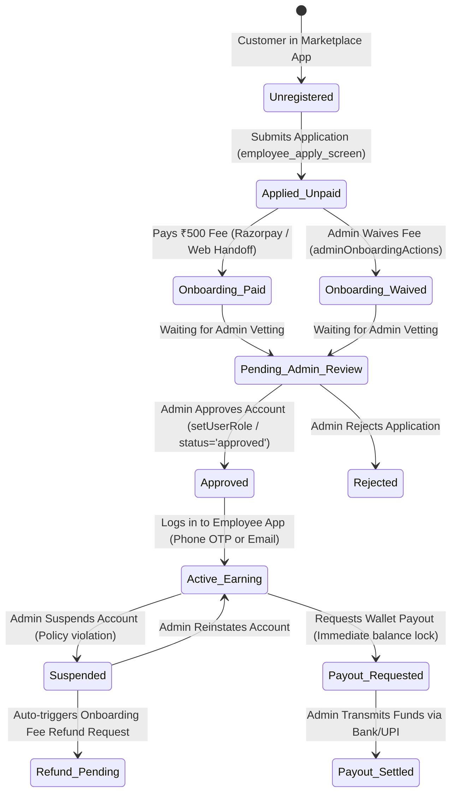
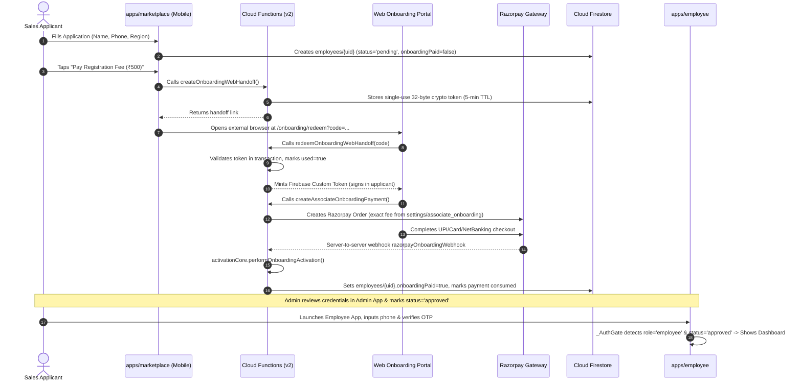
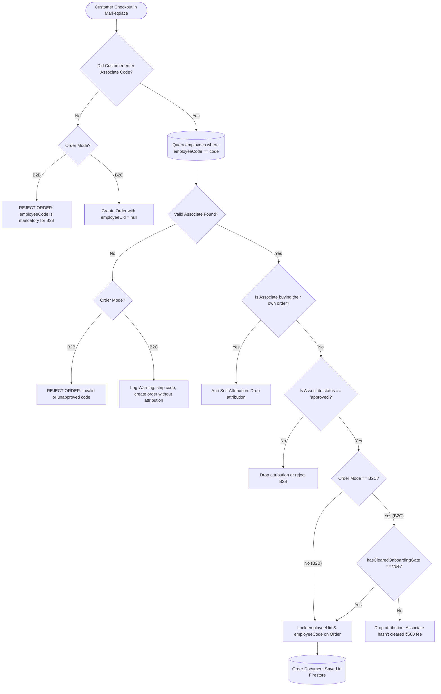
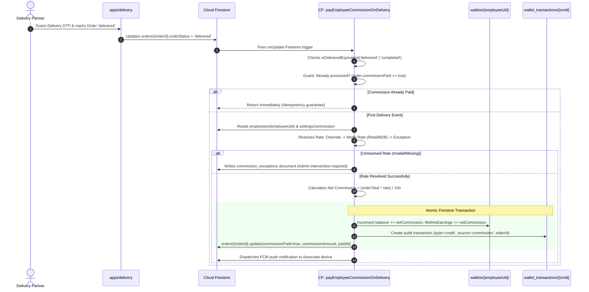
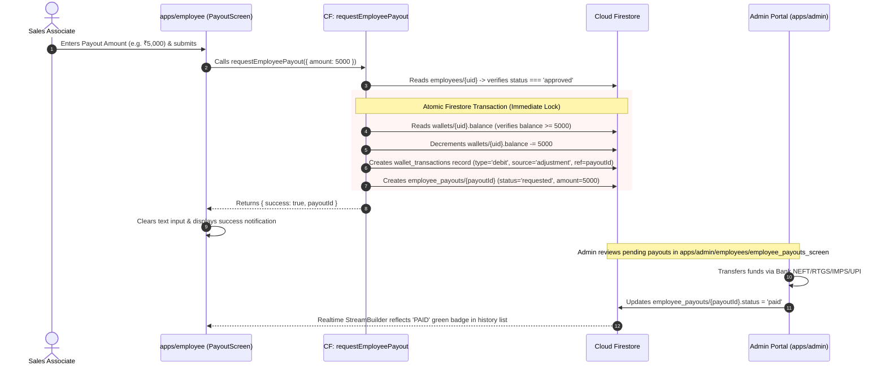

# AgriMore Sales Associate (Employee) App — Master Architecture & Systems Specification

> **Document Type**: Master Technical Specification & Ecosystem Audit  
> **Target Subsystem**: `apps/employee` (Agrimore Sales Associate App)  
> **Monorepo Root**: `SRIESWARAN01/Agrimore-Full-Project`  
> **Associated Package Scope**: `packages/agrimore_core`, `packages/agrimore_ui`, `packages/agrimore_services`, `functions/src/employee/`, `functions/src/customer/`, `firestore.rules`  
> **Measurement Baseline**: Monorepo HEAD @ `d511e00` / `develop` @ `a2dd197`  
> **Authoritative Compliance Standard**: Single-agent discipline, `CLAUDE.md`, `.claude/skills/agrimore/` (D-UIUX, D1, D-BRANCH, I5, I15)

---

## Table of Contents
1. [Executive Overview: What is the Employee App?](#1-executive-overview-what-is-the-employee-app)
   - 1.1 Purpose & Role in the Agrimore Marketplace
   - 1.2 "Sales Associate" vs. "Employee" (The D1 Naming Convention)
   - 1.3 The Two Associate Populations (Self-Applied vs. Admin-Created)
   - 1.4 Business Model, Commission Mechanics & Money Integrity
2. [End-to-End Associate Lifecycle & Workflows](#2-end-to-end-associate-lifecycle--workflows)
   - 2.1 Full Associate Lifecycle State Machine
   - 2.2 Onboarding & Registration Journey (Cross-App Flow)
   - 2.3 Order Attribution Workflow (B2B Wholesale vs. B2C Retail)
   - 2.4 Commission Calculation & Delivery Crediting Pipeline
   - 2.5 Payout Request & Settlement Lifecycle
3. [Exhaustive Screen-by-Screen Inventory & Widget Hierarchy](#3-exhaustive-screen-by-screen-inventory--widget-hierarchy)
   - 3.1 Screen 1: Splash Wrapper (`_EmployeeSplashWrapper`)
   - 3.2 Screen 2: Central Auth Router Gate (`_AuthGate`)
   - 3.3 Screen 3: Sign In Screen (`LoginScreen` — Phone OTP & Email/Password)
   - 3.4 Screen 4: Phone OTP Verification Screen (`AssociateOtpScreen`)
   - 3.5 Screen 5: Pending Approval Screen (`EmployeePendingApprovalScreen`)
   - 3.6 Screen 6: Account Suspended Screen (`SuspendedScreen`)
   - 3.7 Screen 7: Main Sales Dashboard (`DashboardScreen`)
   - 3.8 Screen 8: Attributed Order Detail Screen (`OrderDetailScreen`)
   - 3.9 Screen 9: Commission Wallet Screen (`WalletScreen`)
   - 3.10 Screen 10: Payout Request & History Screen (`PayoutScreen`)
   - 3.11 Screen 11: Associate Profile & Account Hub (`ProfileScreen`)
4. [Ecosystem Systems Architecture (The 4 Architectural Tiers)](#4-ecosystem-systems-architecture-the-4-architectural-tiers)
   - 4.1 Client Application Tier (`apps/employee`)
   - 4.2 Shared Foundation Tier (`agrimore_core`, `agrimore_services`, `agrimore_ui`)
   - 4.3 Backend Cloud Functions Tier (The 12 Engine Functions)
   - 4.4 Data & Security Tier (Firestore Schema, Indexes & Security Rules)
5. [Canonical UI/UX & Feedback Surface Audit](#5-canonical-uiux--feedback-surface-audit)
   - 5.1 Agrimore Design System Compliance (`agrimore_ui`)
   - 5.2 Theme & Token Architecture Audit
   - 5.3 Feedback Surfaces Compliance (`references/feedback.md`)
   - 5.4 Accessibility, Responsive Design & Web Readiness
6. [Gap Analysis: Missing Systems & Engineering Roadmap](#6-gap-analysis-missing-systems--engineering-roadmap)
   - 6.1 Client-Side Functional & UI/UX Gaps
   - 6.2 Backend & Financial Logic Gaps (The FIX-4B Roadmap)
   - 6.3 Infrastructure & DevOps Gaps
   - 6.4 Comprehensive Prioritized Implementation Punchlist
7. [Reference Data Models & API Contracts](#7-reference-data-models--api-contracts)
   - 7.1 Firestore Collections Reference
   - 7.2 Core Dart Models
   - 7.3 Callable & Trigger Function Signatures

---

## 1. Executive Overview: What is the Employee App?

### 1.1 Purpose & Role in the Agrimore Marketplace
Agrimore is an India-first multi-vendor agricultural marketplace connecting farmers, input manufacturers, bulk buyers, retail customers, and logistics partners. Within this ecosystem, **`apps/employee`** serves as the dedicated mobile and web portal for the field sales force — officially designated as **AgriMore Sales Associates**.

The Sales Associate app is **not** an HR or internal corporate attendance app. It is a **revenue-generating B2B sales dashboard, commission tracking wallet, and payout settlement terminal**. Sales Associates act as localized agricultural sales representatives who onboard farmers, retailers, and bulk buyers to Agrimore, facilitate bulk B2B and retail B2C transactions, and earn volume-based or percentage-based commissions on orders attributed to their unique referral credentials.

```
+-----------------------------------------------------------------------------------+
|                            AGRIMORE 5-APP ECOSYSTEM                               |
+-----------------------------------------------------------------------------------+
|  1. apps/marketplace   | Primary customer & buyer shopping app (B2C & B2B)       |
|  2. apps/admin         | Platform governance, catalog, user roles, payouts audit  |
|  3. apps/seller        | Vendor storefront, catalog management, inventory/orders  |
|  4. apps/delivery      | Logistics partner dispatch, routing, proof of delivery  |
|  5. apps/employee      | Sales Associate attribution, sales orders, commission   |
+-----------------------------------------------------------------------------------+
```

### 1.2 "Sales Associate" vs. "Employee" (The D1 Naming Convention)
A fundamental architectural decision governs all code and UI across the repository (**OWNER_DECISION D1**, Phase 16A):
- **User-Facing Copy**: Must **always** use **"Sales Associate"** or **"AgriMore Sales Associate"**. The word "Employee" must never appear in customer-, associate-, or seller-facing UI, dialogs, push notifications, or error strings. Field associates are independent commission-earning business partners, not salaried corporate staff.
- **Internal Identifiers**: Must **strictly remain `employee` / `employees`**. Internal Firestore collection names (`employees`, `employee_payouts`), document keys (`employeeUid`, `employeeCode`), Auth claims (`token.employee`), model classes (`EmployeeModel`), functions (`requestEmployeePayout`, `createEmployeeByAdmin`), and the monorepo directory (`apps/employee`) remain unchanged to avoid massive, breaking production data migrations across 5 deployed client apps, 48 cloud functions, and 1,950+ lines of Firestore security rules.

### 1.3 The Two Associate Populations (Self-Applied vs. Admin-Created)
The employee app caters to two fundamentally distinct user populations who enter the system through completely different onboarding paths:

| Dimension | Self-Applied Associates (Field Reps) | Admin-Created Associates (Staff/Direct) |
|---|---|---|
| **Origination** | `apps/marketplace` under Profile -> Apply as Sales Associate | `apps/admin` via `createEmployeeByAdmin` callable |
| **Credential Type** | Phone Number (Auth record created via Phone OTP) | Email & Password (minted directly by Admin SDK) |
| **Primary Login** | Phone OTP (6-digit code via SMS or Voice call) | Email + Password input fields |
| **Password Exists?** | **No** (never assigned an email or password credential) | **Yes** (has real email/password; can reset password) |
| **Onboarding Fee** | **Required**: Must pay ₹500 Registration Fee (or have it waived) | **Exempt / Pre-cleared** by admin creation flow |
| **Primary Volume** | High volume (open onboarding across rural farming hubs) | Low volume (company agents, regional supervisors) |

### 1.4 Business Model, Commission Mechanics & Money Integrity
1. **Attribution Mechanism**:
   Every associate is assigned a unique alphanumeric `employeeCode` (e.g., `SAAI01`). When a customer inputs this code at checkout in `apps/marketplace`:
   - **B2B Orders**: The code is **mandatory**. Wholesale pricing and bulk quantities cannot be finalized without a valid, approved Sales Associate code.
   - **B2C Retail Orders**: The code is **optional**. Customers enter it to support their local associate or unlock partner discounts.
2. **The ₹500 Onboarding Gate**:
   Self-applied associates must clear a one-time ₹500 Registration & Onboarding Fee (configured in `settings/associate_onboarding`). 
   - Associates who have **not** cleared the fee can still attribute **B2B wholesale orders**.
   - However, **B2C retail orders** silently drop attribution if the associate has not cleared this gate (`hasClearedOnboardingGate == false`). This provides strong incentive for active field associates to formally complete paid registration.
3. **Commission Triggering**:
   Commissions are **never** calculated or credited at checkout time. Orders can be cancelled, returned, or rejected. Commission is calculated and credited via a server-side Cloud Function (`payEmployeeCommissionOnDelivery`) **only when the order status transitions to `delivered` or `completed`**.
4. **Wallet & Payouts**:
   Commission is credited to the associate's digital ledger wallet (`wallets/{uid}`). When an associate requests a payout via `requestEmployeePayout`, the funds are **immediately debited from their available balance in an atomic transaction** to prevent double-spending while awaiting admin bank transfer settlement.

---

## 2. End-to-End Associate Lifecycle & Workflows

### 2.1 Full Associate Lifecycle State Machine



### 2.2 Onboarding & Registration Journey (Cross-App Flow)
Because Google Play policies strictly regulate payment steering and digital goods billing on Android, the associate onboarding payment workflow features a sophisticated web handoff bridge (`ONBOARD-1`):



### 2.3 Order Attribution Workflow (B2B Wholesale vs. B2C Retail)



### 2.4 Commission Calculation & Delivery Crediting Pipeline



### 2.5 Payout Request & Settlement Lifecycle



---

## 3. Exhaustive Screen-by-Screen Inventory & Widget Hierarchy

The application source code lives under `apps/employee/lib/` and contains **12 Dart files** organized cleanly into `app/`, `providers/`, and `screens/`. Below is the exhaustive audit of every single visual surface, widget, button, field, and interaction.

```
apps/employee/lib/
├── main.dart
├── app/
│   └── app.dart
├── providers/
│   └── auth_provider.dart
└── screens/
    ├── auth/
    │   ├── login_screen.dart
    │   ├── associate_otp_screen.dart
    │   ├── pending_approval_screen.dart
    │   └── suspended_screen.dart
    ├── home/
    │   └── dashboard_screen.dart
    ├── orders/
    │   └── order_detail_screen.dart
    ├── wallet/
    │   ├── wallet_screen.dart
    │   └── payout_screen.dart
    └── profile/
        └── profile_screen.dart
```

---

### 3.1 Screen 1: Splash Wrapper (`_EmployeeSplashWrapper`)
- **File**: [`apps/employee/lib/app/app.dart`](file:///Users/saai_siddharth/Projects/Clients/Agrimore/apps/employee/lib/app/app.dart#L66-L89)
- **Visual Purpose**: Initial loading branded launch screen displayed while Flutter engine and Firebase core bindings initialize.
- **Widgets Used**:
  - `PremiumSplashScreen` (from `packages/agrimore_ui/lib/widgets/premium_splash_screen.dart`)
- **UI Elements & Properties**:
  - `appName`: `'Agrimore'`
  - `tagline`: `'Sales Associate'`
  - `logoPath`: `'packages/agrimore_ui/assets/icons/admin_logo.png'` (Reused internal admin logo as temporary fallback until dedicated associate icon is packaged).
  - `animationType`: `SplashAnimationType.admin`
- **Navigation Action**:
  - `onNavigation`: Replaces current route with `MaterialPageRoute(builder: (_) => const _AuthGate())`.

---

### 3.2 Screen 2: Central Auth Router Gate (`_AuthGate`)
- **File**: [`apps/employee/lib/app/app.dart`](file:///Users/saai_siddharth/Projects/Clients/Agrimore/apps/employee/lib/app/app.dart#L91-L130)
- **Role**: Declarative state gate acting as the single source of truth for screen routing based on reactive Firebase Auth and Firestore employee status changes.
- **State Logic & Branches**:
  1. `authProvider.isLoading == true`: Returns `Scaffold(body: Center(child: CircularProgressIndicator()))`.
  2. `authProvider.isAuthenticated && authProvider.isEmployee`: Returns `DashboardScreen()` (Fully authenticated and approved associate).
  3. `user != null && error.contains('suspended')`: Returns `SuspendedScreen()` (Strict precedence: checked before pending).
  4. `user != null && error.contains('pending')`: Returns `EmployeePendingApprovalScreen()` (Account under admin vetting).
  5. Default / Fallback: Returns `LoginScreen()` (Signed out or rejected).

---

### 3.3 Screen 3: Sign In Screen (`LoginScreen`)
- **File**: [`apps/employee/lib/screens/auth/login_screen.dart`](file:///Users/saai_siddharth/Projects/Clients/Agrimore/apps/employee/lib/screens/auth/login_screen.dart)
- **Role**: Unified authentication entry point supporting dual login paths for field associates and administrative reps.

```
+-----------------------------------------------------------+
|                      [Agrimore Logo]                      |
|                         Agrimore                          |
|                      Sales Associate                      |
|                                                           |
|  +-----------------------------------------------------+  |
|  | Sign In                                             |  |
|  | [ Mobile number Tab (Default) ]  [ Email Tab ]      |  |
|  |                                                     |  |
|  | [!] Error Banner (Dynamic conditional)              |  |
|  |                                                     |  |
|  | Mobile Number Form:                                 |  |
|  | [ +91 | [ Enter 10-digit mobile ]                 ] |  |
|  | [                Send code (FilledButton)         ] |  |
|  |                                                     |  |
|  | Email Form (when selected):                         |  |
|  | [ Email Address                                   ] |  |
|  | [ Password                                   (eye)] |  |
|  |                            [Forgot password? (text)]|  |
|  | [                 Sign In (FilledButton)          ] |  |
|  +-----------------------------------------------------+  |
|                                                           |
|       "New associate? Apply for an account from the       |
|          Agrimore customer app under Profile."            |
+-----------------------------------------------------------+
```

- **Interactive UI Elements & Buttons**:
  1. **Background Canvas**: Gradient container (`Alignment.topLeft` to `Alignment.bottomRight`) utilizing `colorScheme.primary` and `colorScheme.primaryContainer`.
  2. **App Branding**:
     - Image Asset: `assets/images/logo.png` (80x80).
     - Title: `'Agrimore'` (w900, 32pt, white).
     - Subtitle: `'Sales Associate'` (w500, 16pt, 80% opacity white).
  3. **Segmented Mode Toggle** (`_buildModeToggle`):
     - Segment 1: `'Mobile number'` (`_LoginMode.phone`, default).
     - Segment 2: `'Email'` (`_LoginMode.email`).
     - Animated pill background switching on tap; resets focus and clears previous auth errors.
  4. **Error Alert Box**:
     - Conditionally rendered via `Consumer<EmployeeAuthProvider>`.
     - Container with light red fill, error icon `Icons.error_outline`, and dynamic text mapping.
  5. **Mobile Form Controls** (`_buildPhoneForm`):
     - `TextFormField` (`_phoneController`): 10-digit phone number, digits only filter, `+91 ` prefix text, `Icons.phone_outlined` prefix icon.
     - Phone Validator: Checks empty, exact 10 digits, and regex `^[6-9]\d{9}$` (standard Indian mobile format).
     - Submit Button: `FilledButton` `'Send code'`. Triggers `_handleSendOtp()`. Displays centered `CircularProgressIndicator` during network call.
  6. **Email Form Controls** (`_buildEmailForm`):
     - `TextFormField` (`_emailController`): Email address input, validates `@` symbol.
     - `TextFormField` (`_passwordController`): Obscure text toggle button (`Icons.visibility` / `Icons.visibility_off`).
     - Forgot Password Button: `GestureDetector` `'Forgot password?'` right-aligned text button. Triggers `_handleForgotPassword()`.
     - Login Button: `FilledButton` `'Sign In'`. Triggers `_handleLogin()`.
  7. **Footer Guidance**: Plain text directing prospective associates to apply via the marketplace app.

---

### 3.4 Screen 4: Phone OTP Verification Screen (`AssociateOtpScreen`)
- **File**: [`apps/employee/lib/screens/auth/associate_otp_screen.dart`](file:///Users/saai_siddharth/Projects/Clients/Agrimore/apps/employee/lib/screens/auth/associate_otp_screen.dart)
- **Role**: Secure 6-digit verification code entry mirroring marketplace UX.
- **Widgets & Interactive Controls**:
  1. **Header Text**: Displays destination phone number and dynamically adapts copy depending on channel (`channel == 'voice'` -> *"We're calling you now with your code on..."* vs. *"We have sent a verification code to..."*).
  2. **6-Digit Input Matrix** (`_buildDigitBox`):
     - 6 individual `Expanded` digit boxes (`TextField` with single digit limit and numeric input formatter).
     - Auto-advances focus to next node upon entry; auto-triggers `_handleVerify()` when the 6th digit is typed.
  3. **Timer & Resend Trigger**:
     - 30-second periodic timer countdown (`_resendSecondsLeft`).
     - Resend SMS/Call Button: Disabled while timer > 0.
     - "Call me instead" Voice Fallback: Offered if timer hits 0 and original channel was SMS.
  4. **Action Buttons**:
     - Text Button: `'Use a different number'` (pops screen back to login).
     - Loading spinner displayed while verification promise is in flight.

---

### 3.5 Screen 5: Pending Approval Screen (`EmployeePendingApprovalScreen`)
- **File**: [`apps/employee/lib/screens/auth/pending_approval_screen.dart`](file:///Users/saai_siddharth/Projects/Clients/Agrimore/apps/employee/lib/screens/auth/pending_approval_screen.dart)
- **Role**: Holding screen for applicants who have paid their onboarding fee or submitted details, but have not yet received admin approval.
- **UI Elements & Buttons**:
  - Avatar Badge: Large blue circular container with `Icons.badge_rounded`.
  - Title: `'Pending Approval'` (w800, 28pt).
  - Explanatory copy explaining that account vetting is in progress.
  - Sign Out Button: `FilledButton.icon` with `Icons.logout_rounded`, background colored `colorScheme.error`. Invokes `context.read<EmployeeAuthProvider>().signOut()`.

---

### 3.6 Screen 6: Account Suspended Screen (`SuspendedScreen`)
- **File**: [`apps/employee/lib/screens/auth/suspended_screen.dart`](file:///Users/saai_siddharth/Projects/Clients/Agrimore/apps/employee/lib/screens/auth/suspended_screen.dart)
- **Role**: Honest status screen for associates whose accounts have been suspended by administrative action.
- **UI Elements & Buttons**:
  - Alert Icon: Large red circular container with `Icons.pause_circle_outline_rounded`.
  - Title: `'Account Suspended'` (w800, 28pt).
  - Explanatory copy citing administrative suspension.
  - Support Information: Displays `AppConstants.supportEmail` and `AppConstants.supportPhone`.
  - Sign Out Button: `FilledButton.icon` with `Icons.logout_rounded` to disconnect credentials.

---

### 3.7 Screen 7: Main Sales Dashboard (`DashboardScreen`)
- **File**: [`apps/employee/lib/screens/home/dashboard_screen.dart`](file:///Users/saai_siddharth/Projects/Clients/Agrimore/apps/employee/lib/screens/home/dashboard_screen.dart)
- **Role**: Primary operational hub for the Sales Associate.

```
+-----------------------------------------------------------+
| [=] My Sales                         (Wallet) (Payout) (Profile)|
+-----------------------------------------------------------+
|  +-----------------------------------------------------+  |
|  | [Badge] YOUR ASSOCIATE CODE                         |  |
|  | +----------------------------------+ +------------+ |  |
|  | | SAAI01                           | | [^] Share  | |  |
|  | | Tap to copy                      | +------------+ |  |
|  | +----------------------------------+                |  |
|  | Share this code with your customers...              |  |
|  | [!] Onboarding Fee notice (if not cleared)          |  |
|  +-----------------------------------------------------+  |
|                                                           |
|  +-----------------------------------------------------+  |
|  | [i] Onboarding Fee Status: Paid ₹500 / Waived / Due |  |
|  +-----------------------------------------------------+  |
|                                                           |
|  +-------------------------+ +-------------------------+  |
|  | [Wallet] Available      | | [Trending] Lifetime     |  |
|  | Rs 14,250               | | Rs 38,900               |  |
|  +-------------------------+ +-------------------------+  |
|                                                           |
|  Orders Attributed To You                                 |
|  +-----------------------------------------------------+  |
|  | #ORD-98234                              [DELIVERED] |  |
|  | Rs 45,000  [B2B Badge]                              |  |
|  +-----------------------------------------------------+  |
|  | #ORD-98112                              [PENDING]   |  |
|  | Rs 1,200   [Retail Badge]                           |  |
|  +-----------------------------------------------------+  |
|                     [ Load more ]                         |
+-----------------------------------------------------------+
```

- **Top App Bar Actions**:
  1. Title: `'My Sales'`.
  2. Wallet Action: `IconButton(Icons.account_balance_wallet_outlined)` -> Opens `WalletScreen`.
  3. Payout Action: `IconButton(Icons.payments_outlined)` -> Opens `PayoutScreen`.
  4. Profile Action: `IconButton(Icons.person_outline_rounded)` -> Opens `ProfileScreen`.
- **Card 1: Associate Code Card (`_AssociateCodeCard`)**:
  - Shared StreamBuilder listener on `employees/{uid}`.
  - Emerald gradient styling (`AppColors.primary` to `AppColors.primaryDark`).
  - Large Code Display: Bold 26pt monospace text.
  - Tap-to-Copy: Entire code container is wrapped in `InkWell`. Copies code to `Clipboard` and fires `HapticFeedback.selectionClick()` + confirmation SnackBar.
  - Native Share Button (`_ActionButton`): Taps native OS share sheet using `share_plus` (`Share.share('Use my AgriMore Sales Associate code...')`).
  - Retail Gate Warning: Shows warning banner if `hasClearedOnboardingGate == false` explaining that retail orders won't attribute until fee is resolved.
- **Card 2: Onboarding Fee Status Card (`_OnboardingFeeStatusCard`)**:
  - Resolves 5 distinct operational states:
    1. `Refunded`: Orange alert icon + refund notice.
    2. `Paid`: Green checkmark icon + exact fee formatted via `PriceFormatter.formatPrice()`.
    3. `Waived`: Blue verified badge + waiver notice.
    4. `Due / Incomplete`: Neutral info icon + completion prompt.
    5. `Error / Empty`: Gracefully collapsed via `SizedBox.shrink()`.
- **Card 3 & 4: Commission Summary Row (`_SummaryCard`)**:
  - Live StreamBuilder listener on `wallets/{uid}`.
  - Card 1: Available Balance (`balance`) in green theme.
  - Card 2: Total Lifetime Commission (`lifetimeEarnings`) in blue theme.
- **Section 5: Attributed Orders List (`_buildOrdersList`)**:
  - Server-side query with composite index: `.where('employeeUid', isEqualTo: uid).orderBy('createdAt', descending: true).limit(_pageSize)`.
  - Empty State: `'No orders attributed to you yet'`.
  - Order Tile (`ListTile` inside `Card`):
    - Title: `#orderNumber`.
    - Subtitle: `Wrap` widget containing money total and Mode Badge (`B2B` vs `Retail`).
    - Trailing: Status badge container (`DELIVERED`/`COMPLETED` in green vs `PENDING`/`SHIPPED` in amber).
    - Tap Target: Navigates to `OrderDetailScreen` passing existing doc snapshot (zero duplicate reads).
  - Pagination Button: `'Load more'` button increments `_pageSize += 20`.

---

### 3.8 Screen 8: Attributed Order Detail Screen (`OrderDetailScreen`)
- **File**: [`apps/employee/lib/screens/orders/order_detail_screen.dart`](file:///Users/saai_siddharth/Projects/Clients/Agrimore/apps/employee/lib/screens/orders/order_detail_screen.dart)
- **Role**: Read-only breakdown of a specific attributed customer order. Zero additional Firestore reads; relies entirely on the document map passed from Dashboard.
- **UI Sections & Widgets**:
  1. **App Bar**: Displays `'Order #$orderNumber'`.
  2. **Order Summary Card (`_SectionCard`)**:
     - Order Number (`_DetailRow`).
     - Date Placed (Formatted via `DateFormat('d MMM yyyy, h:mm a')`).
     - Order Status (Color coded green for delivered/completed, amber otherwise).
     - Order Type (`B2B` vs `Retail`).
     - Order Total (`Rs X`).
  3. **Commission Card (`_CommissionCard`)**:
     - If `commissionPaid == true`: Displays Commission Paid amount in green and payment timestamp.
     - If `commissionPaid == false`: Displays informational notice (*"Commission is calculated once this order is delivered"*).
  4. **Line Items Card (`_SectionCard`)**:
     - Maps through `items` array.
     - Product Name, Quantity (`×$quantity`), and Line Price.

---

### 3.9 Screen 9: Commission Wallet Screen (`WalletScreen`)
- **File**: [`apps/employee/lib/screens/wallet/wallet_screen.dart`](file:///Users/saai_siddharth/Projects/Clients/Agrimore/apps/employee/lib/screens/wallet/wallet_screen.dart)
- **Role**: Financial ledger tracking commission accruals and payout debits.
- **Widgets & Features**:
  1. **Balance Banner Card (`_buildBalanceCard`)**:
     - Real-time stream on `wallets/{uid}`.
     - Large 32pt balance display.
     - Lifetime earned commission metric.
  2. **Transaction History Feed (`_buildTransactionsList`)**:
     - Real-time stream on `wallet_transactions` where `userId == uid` ordered by `createdAt` desc, paginated (`_pageSize = 20`).
     - Transaction Tile (`_TransactionTile`):
       - Icon & Color: Dynamic based on credit (green) vs. debit (red).
       - Title: Server description string (e.g. *"Commission on B2C order ORD-1234"*).
       - Subtitle: Formatted date.
       - Trailing: Formatted amount (`+₹500` / `-₹2,000`).
       - Meta Chips: Wrap row showing transaction source, order mode (`B2B`/`Retail`), order reference ID, and rate source (`'Your custom commission rate'` vs `'Standard commission rate'`).
  3. **Pagination Control**: `'Load more'` button incrementing page size by 20.

---

### 3.10 Screen 10: Payout Request & History Screen (`PayoutScreen`)
- **File**: [`apps/employee/lib/screens/wallet/payout_screen.dart`](file:///Users/saai_siddharth/Projects/Clients/Agrimore/apps/employee/lib/screens/wallet/payout_screen.dart)
- **Role**: Withdrawal submission screen and disbursement tracking log.
- **Form Controls & Submission Flow**:
  1. **Request Box Container**:
     - Title: `'Request a Payout'`.
     - Subtitle notice: *"The requested amount is deducted from your wallet immediately."*
     - Amount Input: `TextField` (`_amountController`) with number keyboard and rupee prefix icon `Icons.currency_rupee`.
     - Submit Button: `FilledButton` `'Submit Request'`.
     - Submission Logic: Validates positive number -> Calls `FirebaseFunctions.instance.httpsCallable('requestEmployeePayout')` -> Displays loading indicator -> Shows Green/Red SnackBar -> Clears input.
  2. **Payout History List (`_buildHistory`)**:
     - Real-time stream on `employee_payouts` where `employeeId == uid` ordered by `createdAt` desc (paginated, 20 per page).
     - Tile: Formatted amount (`Rs X`) and Status Pill (`PAID` in green vs `REQUESTED`/`PROCESSING` in amber).
     - Pagination Control: `'Load more'` button.

---

### 3.11 Screen 11: Associate Profile & Account Hub (`ProfileScreen`)
- **File**: [`apps/employee/lib/screens/profile/profile_screen.dart`](file:///Users/saai_siddharth/Projects/Clients/Agrimore/apps/employee/lib/screens/profile/profile_screen.dart)
- **Role**: Account details verification, corporate support contact, and secure sign out.
- **Widgets & UI Elements**:
  1. **Profile Header (`_ProfileHeader`)**:
     - Circular avatar with primary emerald background and `Icons.person_rounded`.
     - Associate name (w800, 18pt).
  2. **Account Details Card (`_InfoCard`)**:
     - Phone: Selectable text (SelectableText prevents retyping).
     - Email: Selectable text.
     - Associate Code: Selectable text.
     - Approval Status: Formatted label (`Approved`, `Pending Approval`, `Suspended`).
  3. **Support Contact Card (`_SupportCard`)**:
     - Official Support Email: `AppConstants.supportEmail`.
     - Official Support Phone: `AppConstants.supportPhone`.
  4. **Sign Out Button (`_SignOutButton`)**:
     - `OutlinedButton.icon` with red outline and `Icons.logout_rounded`.
     - Two-step safety guard: Opens `DialogHelper.showConfirmation` (*"Are you sure you want to sign out of your associate account?"*).
     - Safe Navigation: Signs out via provider, then calls `Navigator.popUntil((route) => route.isFirst)` to prevent leaving an orphaned, erroring profile screen on the stack.

---

## 4. Ecosystem Systems Architecture (The 4 Architectural Tiers)

```
+---------------------------------------------------------------------------------------------------------+
|                                    1. CLIENT APPLICATION TIER                                           |
| apps/employee (Flutter 3.44.8, Dart 3.12.2, Android targetSdk 35, Web PWA)                              |
| - 12 Lib Files | State: Provider (EmployeeAuthProvider) | Multi-auth: Phone OTP & Email/Password        |
+---------------------------------------------------------------------------------------------------------+
                                                     |
                                                     v
+---------------------------------------------------------------------------------------------------------+
|                                      2. SHARED PACKAGES TIER                                            |
| packages/agrimore_core        | packages/agrimore_ui            | packages/agrimore_services            |
| - EmployeeModel, UserModel    | - AppColors, AppTheme           | - AuthService (Phone OTP engine)      |
| - OrderModel, WalletModel     | - DialogHelper, SnackbarHelper  | - FCM NotificationService             |
| - PriceFormatter, Constants   | - PremiumSplashScreen           | - AppCheckService (reCAPTCHA v3)      |
+---------------------------------------------------------------------------------------------------------+
                                                     |
                                                     v
+---------------------------------------------------------------------------------------------------------+
|                                   3. BACKEND CLOUD FUNCTIONS TIER                                       |
| functions/src/employee/ & customer/ (Node.js 22, TypeScript, Firebase v1/v2)                            |
| 1. activationCore.ts               5. createAssociateOnboardingPayment.ts  9. employeeCommission.ts     |
| 2. activateAssociateOnboarding.ts   6. getAssociateOnboardingConfig.ts     10. requestEmployeePayout.ts |
| 3. razorpayOnboardingWebhook.ts    7. onboardingConfig.ts                  11. createEmployeeByAdmin.ts |
| 4. reconcileStalePayments.ts       8. onboardingWebHandoff.ts              12. createOrder.ts           |
+---------------------------------------------------------------------------------------------------------+
                                                     |
                                                     v
+---------------------------------------------------------------------------------------------------------+
|                                     4. DATA & SECURITY RULES TIER                                       |
| Cloud Firestore (agrimore-66a4e) & firestore.rules (1,951 lines)                                        |
| - employees/{uid}             - wallets/{uid}                   - orders/{orderId}                      |
| - employee_payouts/{payoutId} - wallet_transactions/{txnId}     - settings/associate_onboarding         |
+---------------------------------------------------------------------------------------------------------+
```

### 4.1 Client Application Tier (`apps/employee`)
- **SDK Constraints**: Flutter `^3.6.0` (Toolchain: Flutter 3.44.8, Dart 3.12.2).
- **Architecture**: Single-provider reactive pattern powered by `provider: ^6.1.2`. `EmployeeAuthProvider` manages Firebase Auth state, Firestore user document syncing, role validation, and FCM push token registration.
- **Orientation Lock**: Fixed to portrait (`portraitUp`, `portraitDown`) at startup.
- **Local Emulators Support**: Supports `--dart-define=USE_FIREBASE_EMULATOR=true` to redirect Auth (9099), Firestore (8080), and Functions (5001) for visual testing without touching production.

### 4.2 Shared Foundation Tier
1. **`agrimore_core`**: Supplies `EmployeeModel` (with full onboarding gate getters), `UserModel`, `OrderModel`, `WalletModel`, `WalletTransactionModel`, and constants (`AppConstants.supportEmail`).
2. **`agrimore_services`**:
   - `AuthService`: Shared singleton handling Firebase Auth phone OTP dispatch and verification across both Marketplace and Employee apps.
   - `NotificationService`: Background message handler and push navigator key binding.
   - `AppCheckService`: Monitoring-mode App Check initialization.
3. **`agrimore_ui`**: Supplies `PremiumSplashScreen`, `AppColors`, and `DialogHelper`.

### 4.3 Backend Cloud Functions Tier (The 12 Engine Functions)
The backend logic governing associates is strictly enforced server-side. No client can directly manipulate commission amounts, wallet balances, or onboarding flags.

1. **`activationCore.ts` (`performOnboardingActivation`)**:
   - Central transaction engine for onboarding fee payment consumption.
   - Enforces **4-Way Anti-Double-Spend Cross-Consumption (Invariant I5)**:
     A payment captured via Razorpay cannot be consumed more than once across:
     - `consumedByOrderId` (Product purchase)
     - `consumedByOnboardingFor` (Associate onboarding fee)
     - `consumedByWalletTopup` (Customer wallet funding)
     - `consumedBySellerAiActivationFor` (Seller AI funding)
   - Checks caller ownership (`payment.userId === uid`), captured status, and exact fee tolerance (±₹0.01).
2. **`createAssociateOnboardingPayment.ts` (`createAssociateOnboardingPayment`)**:
   - Callable creating Razorpay orders specifically for onboarding fee. Rate-limited to 1 call per 30 seconds per UID. Amount read strictly from `settings/associate_onboarding`.
3. **`activateAssociateOnboarding.ts` (`activateAssociateOnboarding`)**:
   - Client callable invoked by the onboarding web screen upon Razorpay success. Delegates immediately to `activationCore`.
4. **`razorpayOnboardingWebhook.ts` (`razorpayOnboardingWebhook`)**:
   - Server-to-server webhook endpoint verifying Razorpay HMAC signature. Captures payments and activates onboarding even if user's mobile browser crashed.
5. **`reconcileStaleOnboardingPayments.ts` (`reconcileStaleOnboardingPayments`)**:
   - Automated scheduled cron job scanning for unconsumed captured payments and reconciling stalled activations.
6. **`adminOnboardingActions.ts`**:
   - `waiveAssociateOnboardingFee`: Admin action to waive the fee with a mandatory written audit reason.
   - `recordAssociateOnboardingRefund`: Admin action recording that an onboarding fee was refunded (reverses gate clearance).
   - `requestAssociateOnboardingRefundOnSuspend`: Firestore trigger opening a pending refund request when an approved, paid associate is suspended.
7. **`onboardingWebHandoff.ts`**:
   - `createOnboardingWebHandoff`: Mints 5-minute single-use cryptographic token for seamless mobile-to-web payment handoff.
   - `redeemOnboardingWebHandoff`: Atomically consumes token and returns custom Auth token to sign the applicant into web checkout.
8. **`onboardingConfig.ts`**:
   - Single source of truth for fee amount.
   - Features an automated prohibited claims scanner (`findProhibitedClaims`) rejecting terms like *guarantee, interest, return, yield, investment, dividend*.
9. **`employeeCommission.ts` (`payEmployeeCommissionOnDelivery`)**:
   - Firestore `onUpdate` trigger on `/orders/{orderId}`.
   - Filters on `delivered` and `completed` status transitions.
   - Resolves rate hierarchically:
     1. `employees/{uid}.commissionRate` (if > 0 and <= 100).
     2. `settings/commission` (`employeeRetailRate` for B2C, `employeeDefaultRate` for B2B).
     3. Unresolved: Logs to `commission_exceptions` and credits ₹0 (fails safe).
   - Atomically updates wallet balance and creates audit ledger row.
10. **`requestEmployeePayout.ts` (`requestEmployeePayout`)**:
    - Atomic callable debiting wallet balance immediately and writing `employee_payouts` record with status `requested`.
11. **`createEmployeeByAdmin.ts` (`createEmployeeByAdmin`)**:
    - Admin callable minting staff associate accounts, setting custom Auth claims (`employee: true`, `employeeApproved: true`), and generating `employeeCode`.
12. **`createOrder.ts`**:
    - Validates associate code at checkout, enforces B2B requirement, checks anti-self-attribution, verifies onboarding fee clearance for B2C retail attribution, and binds `employeeUid` to order document.

### 4.4 Data & Security Tier (Firestore Schema, Indexes & Security Rules)

#### Firestore Security Rules Matrix
| Collection Path | Read Rule | Create Rule | Update Rule | Delete Rule |
|---|---|---|---|---|
| `/employees/{uid}` | Owner (`isOwner(uid)`) OR Admin | Admin OR (Owner if `status=='pending'` & no onboarding fields) | Admin OR (Owner without changing status, commission, or onboarding fields) | Admin Only |
| `/employee_payouts/{id}` | Owner (`resource.data.employeeId == auth.uid`) OR Admin | `false` (Cloud Functions Admin SDK only) | Admin Only (Mark as paid) | `false` |
| `/orders/{orderId}` | Buyer, Seller, Delivery Partner, Admin OR **Attributed Associate** (`resource.data.employeeUid == auth.uid`) | Buyer Only | Gated state transitions; `employeeUid` and `employeeCode` are **strictly immutable** | `false` |
| `/wallets/{uid}` | Owner OR Admin | `false` (Functions only) | `false` (Functions only) | `false` |
| `/wallet_transactions/{id}` | Owner (`resource.data.userId == auth.uid`) OR Admin | `false` (Functions only) | `false` | `false` |

#### Composite Indexes (`firestore.indexes.json`)
The Employee App relies on two composite indexes deployed in production:
1. `employee_payouts`: `employeeId` (ASCENDING) + `createdAt` (DESCENDING) -> Enables paginated history in `PayoutScreen`.
2. `orders`: `employeeUid` (ASCENDING) + `createdAt` (DESCENDING) -> Enables paginated attributed orders feed in `DashboardScreen`.

---

## 5. Canonical UI/UX & Feedback Surface Audit

An audit was performed against the authoritative Agrimore UI guidelines ([`references/uiux.md`](file:///.claude/skills/agrimore/references/uiux.md) and [`references/feedback.md`](file:///.claude/skills/agrimore/references/feedback.md)):

### 5.1 Agrimore Design System Compliance (`agrimore_ui`)
- **Current Finding**: `apps/employee` currently has **low-to-moderate adoption** of the shared `agrimore_ui` package.
- **Theme Definition**:
  - `apps/employee/lib/app/app.dart` defines an **inline ThemeData**:
    ```dart
    ThemeData(
      colorScheme: ColorScheme.fromSeed(
        seedColor: const Color(0xFF2D7D3C), // Hardcoded seed color
        brightness: Brightness.light,
      ),
      useMaterial3: true,
    )
    ```
  - It does **not** use the canonical `AppTheme.lightTheme` or `AppTheme.darkTheme` from `packages/agrimore_ui/lib/themes/app_theme.dart`.
- **Common Widget Primitives**:
  - Does **not** use `CustomButton`, `CustomTextField`, or `CustomAppBar` from `packages/agrimore_ui/lib/widgets/common/`.
  - Directly builds with standard Flutter Material 3 components (`FilledButton`, `OutlinedButton`, `TextFormField`, `Card`, `ListTile`).
  - Positively: It does **not** create duplicate custom widget classes with names like `MyCustomButton` or `EmployeeTextField` (satisfies the `ZERO_NEW_WIDGETS` rule).

### 5.2 Theme & Token Architecture Audit
- **Color Literals vs. AppColors**:
  - `_AssociateCodeCard` correctly uses `AppColors.primary`, `AppColors.primaryDark`, `AppColors.primaryDarker`, and `AppColors.accent`.
  - However, numerous **raw color literals** exist across screens:
    - `Color(0xFFF8FAFC)` (Scaffold background across 5 screens).
    - `Color(0xFF16A34A)` (Wallet green in Dashboard and WalletScreen).
    - `Color(0xFF2563EB)` (Total commission blue).
    - `Color(0xFF15803D)` (Credit text green).
    - `Colors.green.shade50`, `Colors.amber.shade50`, `Colors.blue.shade50`, `Colors.red.shade50` (Status pill backgrounds).
  - *Recommendation*: Refactor raw literals to tokens in `AppColors`.

### 5.3 Feedback Surfaces Compliance (`references/feedback.md`)
- **SnackBar Usage**:
  - The canonical feedback standard requires `SnackbarHelper.showSuccess`, `SnackbarHelper.showError`, etc.
  - **Audit Result**: `apps/employee` currently contains **12 raw `ScaffoldMessenger.of(context).showSnackBar` calls** and **0 `SnackbarHelper` calls**.
- **Dialog Usage**:
  - `ProfileScreen` correctly adopts `DialogHelper.showConfirmation` for sign out confirmation.
- **Empty & Error States**:
  - The canonical standard prescribes `EmptyStateWidget` and `ErrorView` from `agrimore_ui`.
  - **Audit Result**: `DashboardScreen`, `WalletScreen`, and `PayoutScreen` currently use raw inline `Center(child: Text('No transactions yet'))` and `Text('Error: ${snap.error}')` instead of `EmptyStateWidget` and `ErrorView`.
- **Price / Currency Formatting**:
  - `DashboardScreen:753` correctly uses `PriceFormatter.formatPrice(amount)`.
  - However, `DashboardScreen`, `WalletScreen`, `PayoutScreen`, and `OrderDetailScreen` define redundant private helpers:
    ```dart
    static String _formatMoney(double value) => 'Rs ${value.toStringAsFixed(0)}';
    ```
  - This hardcodes "Rs" instead of the standard symbol "₹", omits locale comma separation, and truncates decimal precision.

### 5.4 Accessibility, Responsive Design & Web Readiness
- **Responsive Layouts**:
  - Layouts rely on fixed padding (16pt, 24pt) and `SafeArea`.
  - Tablet / Desktop web layouts are not customized; they render as scaled single-column mobile views.
- **Web Artifacts**:
  - `apps/employee/web/index.html` is fully configured with PWA metadata, OpenGraph tags, and favicon icons.
  - However, `firebase.json` has **no hosting target configured for `apps/employee`** (`agrimore-employee.web.app` exists in manifest but not in deployment config).

---

## 6. Gap Analysis: Missing Systems & Engineering Roadmap

### 6.1 Client-Side Functional & UI/UX Gaps

| Area | Current State | Target Enhancement | Priority |
|---|---|---|---|
| **Automated Tests** | `apps/employee/test/` has **0 tests** | Unit tests for `EmployeeAuthProvider`, Widget tests for `LoginScreen`, `AssociateOtpScreen`, `DashboardScreen` | **P1** |
| **Feedback Canonicalization** | 12 raw `showSnackBar` calls; raw text empty states | Migrate to `SnackbarHelper`, `EmptyStateWidget`, and `ErrorView` | **P2** |
| **Theme Unification** | Inline `ThemeData` with hardcoded seed | Migrate `app.dart` to `AppTheme.lightTheme` & `AppTheme.darkTheme` | **P2** |
| **Price Formatter** | Redundant `_formatMoney` ("Rs X") | Replace with `PriceFormatter.formatPrice` across all 4 screens | **P3** |
| **Bank / UPI Collection** | Payout request only takes an amount | Screen / sheet to input and save Bank Account IFSC & UPI VPA | **P1** |
| **Search & Filtering** | Plain paginated order stream | Filter orders by Date range, Order Mode (B2B/Retail), and Status | **P2** |
| **Sales Analytics** | Only raw totals shown | Visual charts (Weekly/Monthly sales volume, commission earned) | **P3** |
| **Notification Inbox** | Tapped push routes to generic gate | In-app notification center screen to view missed commission alerts | **P2** |
| **Branding Asset** | Splash uses `admin_logo.png`; launcher icon label says "Agrimore Employee" | Dedicated associate icon asset; update Android label to "Agrimore Sales Associate" | **P3** |

### 6.2 Backend & Financial Logic Gaps (The FIX-4B Roadmap)
The repository security audit identified three financial edge-cases currently scheduled under **Phase FIX-4B**:
1. **N-9 (Commission Reversal on Cancellation/Refund)**:
   - *Issue*: If an order is delivered and commission is paid to an associate, but the order is subsequently returned or refunded, the commission is currently **not reversed**.
   - *Target*: Server-side trigger to debit associate wallet or log a negative adjustment balance upon order return.
2. **N-29 (Commission Base Exclusion)**:
   - *Issue*: Commission is currently computed on `after.total`, which includes delivery charges and GST. Associates are effectively earning commission on government tax.
   - *Target*: Update calculation to base commission strictly on `itemsTotal` or `subtotal - discount`.
3. **N-27 (Mixed-Category Commission Rates)**:
   - *Issue*: Orders containing products from multiple categories currently take the commission rate from the first item.

### 6.3 Infrastructure & DevOps Gaps
1. **Missing Firebase Hosting Site**:
   - `firebase.json` defines hosting sites for Marketplace, Admin, Delivery, and Seller, but lacks a block for `apps/employee/build/web`.
   - Needs:
     ```json
     {
       "site": "agrimore-employee",
       "public": "apps/employee/build/web",
       "rewrites": [{ "source": "**", "destination": "/index.html" }]
     }
     ```
2. **Dedicated Deep Link Route Resolution**:
   - Currently, `NotificationService.handleNotificationNavigation` pushes named routes which hit `onUnknownRoute` and fall back to `_AuthGate`.
   - Needs declarative routing (e.g. `/orders/:id`, `/wallet`) so tapping a commission push notification jumps straight to the relevant order.

---

## 7. Reference Data Models & API Contracts

### 7.1 Firestore Collections Reference

#### `/employees/{uid}`
```typescript
interface EmployeeDocument {
  userId: string;
  name: string;
  email: string;
  phone: string;
  employeeCode: string;          // e.g. "SAAI01"
  status: "pending" | "approved" | "suspended";
  commissionRate: number;        // Override percentage, default 0.0
  createdBy: "self" | "admin";
  createdAt: Timestamp;
  updatedAt: Timestamp;
  
  // Phase 16A Onboarding Fee Fields (Read-only for clients)
  onboardingPaid: boolean;
  onboardingWaived: boolean;
  onboardingFeeAmount?: number;  // e.g. 500
  onboardingPaymentId?: string;  // Razorpay payment ID
  onboardingPaidAt?: Timestamp;
  onboardingWaivedAt?: Timestamp;
  onboardingWaivedBy?: string;   // Admin UID
  onboardingWaivedReason?: string;
  onboardingRefundedAt?: Timestamp;
}
```

#### `/employee_payouts/{payoutId}`
```typescript
interface EmployeePayoutDocument {
  employeeId: string;
  amount: number;
  status: "requested" | "processing" | "paid" | "rejected";
  createdAt: Timestamp;
  processedAt?: Timestamp;
  processedBy?: string;         // Admin UID
  transactionRef?: string;      // Bank UTR / IMPS reference
}
```

#### `/wallets/{uid}` & `/wallet_transactions/{txnId}`
```typescript
interface WalletDocument {
  balance: number;              // Current available funds (INR)
  lifetimeEarnings: number;     // Cumulative commissions credited
  coins: number;                // Reward coins
  updatedAt: Timestamp;
}

interface WalletTransactionDocument {
  walletId: string;
  userId: string;
  type: "credit" | "debit";
  source: "commission" | "adjustment" | "order_payment" | "refund";
  amount: number;
  balanceAfter: number;
  orderId?: string | null;
  description: string;
  referenceId?: string;
  createdAt: Timestamp;
  metadata?: {
    orderMode?: "B2B" | "B2C";
    rateSource?: "employee_override" | "configured_mode_rate";
    ratePercent?: number;
    payoutId?: string;
  };
}
```

### 7.2 Core Dart Models
- **`EmployeeModel`**: Located in [`packages/agrimore_core/lib/models/employee_model.dart`](file:///Users/saai_siddharth/Projects/Clients/Agrimore/packages/agrimore_core/lib/models/employee_model.dart).
  - Key getter: `hasClearedOnboardingGate => (onboardingPaid || onboardingWaived) && onboardingRefundedAt == null`.
- **`UserModel`**: Located in [`packages/agrimore_core/lib/models/user_model.dart`](file:///Users/saai_siddharth/Projects/Clients/Agrimore/packages/agrimore_core/lib/models/user_model.dart).
  - Role check: `bool get isEmployee => role == 'employee'`.

### 7.3 Cloud Functions Signatures

```typescript
// 1. Request Payout (Callable v1)
export const requestEmployeePayout: HttpsFunction<{ amount: number }, { success: boolean; payoutId: string; amount: number }>;

// 2. Create Onboarding Payment (Callable v2)
export const createAssociateOnboardingPayment: HttpsFunction<void, { success: boolean; razorpayOrderId: string; amount: number; keyId: string }>;

// 3. Activate Onboarding (Callable v2)
export const activateAssociateOnboarding: HttpsFunction<{ paymentId: string; razorpayOrderId?: string }, { success: boolean; employeeId: string; paymentId: string }>;

// 4. Create Web Handoff (Callable v2)
export const createOnboardingWebHandoff: HttpsFunction<void, { success: boolean; code: string }>;

// 5. Redeem Web Handoff (Callable v2)
export const redeemOnboardingWebHandoff: HttpsFunction<{ code: string }, { success: boolean; customToken: string }>;

// 6. Waive Fee (Admin Callable v2)
export const waiveAssociateOnboardingFee: HttpsFunction<{ employeeId: string; reason: string }, { success: boolean }>;

// 7. Order Delivery Commission Trigger (Firestore v1 Trigger)
export const payEmployeeCommissionOnDelivery: CloudFunction<Change<DocumentSnapshot>>;
```

---

## 8. Summary Conclusion

The **Agrimore Employee App** is a specialized, production-ready operational terminal for **AgriMore Sales Associates**. It links directly to the financial engine of the marketplace, enabling B2B wholesale order routing and B2C retail attribution, protected by atomic server-side transactions and multi-layered fraud guards (such as the 4-way anti-double-spend invariant I5 and the ₹500 retail onboarding gate).

While the underlying Firebase, Cloud Functions, and data models are robust and secure, the client app (`apps/employee`) represents an ideal candidate for **UI/UX canonicalization**: unifying its theme with `agrimore_ui`, migrating raw SnackBars to `SnackbarHelper`, implementing `EmptyStateWidget`/`ErrorView`, adding automated widget tests, and introducing in-app bank/UPI payout account management.
