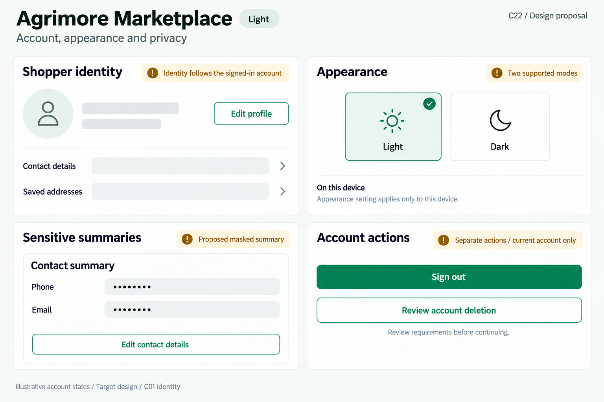
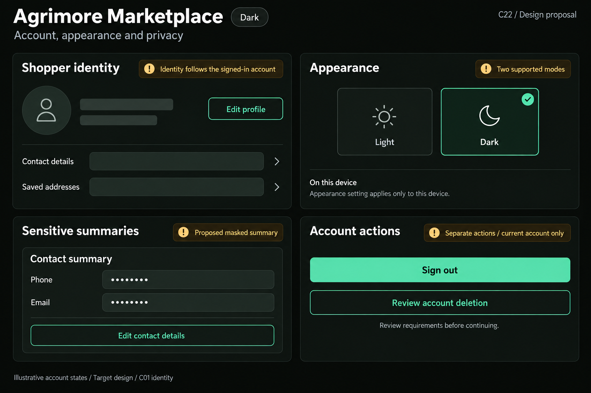
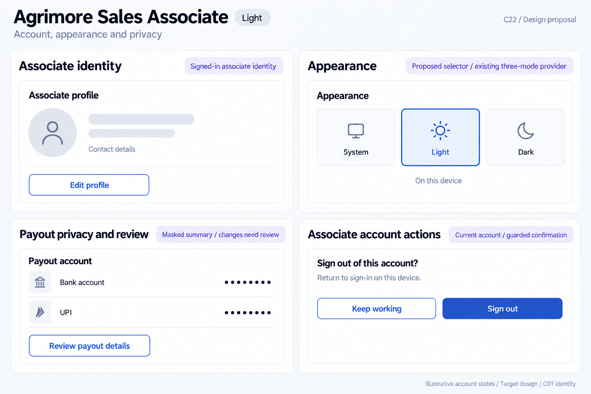
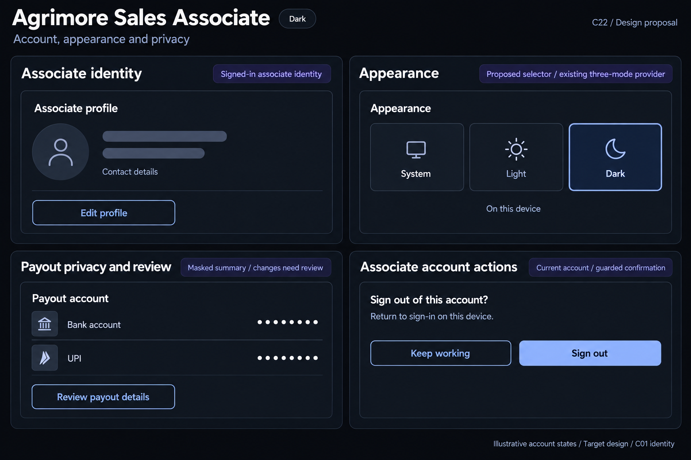

# Agrimore — C22 account, appearance and privacy presentation

**PROVISIONAL_DIRECTION / TARGET_IMPLEMENTATION · v1 · 2026-10-03.** Ten premium Storybook boards: one light and one dark per app. C01 remains the approved identity reference.

[Codebase and domain map](ACCOUNT_APPEARANCE_PRIVACY_PRESENTATION_DOMAIN_MAP_2026-10-03.md) · [C01 approval index](COLOR_ROLES_THEME_IDENTITY_LOCK_2026-10-02.md).

Five app-specific systems separate identity, supported local appearance modes, sensitive summaries and account actions. Marketplace/Admin use two theme choices; Seller/Delivery/Associate providers support three. Admin binding and Associate selector are proposals. Delivery UPI masking is proposed; existing seller masks and Delivery/Admin session guards are preserved. Sign-out is separate from deletion; only Marketplace/Delivery deletion entries are evidenced here. These are target Storybook specimens, not running screenshots or executed operations. C01 token metadata is inherited; raster values are approximate. No sidebar.

## Agrimore Marketplace

Calm professional green shopper identity, warm-gold appearance guidance and natural-stone privacy summaries.

[App notes](../../apps/marketplace/assets/ui-mockups/22-account-appearance-privacy-presentation/README.md) · [Prompts](../../apps/marketplace/assets/ui-mockups/22-account-appearance-privacy-presentation/prompts.md) · [Manifest](../../apps/marketplace/assets/ui-mockups/22-account-appearance-privacy-presentation/manifest.json).

### Light

### Dark

## Agrimore Seller

Compact merchant blue-teal surfaces, copper privacy/change guidance and cool-neutral structured business identity.

[App notes](../../apps/seller/assets/ui-mockups/22-account-appearance-privacy-presentation/README.md) · [Prompts](../../apps/seller/assets/ui-mockups/22-account-appearance-privacy-presentation/prompts.md) · [Manifest](../../apps/seller/assets/ui-mockups/22-account-appearance-privacy-presentation/manifest.json).

### Light

### Dark

## Agrimore Delivery

Field-readable black/white identity, burgundy sensitive-action context, burnt-orange appearance guidance and large clear targets.

[App notes](../../apps/delivery/assets/ui-mockups/22-account-appearance-privacy-presentation/README.md) · [Prompts](../../apps/delivery/assets/ui-mockups/22-account-appearance-privacy-presentation/prompts.md) · [Manifest](../../apps/delivery/assets/ui-mockups/22-account-appearance-privacy-presentation/manifest.json).

### Light

### Dark

## Agrimore Sales Associate

Premium royal-blue associate identity, indigo appearance/review context and pearl/slate privacy rows.

[App notes](../../apps/employee/assets/ui-mockups/22-account-appearance-privacy-presentation/README.md) · [Prompts](../../apps/employee/assets/ui-mockups/22-account-appearance-privacy-presentation/prompts.md) · [Manifest](../../apps/employee/assets/ui-mockups/22-account-appearance-privacy-presentation/manifest.json).

### Light

### Dark

## Agrimore Admin

Professional blue administrator identity, cyan appearance/privacy guidance and restrained steel/slate security context.

[App notes](../../apps/admin/assets/ui-mockups/22-account-appearance-privacy-presentation/README.md) · [Prompts](../../apps/admin/assets/ui-mockups/22-account-appearance-privacy-presentation/prompts.md) · [Manifest](../../apps/admin/assets/ui-mockups/22-account-appearance-privacy-presentation/manifest.json).

### Light

### Dark

## Asset integrity check

First post-packaging validation snapshot: **PASS**. Ten 1536 × 1024 PNGs form five light/dark pairs; PNG chunk checksums, copied-output hashes, ten exact prompt blocks, reference-input hashes, approved C01 token metadata and 82 local document links passed. Exactly 27 new repository files; all 918 earlier design files remained byte-for-byte intact. No refinements were needed after visual review.

Snapshot HEAD: 7285db1207b2fa7219e2866a6c20de6334fc1ce5; branch: agrimore/foundation-f3c-distance-delivery-pricing. Shared implementation changed apps/marketplace/lib/providers/order_provider.dart between inventory and packaging; that source was observed and preserved. No additional indexed source or platform-config changes were observed during this first packaging/check snapshot. This records a point in time, not a guarantee that the other chat or HEAD stops advancing.

Scope: design assets/docs only. Integrity checks and visual review do not certify pixel-exact tokens, runtime rendering, accessibility, privacy/security, theme persistence, authentication, deletion or backend business outcomes. C22 remains PROVISIONAL_DIRECTION / TARGET_IMPLEMENTATION; C01 remains APPROVED_LOCKED.
