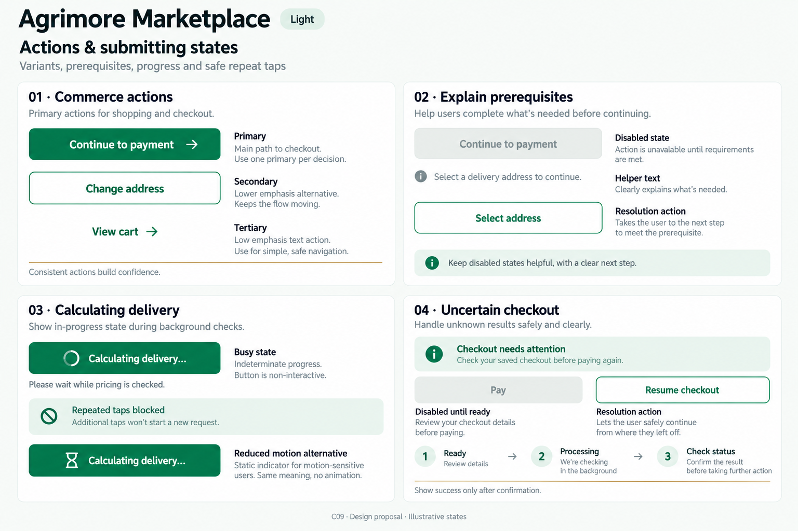
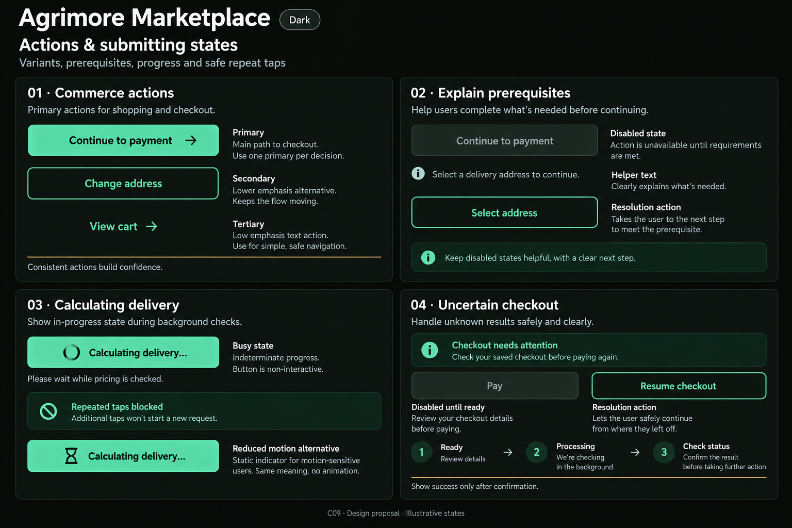
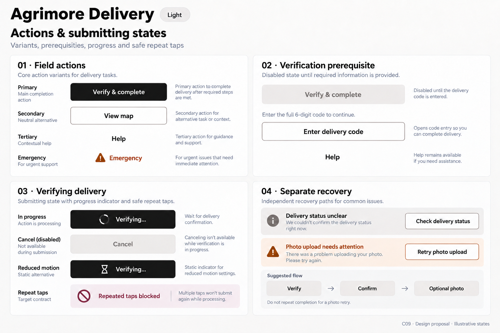
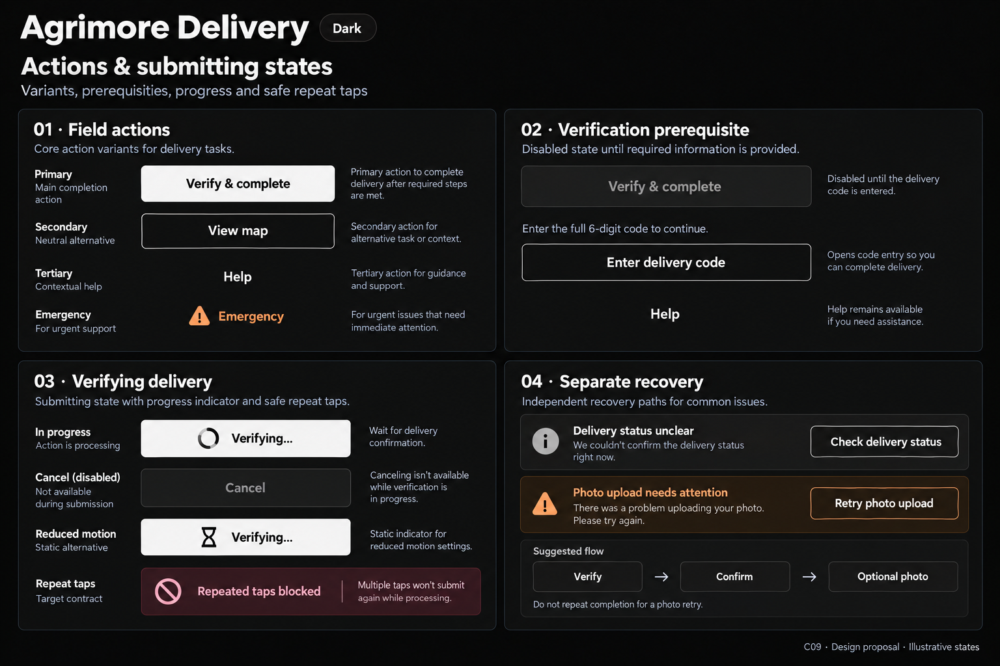
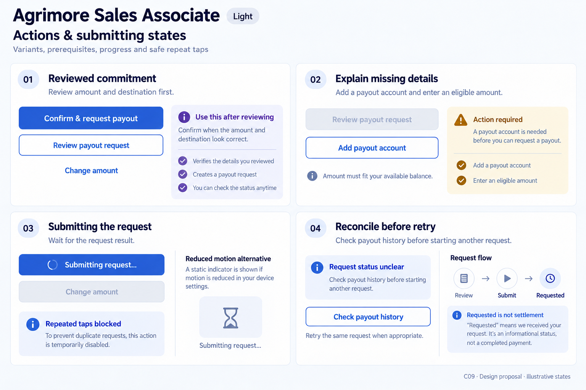
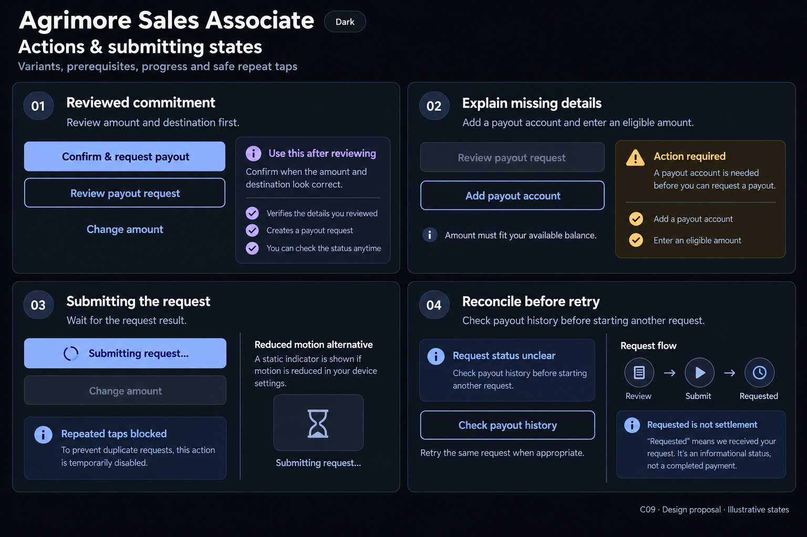
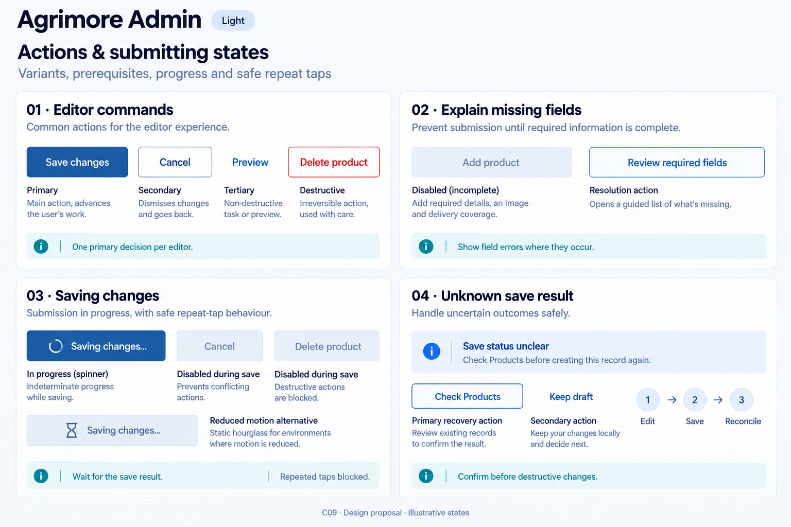
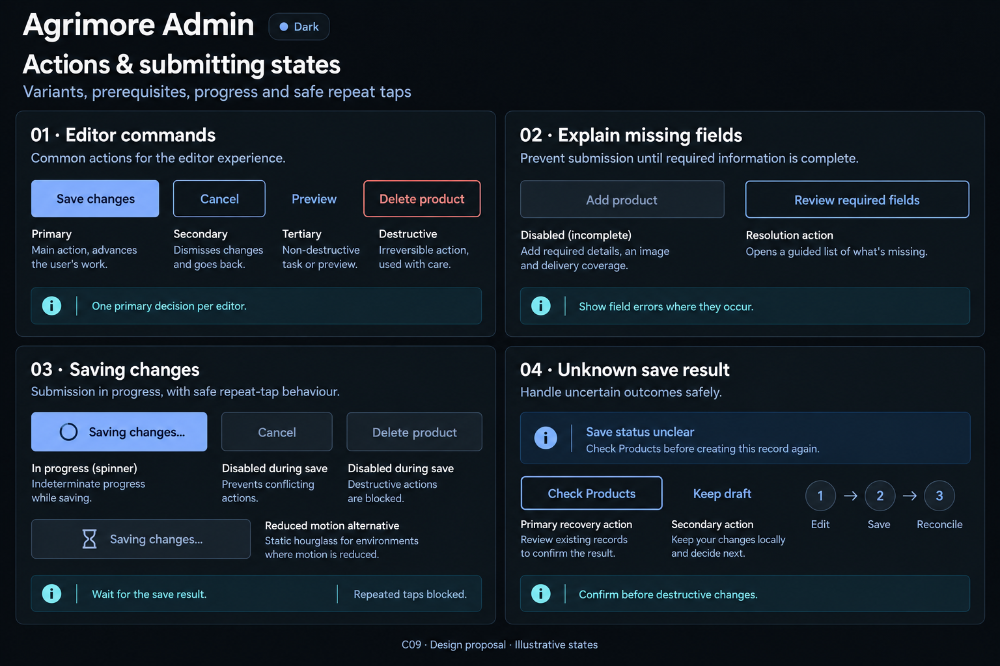

# Agrimore — C09 actions and submitting states

**PROVISIONAL_DIRECTION / TARGET_IMPLEMENTATION · v1 · 2026-10-03.** Ten Storybook reference boards, five domain-specific systems, light and dark. C01 remains the approved identity source. Static design proposals; no runtime/button migration or asset registration.

[Codebase and domain map](ACTIONS_SUBMITTING_STATES_DOMAIN_MAP_2026-10-03.md) · [Approved five-app identity](COLOR_ROLES_THEME_IDENTITY_LOCK_2026-10-02.md).

Each pair covers button variants, disabled explanations, labeled progress, duplicate-tap blocking and recovery. Examples are synthetic target specimens, not live submissions or backend confirmation. Color and typography targets are inherited exactly in manifests; image rendering is approximate.

| App | Action character |
| --- | --- |
| Agrimore Marketplace | Professional green shopping actions with warm-gold secondary accents, natural-stone helper surfaces and reassuring plain copy. |
| Agrimore Seller | Blue-teal operational controls, copper non-status accents, cool-neutral prerequisite and work-in-progress surfaces. |
| Agrimore Delivery | Black/white action hierarchy with restrained burgundy secondary controls and burnt-orange help accents; field-readable labels and strong neutral surfaces. |
| Agrimore Sales Associate | Premium muted royal-blue commitment controls with supporting indigo, pearl/slate panels and restrained financial-status copy. |
| Agrimore Admin | Professional muted institutional-blue action system with supporting cyan, steel borders and slate helper text; clear editor command hierarchy. |

## Agrimore Marketplace

Professional green shopping actions with warm-gold secondary accents, natural-stone helper surfaces and reassuring plain copy.

[App notes](../../apps/marketplace/assets/ui-mockups/09-actions-submitting-states/README.md) · [Exact prompts](../../apps/marketplace/assets/ui-mockups/09-actions-submitting-states/prompts.md) · [Manifest](../../apps/marketplace/assets/ui-mockups/09-actions-submitting-states/manifest.json).

### Light

### Dark

## Agrimore Seller

Blue-teal operational controls, copper non-status accents, cool-neutral prerequisite and work-in-progress surfaces.

[App notes](../../apps/seller/assets/ui-mockups/09-actions-submitting-states/README.md) · [Exact prompts](../../apps/seller/assets/ui-mockups/09-actions-submitting-states/prompts.md) · [Manifest](../../apps/seller/assets/ui-mockups/09-actions-submitting-states/manifest.json).

### Light

### Dark

## Agrimore Delivery

Black/white action hierarchy with restrained burgundy secondary controls and burnt-orange help accents; field-readable labels and strong neutral surfaces.

[App notes](../../apps/delivery/assets/ui-mockups/09-actions-submitting-states/README.md) · [Exact prompts](../../apps/delivery/assets/ui-mockups/09-actions-submitting-states/prompts.md) · [Manifest](../../apps/delivery/assets/ui-mockups/09-actions-submitting-states/manifest.json).

### Light

### Dark

## Agrimore Sales Associate

Premium muted royal-blue commitment controls with supporting indigo, pearl/slate panels and restrained financial-status copy.

[App notes](../../apps/employee/assets/ui-mockups/09-actions-submitting-states/README.md) · [Exact prompts](../../apps/employee/assets/ui-mockups/09-actions-submitting-states/prompts.md) · [Manifest](../../apps/employee/assets/ui-mockups/09-actions-submitting-states/manifest.json).

### Light

### Dark

## Agrimore Admin

Professional muted institutional-blue action system with supporting cyan, steel borders and slate helper text; clear editor command hierarchy.

[App notes](../../apps/admin/assets/ui-mockups/09-actions-submitting-states/README.md) · [Exact prompts](../../apps/admin/assets/ui-mockups/09-actions-submitting-states/prompts.md) · [Manifest](../../apps/admin/assets/ui-mockups/09-actions-submitting-states/manifest.json).

### Light

### Dark

