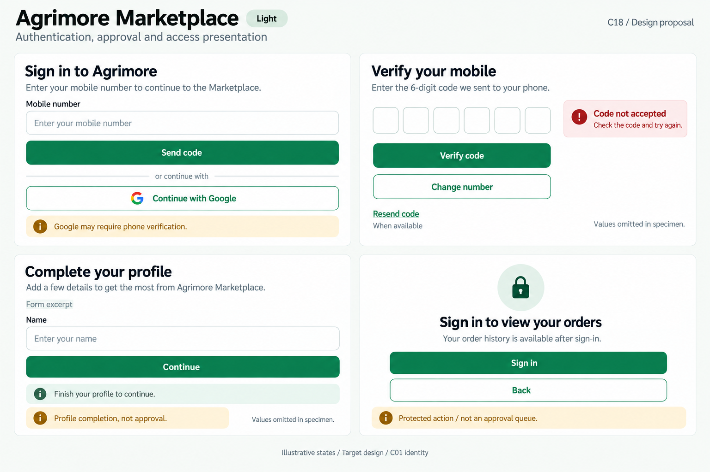
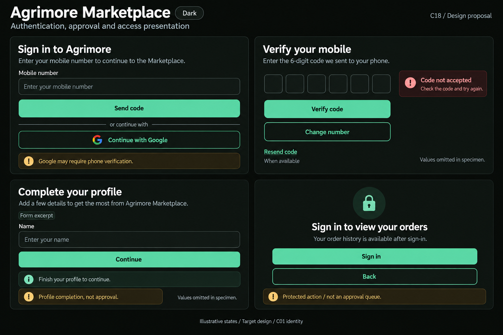
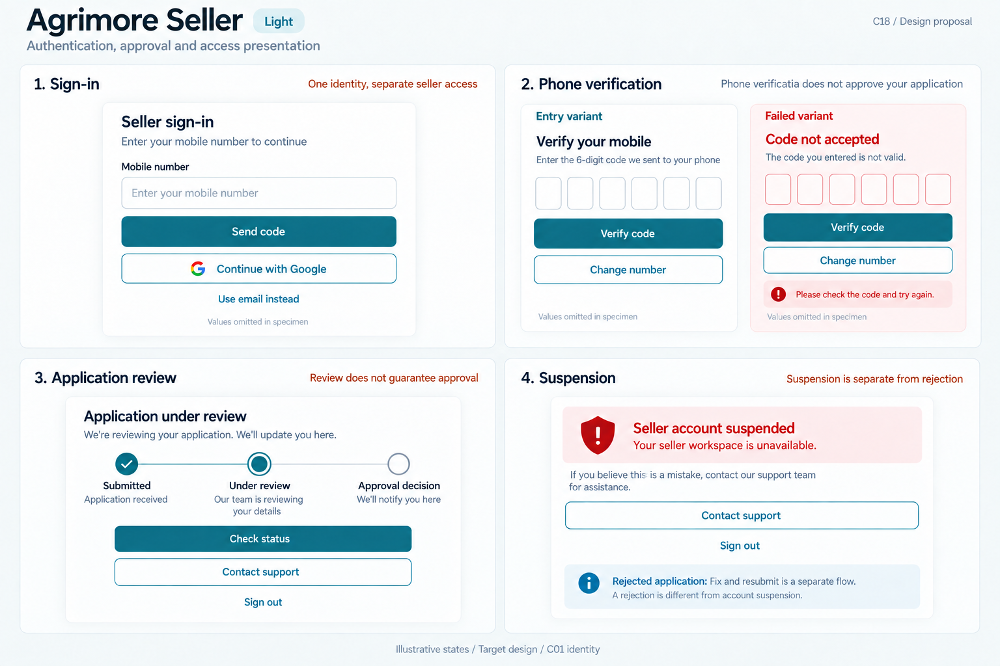
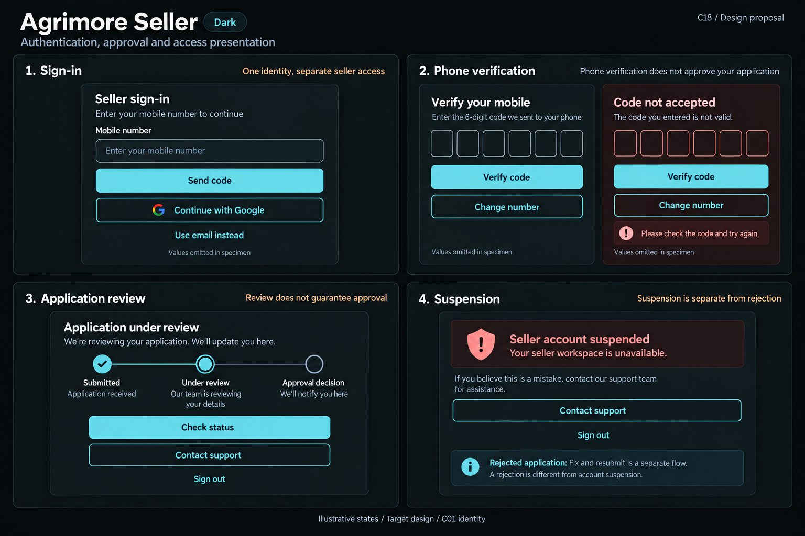
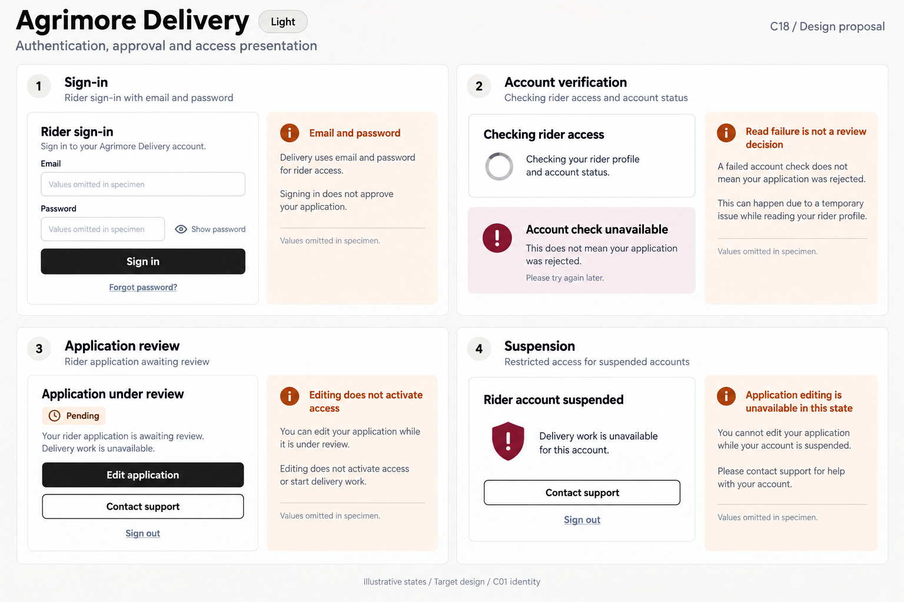
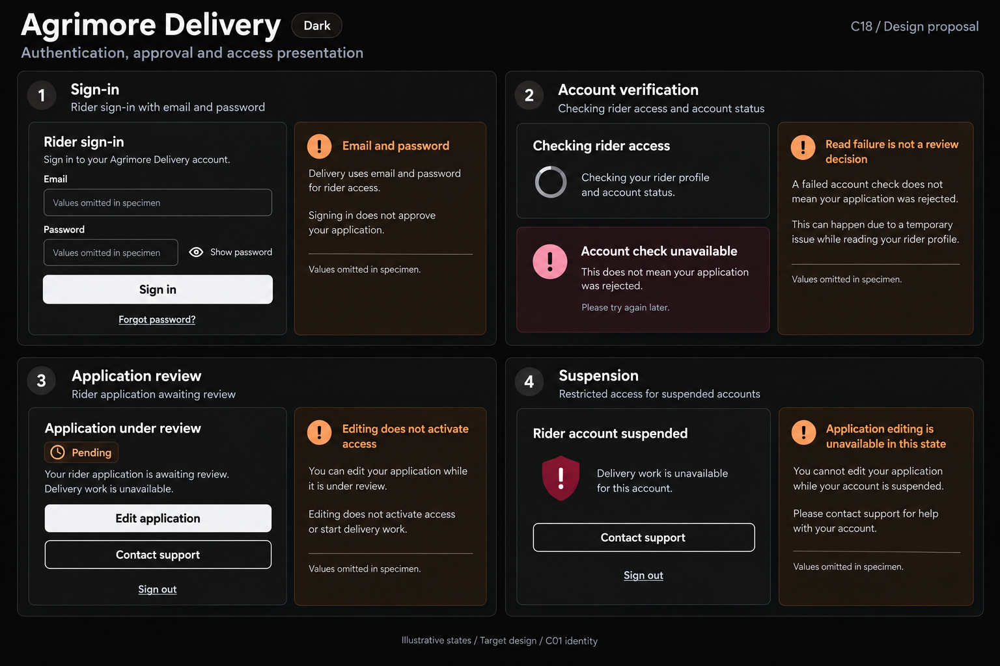
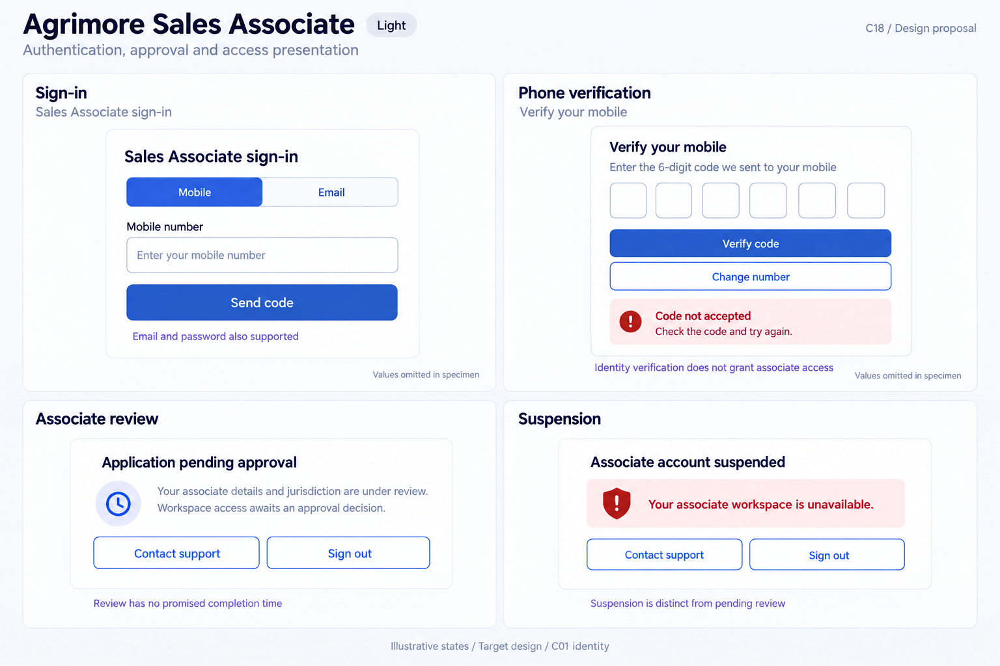
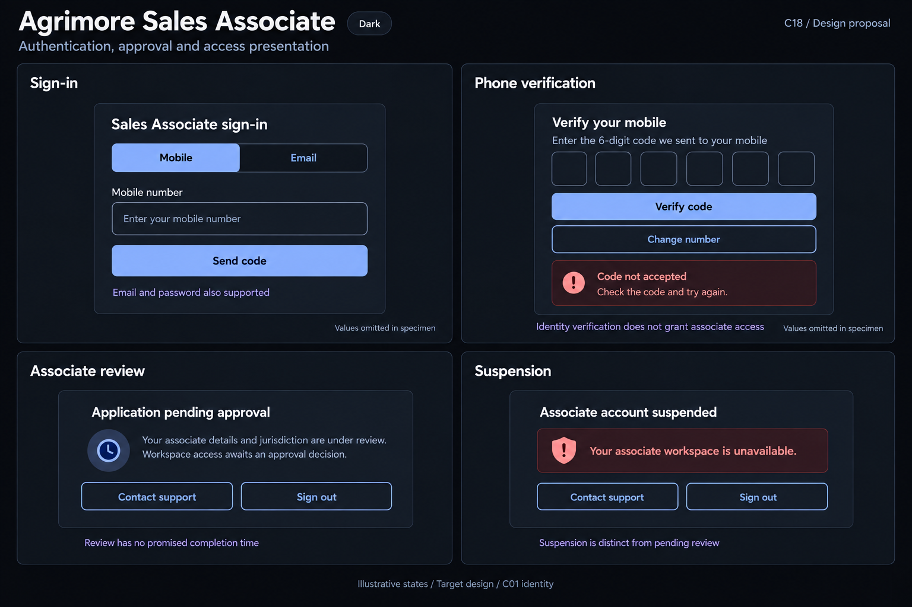
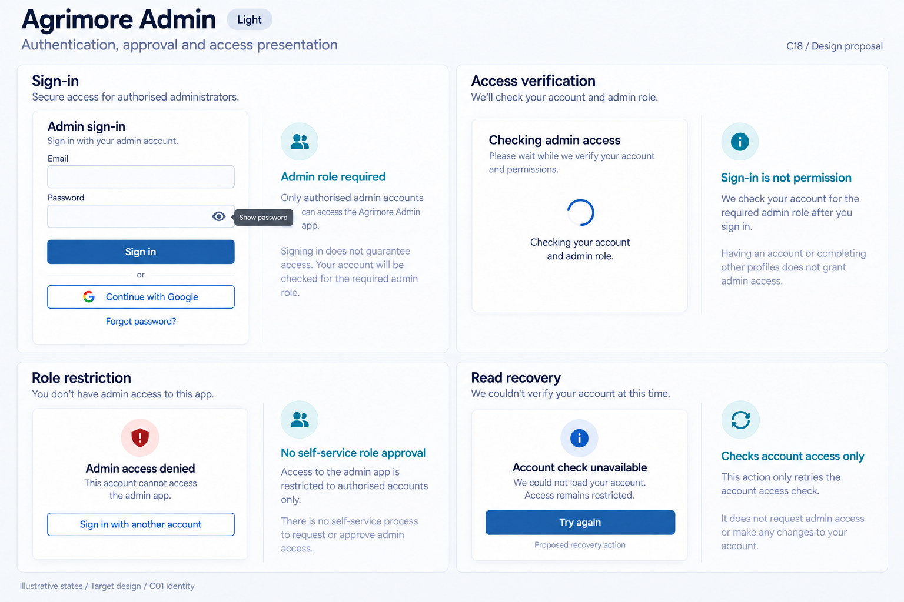
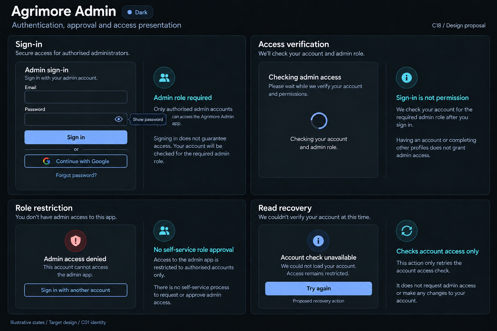

# Agrimore — C18 authentication, approval and access presentation

**PROVISIONAL_DIRECTION / TARGET_IMPLEMENTATION · v1 · 2026-10-03.** Ten premium Storybook boards: one light and one dark per app. C01 remains the approved identity reference.

[Codebase and domain map](AUTHENTICATION_APPROVAL_ACCESS_PRESENTATION_DOMAIN_MAP_2026-10-03.md) · [C01 approval index](COLOR_ROLES_THEME_IDENTITY_LOCK_2026-10-02.md).

Five distinct domain presentations preserve existing identity methods and distinguish checking access, profile completion, role approval, denied permission and restrictions. Marketplace illustrates profile completion and protected-feature sign-in, without a buyer approval queue. Delivery illustrates email/password and KYC, without OTP. Admin illustrates role denial and failed account reads, without self-provisioning or a fabricated approval/suspension flow. These generated boards are target design specimens, not implemented widgets or running app screenshots. Exact C01 token metadata is inherited; raster colours and geometry are approximate. Fields omit sample user values. Independent states are not simultaneous outcomes or a guaranteed approval sequence. No sidebar.

## Agrimore Marketplace

Welcoming professional-green buyer forms, warm-gold guidance, natural-stone surfaces and generous rounded profile cards.

[App notes](../../apps/marketplace/assets/ui-mockups/18-authentication-approval-access-presentation/README.md) · [Prompts](../../apps/marketplace/assets/ui-mockups/18-authentication-approval-access-presentation/prompts.md) · [Manifest](../../apps/marketplace/assets/ui-mockups/18-authentication-approval-access-presentation/manifest.json).

### Light

### Dark

## Agrimore Seller

Compact blue-teal merchant identity panels, copper application context, cool-neutral review surfaces and clear operational restriction cards.

[App notes](../../apps/seller/assets/ui-mockups/18-authentication-approval-access-presentation/README.md) · [Prompts](../../apps/seller/assets/ui-mockups/18-authentication-approval-access-presentation/prompts.md) · [Manifest](../../apps/seller/assets/ui-mockups/18-authentication-approval-access-presentation/manifest.json).

### Light

### Dark

## Agrimore Delivery

High-contrast black/white rider credential forms, burgundy restriction cues, burnt-orange field guidance and large task-ready controls.

[App notes](../../apps/delivery/assets/ui-mockups/18-authentication-approval-access-presentation/README.md) · [Prompts](../../apps/delivery/assets/ui-mockups/18-authentication-approval-access-presentation/prompts.md) · [Manifest](../../apps/delivery/assets/ui-mockups/18-authentication-approval-access-presentation/manifest.json).

### Light

### Dark

## Agrimore Sales Associate

Premium royal-blue associate forms, indigo jurisdiction-review context, pearl/slate cards and restrained status hierarchy.

[App notes](../../apps/employee/assets/ui-mockups/18-authentication-approval-access-presentation/README.md) · [Prompts](../../apps/employee/assets/ui-mockups/18-authentication-approval-access-presentation/prompts.md) · [Manifest](../../apps/employee/assets/ui-mockups/18-authentication-approval-access-presentation/manifest.json).

### Light

### Dark

## Agrimore Admin

Professional-blue controlled-entry forms, cyan role explanations, steel/slate status rows and precise refusal copy.

[App notes](../../apps/admin/assets/ui-mockups/18-authentication-approval-access-presentation/README.md) · [Prompts](../../apps/admin/assets/ui-mockups/18-authentication-approval-access-presentation/prompts.md) · [Manifest](../../apps/admin/assets/ui-mockups/18-authentication-approval-access-presentation/manifest.json).

### Light

### Dark

## Artifact verification evidence

The C18 asset validator passed after packaging: ten valid PNGs in five light/dark pairs, 27 declared new files, 13 exact initial/refinement prompt blocks with input/output hashes, 91 local document links, and all 810 earlier design files preserved byte-for-byte. Each PNG matches its selected generated source; PNG chunk CRCs and dimensions were checked. C01 APPROVED_LOCKED reference hashes, palette/status metadata, typography, spacing, radius and border metadata were verified for all ten variants. Raster color, geometry, accessibility and auth behavior remain unverified by these asset checks.

Fresh static inventory: 818 eligible source files / 271,696 lines at `a803a9d1866477ac621be50a9a3d3de1a2fa0800`. Validation observed HEAD `453a432e844174fcf90517744457ec85dada375c` on `agrimore/foundation-f3c-distance-delivery-pricing`. Concurrent changes before packaging were observed in `apps/marketplace/lib/providers/product_credit_provider.dart` and `apps/marketplace/lib/providers/rfq_provider.dart`; this task preserved them. The first post-packaging validation observed no changes in the 818 inventoried source files relative to the packaging baseline. A subsequent validation after adding this evidence observed another concurrent change in apps/marketplace/lib/providers/rfq_provider.dart. The ten hashed platform configurations matched inventory. These are recorded snapshots; this task did not edit those source files. These observations do not imply a frozen checkout or repo-wide runtime verification.

Visual review selected one Seller light refinement to remove a sample phone value and label verification variants, plus Admin light/dark refinements to retain one password-visibility control. Initial outputs and exact refinement provenance are recorded; selected PNG bytes were copied without image editing. Built-in image_gen was used. No runtime auth/provider/router/backend implementation, live calls, deployment, commits or other-chat interruption by this task.

