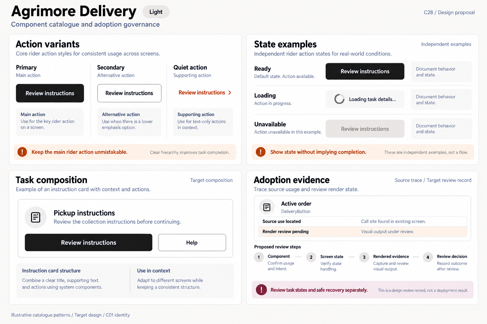
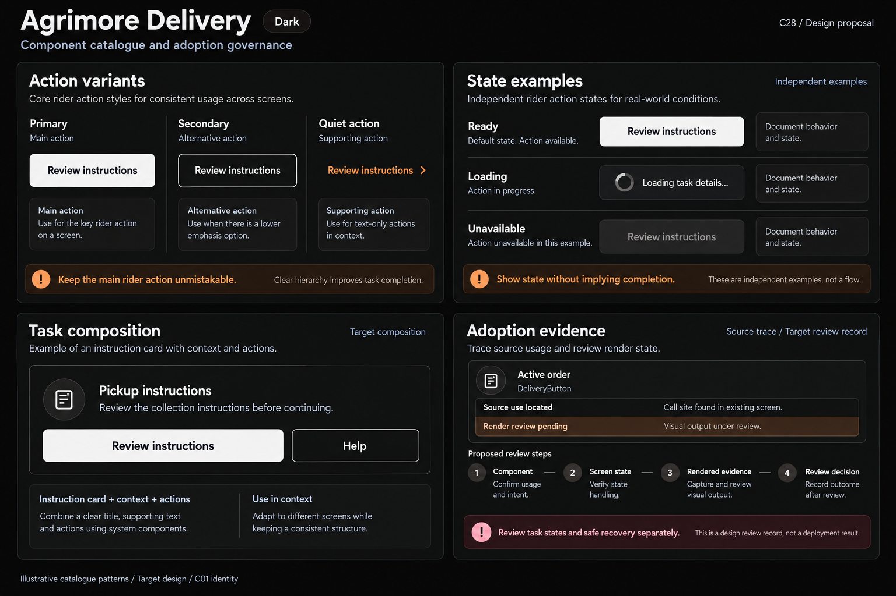
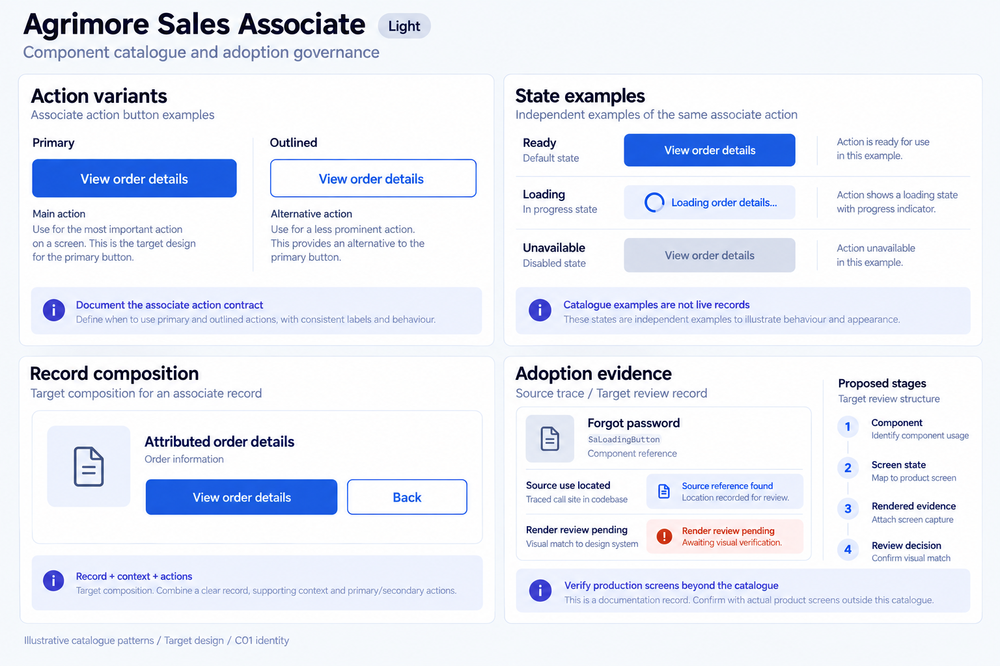
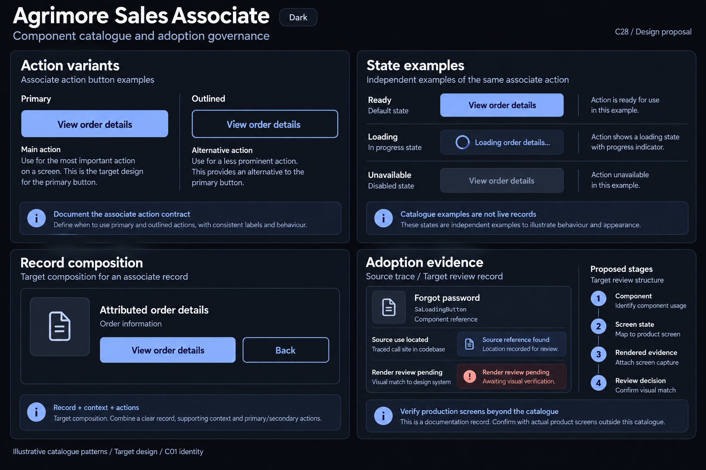
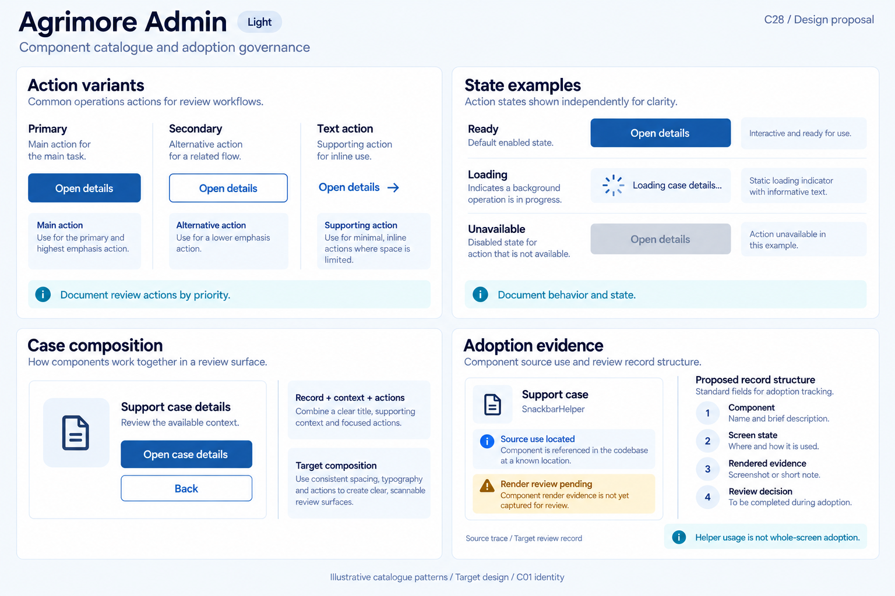
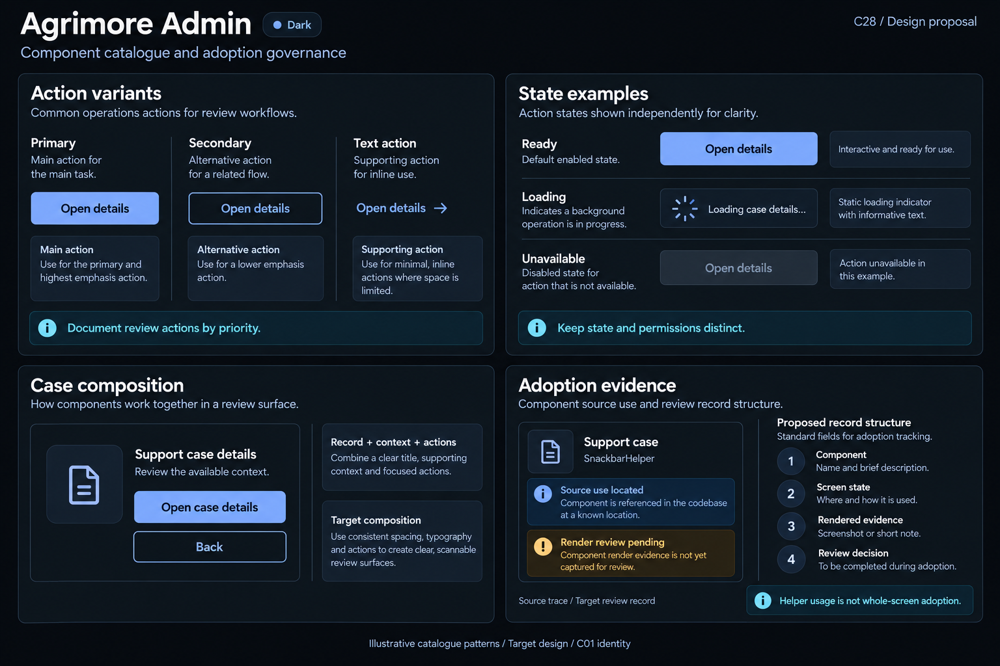

# Agrimore — C28 component catalogue and adoption governance

**PROVISIONAL_DIRECTION / TARGET_IMPLEMENTATION · v1 · 2026-10-04.** Ten premium Storybook boards: light and dark for each app, inheriting approved C01 identity metadata.

[Codebase, component inventory and adoption map](COMPONENT_CATALOGUE_ADOPTION_GOVERNANCE_DOMAIN_MAP_2026-10-04.md) · [C01 approval index](COLOR_ROLES_THEME_IDENTITY_LOCK_2026-10-02.md).

Each pair documents action variants, independent ready/loading/unavailable examples, domain composition and a proposed adoption record. Five actual Flutter source uses are traced; render review remains pending. Images are target designs, not screenshots of executed widgets or evidence of finished migrations. No sidebar. C01 raster values are approximate.

## Agrimore Marketplace

Professional-green customer components, warm-gold catalogue annotations and natural-stone surfaces.

[App notes](../../apps/marketplace/assets/ui-mockups/28-component-catalogue-adoption-governance/README.md) · [Prompts](../../apps/marketplace/assets/ui-mockups/28-component-catalogue-adoption-governance/prompts.md) · [Manifest](../../apps/marketplace/assets/ui-mockups/28-component-catalogue-adoption-governance/manifest.json).

### Light

### Dark

## Agrimore Seller

Blue-teal merchant component library, copper catalogue notes and cool-neutral editor surfaces.

[App notes](../../apps/seller/assets/ui-mockups/28-component-catalogue-adoption-governance/README.md) · [Prompts](../../apps/seller/assets/ui-mockups/28-component-catalogue-adoption-governance/prompts.md) · [Manifest](../../apps/seller/assets/ui-mockups/28-component-catalogue-adoption-governance/manifest.json).

### Light

### Dark

## Agrimore Delivery

Monochrome rider catalogue with burnt-orange state guidance and burgundy review context.

[App notes](../../apps/delivery/assets/ui-mockups/28-component-catalogue-adoption-governance/README.md) · [Prompts](../../apps/delivery/assets/ui-mockups/28-component-catalogue-adoption-governance/prompts.md) · [Manifest](../../apps/delivery/assets/ui-mockups/28-component-catalogue-adoption-governance/manifest.json).

### Light

### Dark

## Agrimore Sales Associate

Premium royal-blue catalogue, indigo evidence notes and pearl/slate associate records.

[App notes](../../apps/employee/assets/ui-mockups/28-component-catalogue-adoption-governance/README.md) · [Prompts](../../apps/employee/assets/ui-mockups/28-component-catalogue-adoption-governance/prompts.md) · [Manifest](../../apps/employee/assets/ui-mockups/28-component-catalogue-adoption-governance/manifest.json).

### Light

### Dark

## Agrimore Admin

Professional-blue operations components, cyan evidence guidance and steel/slate review surfaces.

[App notes](../../apps/admin/assets/ui-mockups/28-component-catalogue-adoption-governance/README.md) · [Prompts](../../apps/admin/assets/ui-mockups/28-component-catalogue-adoption-governance/prompts.md) · [Manifest](../../apps/admin/assets/ui-mockups/28-component-catalogue-adoption-governance/manifest.json).

### Light

### Dark

## Asset integrity check

First post-packaging snapshot: **PASS**. Ten 1536 × 1024 PNGs form five light/dark pairs. PNG chunk checksums, copied-output hashes, 15 exact generation/refinement prompt blocks, reference-input hashes, approved C01 token metadata, source-snapshot manifest records and 534 local document links verified. Exactly 27 new repository files; all 1080 earlier design files remained byte-for-byte intact.

All ten selected boards received visual review for distinct C01 identities, readable inverse dark-primary content, target action variants, independent loading/unavailable examples, domain composition and honest source-use/render-pending records. Every light board received a focused refinement to remove implementation/code/token annotations and certification-like icons; the Seller refinement removed an invented source-file path. Dark boards use approved C01 dark identity plus selected light composition references. Source call sites are documentation annotations, not proof of completed runtime screen migration. Exact selected generation/refinement history is preserved in app prompts/manifests.

Component source inventory: 57 candidate family files; presentation mapping queue: 372 Dart files, not a distinct-route count; 5 manual source traces. All rendered/adoption states remain NOT_RUN / NOT_VERIFIED. Widget/golden test sources exist but were not executed. No reviewer approval or release adoption was created.

Snapshot HEAD: d3af89aea725924241f35505397772d8c48e15f6; inventory HEAD: 64a71d4e6e6bff5ab04e9dcd38bc84d24f3b266a; branch: agrimore/foundation-f3c-distance-delivery-pricing. Source changes between inventory and packaging were observed and preserved: apps/marketplace/lib/providers/review_provider.dart, apps/marketplace/lib/screens/user/shop/widgets/add_review_dialog.dart, apps/marketplace/lib/screens/user/shop/widgets/review_card.dart. Additional source changes during packaging/check were observed and preserved: apps/marketplace/lib/screens/user/shop/widgets/review_card.dart. Platform configuration changes since inventory were not observed. Component/presentation source changes since mapping snapshot were observed and preserved: apps/marketplace/lib/screens/user/shop/widgets/review_card.dart. This is a point-in-time observation; another chat may continue advancing the shared checkout.

Scope: asset/doc/source-snapshot integrity only. Raster review does not establish rendered Flutter behavior, accessibility compliance, executed state tests, C01 pixel-exact adoption, full screen migration or a release decision. No runtime/package folder, app/widget, test source or backend was changed by this task. C28 remains PROVISIONAL_DIRECTION / TARGET_IMPLEMENTATION; C01 remains APPROVED_LOCKED.
