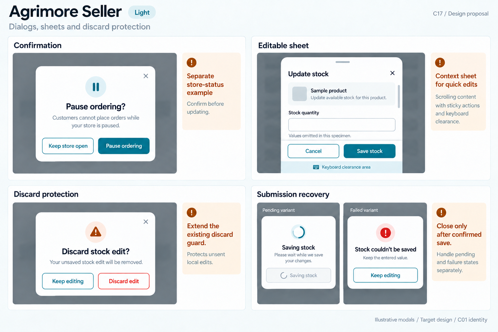
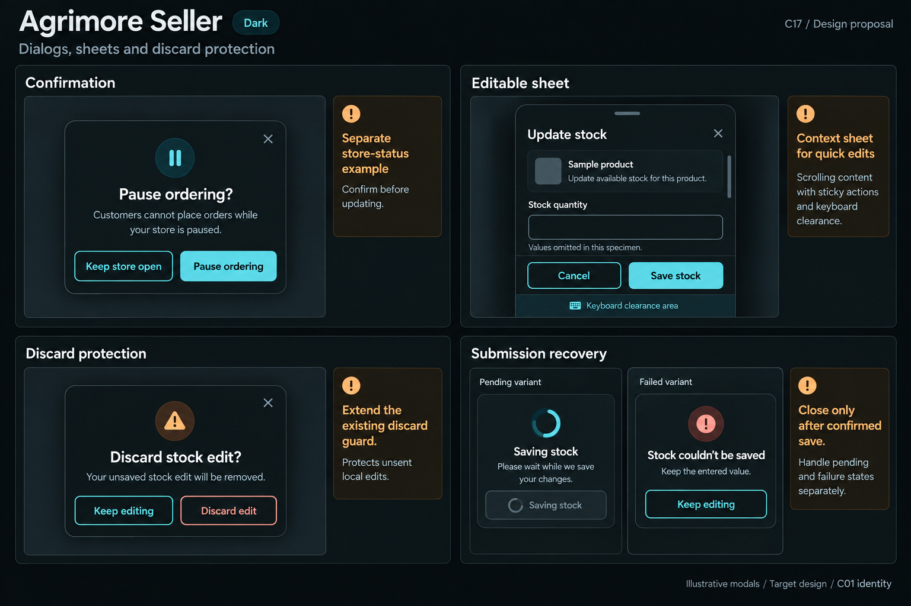
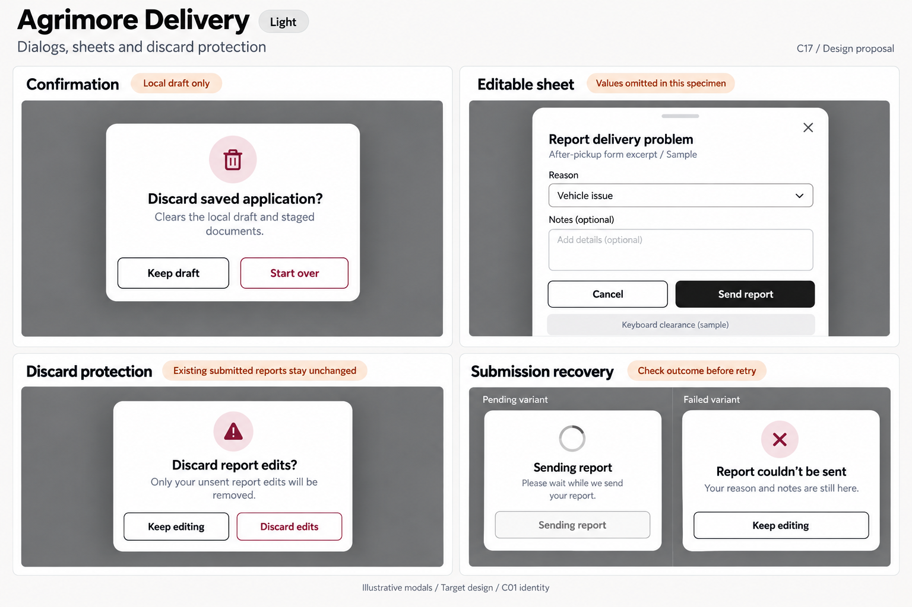
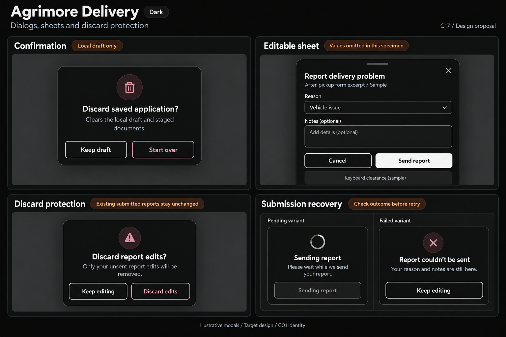
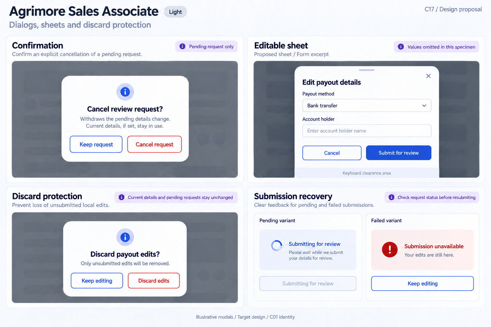
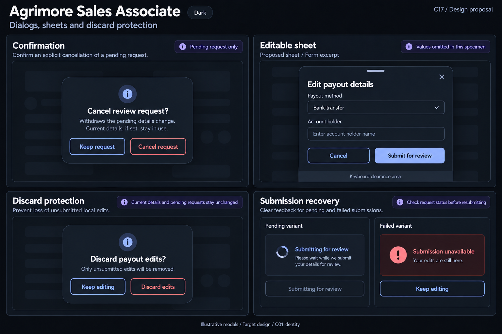

# Agrimore — C17 dialogs, sheets and discard protection

**PROVISIONAL_DIRECTION / TARGET_IMPLEMENTATION · v1 · 2026-10-03.** Ten premium Storybook boards: one light and one dark per app. C01 remains the approved identity reference.

[Codebase and domain map](DIALOGS_SHEETS_DISCARD_PROTECTION_DOMAIN_MAP_2026-10-03.md) · [C01 approval index](COLOR_ROLES_THEME_IDENTITY_LOCK_2026-10-02.md).

Each app illustrates explicit consequence confirmation, a domain editor sheet, local dirty-edit protection and independent pending/failure recovery. Cart clearing, local draft reset, pending-review cancellation and case-link removal retain different scopes. These are generated design specimens, not implemented widgets or app screenshots. Token metadata is inherited exactly; raster colors, type and geometry remain approximate. Empty specimen fields deliberately omit user-entered values; future runtime preserves the actual input. Success/failure/pending sub-specimens are independent illustrative variants, never simultaneous live outcomes. Guard and modal-accessibility behavior is proposed; panels are not actual running app screenshots. Existing sheets/pages and proposed adaptations are distinguished in the domain map. No sidebar.

## Agrimore Marketplace

Professional-green buyer dialogs, warm-gold consequences, natural-stone scrims and rounded quote-request sheets.

[App notes](../../apps/marketplace/assets/ui-mockups/17-dialogs-sheets-discard-protection/README.md) · [Prompts](../../apps/marketplace/assets/ui-mockups/17-dialogs-sheets-discard-protection/prompts.md) · [Manifest](../../apps/marketplace/assets/ui-mockups/17-dialogs-sheets-discard-protection/manifest.json).

### Light

### Dark

## Agrimore Seller

Compact blue-teal merchant confirmations, copper consequences, cool-neutral stock sheets and operational sticky footers.

[App notes](../../apps/seller/assets/ui-mockups/17-dialogs-sheets-discard-protection/README.md) · [Prompts](../../apps/seller/assets/ui-mockups/17-dialogs-sheets-discard-protection/prompts.md) · [Manifest](../../apps/seller/assets/ui-mockups/17-dialogs-sheets-discard-protection/manifest.json).

### Light

### Dark

## Agrimore Delivery

High-contrast black/white field sheets, burgundy local-discard warnings, burnt-orange task scope and large labelled controls.

[App notes](../../apps/delivery/assets/ui-mockups/17-dialogs-sheets-discard-protection/README.md) · [Prompts](../../apps/delivery/assets/ui-mockups/17-dialogs-sheets-discard-protection/prompts.md) · [Manifest](../../apps/delivery/assets/ui-mockups/17-dialogs-sheets-discard-protection/manifest.json).

### Light

### Dark

## Agrimore Sales Associate

Premium royal-blue review-request sheets, indigo scope guidance and calm pearl/slate modal surfaces.

[App notes](../../apps/employee/assets/ui-mockups/17-dialogs-sheets-discard-protection/README.md) · [Prompts](../../apps/employee/assets/ui-mockups/17-dialogs-sheets-discard-protection/prompts.md) · [Manifest](../../apps/employee/assets/ui-mockups/17-dialogs-sheets-discard-protection/manifest.json).

### Light

### Dark

## Agrimore Admin

Professional-blue operational dialogs, cyan scope explanations, steel/slate dense form surfaces and precise destructive consequences.

[App notes](../../apps/admin/assets/ui-mockups/17-dialogs-sheets-discard-protection/README.md) · [Prompts](../../apps/admin/assets/ui-mockups/17-dialogs-sheets-discard-protection/prompts.md) · [Manifest](../../apps/admin/assets/ui-mockups/17-dialogs-sheets-discard-protection/manifest.json).

### Light

### Dark

## Asset verification

**PASS — asset and document integrity only.** Ten selected PNGs form five light/dark pairs. PNG headers, dimensions, chunk CRCs, copied bytes and SHA-256 hashes verified; C01 palette/status/type/spacing/radius/border metadata matches the approved locks exactly. 13 exact generation/refinement prompt blocks and 80 local document links verified. All 783 earlier design files, including C16, remain byte-identical. All selected boards were visually reviewed.

The source inventory was captured at HEAD 97f171f00f8330f1ae7c831845e4dd94a8ae2c33 (817 eligible source files / 271,604 lines). Concurrent work advanced HEAD to 15291767d80f99a209b9aac11c8665dc217be17c and changed `functions/src/delivery/riderMoney.ts` before packaging; that file is outside the focused C17 modal sources. These changes were observed and preserved, not modified or reverted by this design task. No inventoried source changed during packaging, and the ten observed platform configs remain unchanged since inventory. Branch remains `agrimore/foundation-f3c-distance-delivery-pricing`. No runtime, assistive-technology or pixel-exact raster certification is implied.

