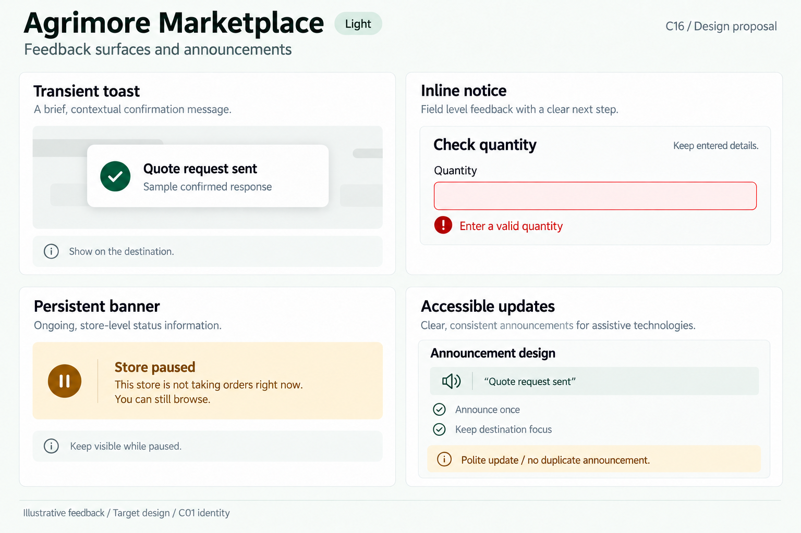
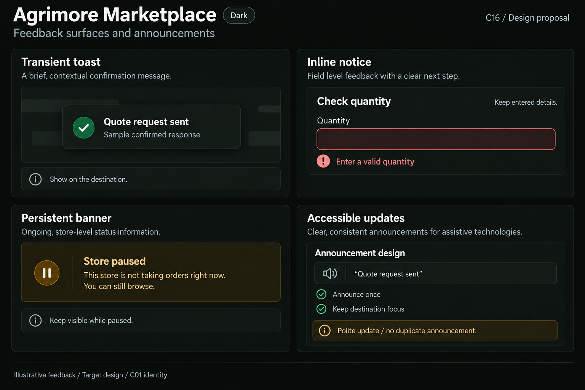
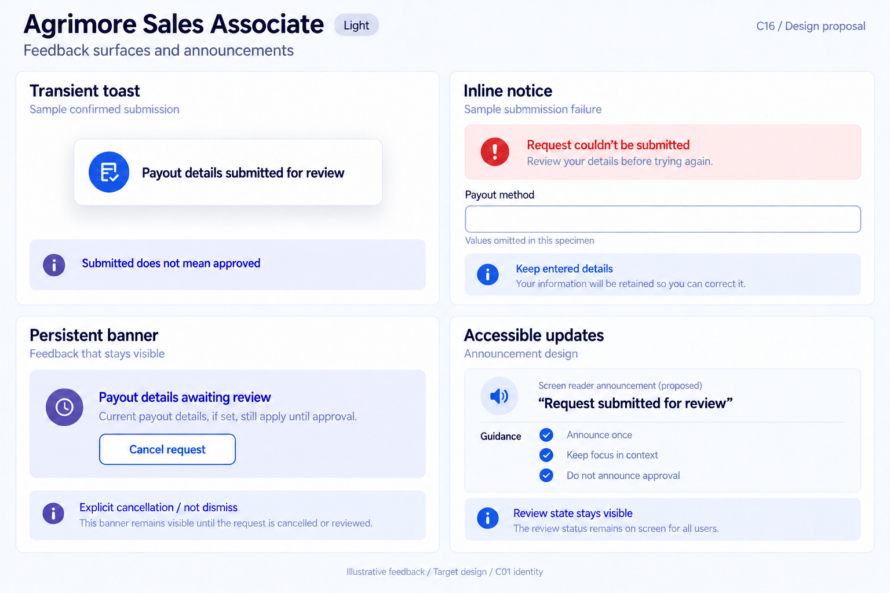
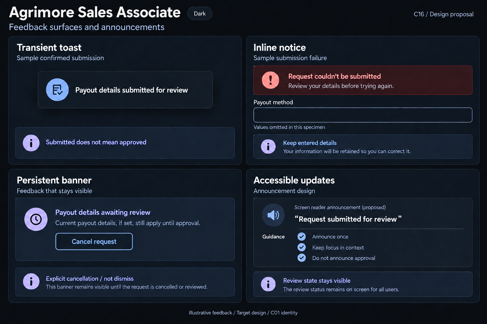
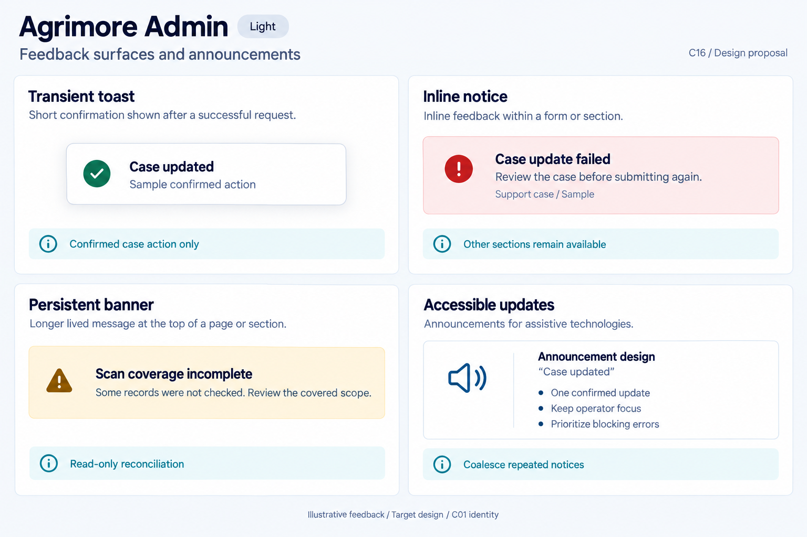
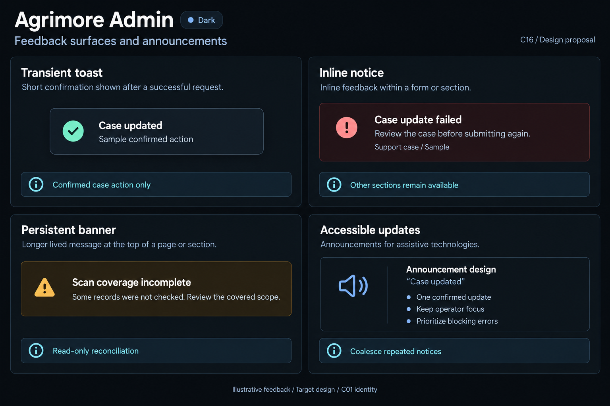

# Agrimore — C16 feedback surfaces and announcements

**PROVISIONAL_DIRECTION / TARGET_IMPLEMENTATION · v1 · 2026-10-03.** Ten premium Storybook boards: one light and one dark per app. C01 remains the approved identity reference.

[Codebase and domain map](FEEDBACK_SURFACES_ANNOUNCEMENTS_DOMAIN_MAP_2026-10-03.md) · [C01 approval index](COLOR_ROLES_THEME_IDENTITY_LOCK_2026-10-02.md).

Each app illustrates a brief confirmed-event toast, action-scoped inline notice, persistent domain condition and proposed accessible announcement rules. Confirmation scope is specific: quote request, stock change, proof photo, payout-review submission or case update. These are generated design specimens, not implemented widgets or app screenshots. Token metadata is inherited exactly; raster colors, type and geometry remain approximate. Empty specimen fields deliberately omit user-entered values; future runtime preserves the actual input. Success/failure/pending sub-specimens are independent illustrative variants, never simultaneous live outcomes. Announcement rows are design annotations, not screen-reader transcripts. No sidebar.

## Agrimore Marketplace

Professional-green buyer feedback with warm-gold context and natural-stone storefront surfaces.

[App notes](../../apps/marketplace/assets/ui-mockups/16-feedback-surfaces-announcements/README.md) · [Prompts](../../apps/marketplace/assets/ui-mockups/16-feedback-surfaces-announcements/prompts.md) · [Manifest](../../apps/marketplace/assets/ui-mockups/16-feedback-surfaces-announcements/manifest.json).

### Light

### Dark

## Agrimore Seller

Blue-teal operational feedback, copper guidance, compact cool-neutral surfaces and footer-aware floating toasts.

[App notes](../../apps/seller/assets/ui-mockups/16-feedback-surfaces-announcements/README.md) · [Prompts](../../apps/seller/assets/ui-mockups/16-feedback-surfaces-announcements/prompts.md) · [Manifest](../../apps/seller/assets/ui-mockups/16-feedback-surfaces-announcements/manifest.json).

### Light

### Dark

## Agrimore Delivery

High-contrast black/white field feedback, burgundy error context, burnt-orange recovery guidance and generous labelled actions.

[App notes](../../apps/delivery/assets/ui-mockups/16-feedback-surfaces-announcements/README.md) · [Prompts](../../apps/delivery/assets/ui-mockups/16-feedback-surfaces-announcements/prompts.md) · [Manifest](../../apps/delivery/assets/ui-mockups/16-feedback-surfaces-announcements/manifest.json).

### Light

### Dark

## Agrimore Sales Associate

Premium royal-blue relationship and payout-review feedback, indigo pending context with pearl/slate surfaces.

[App notes](../../apps/employee/assets/ui-mockups/16-feedback-surfaces-announcements/README.md) · [Prompts](../../apps/employee/assets/ui-mockups/16-feedback-surfaces-announcements/prompts.md) · [Manifest](../../apps/employee/assets/ui-mockups/16-feedback-surfaces-announcements/manifest.json).

### Light

### Dark

## Agrimore Admin

Professional-blue operational feedback, cyan context cues and dense steel/slate information surfaces.

[App notes](../../apps/admin/assets/ui-mockups/16-feedback-surfaces-announcements/README.md) · [Prompts](../../apps/admin/assets/ui-mockups/16-feedback-surfaces-announcements/prompts.md) · [Manifest](../../apps/admin/assets/ui-mockups/16-feedback-surfaces-announcements/manifest.json).

### Light

### Dark

## Asset verification

**PASS — asset and document integrity only.** Ten selected PNGs form five light/dark pairs. PNG headers, dimensions, chunk CRCs, byte copies and SHA-256 hashes verified; C01 palettes, status colors, typography, spacing, radii and border metadata match the approved locks exactly. Seventeen exact generation/refinement prompt blocks and 86 local document links verified. All 756 earlier design files remain byte-identical. The 817 inventoried source files and ten observed Android/iOS configs remain unchanged across packaging; Git HEAD and branch remain unchanged. All selected images were visually reviewed. No runtime, assistive-technology or pixel-exact raster certification is implied.
