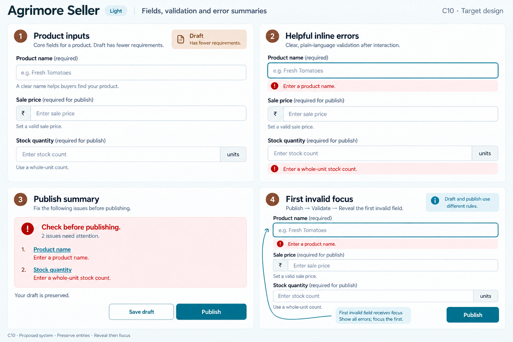
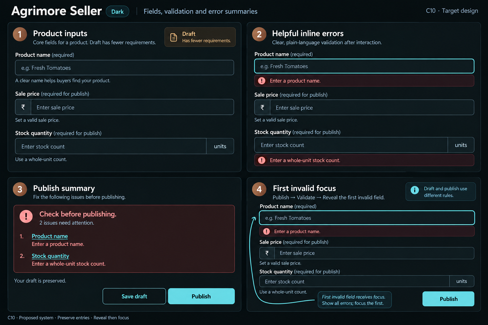
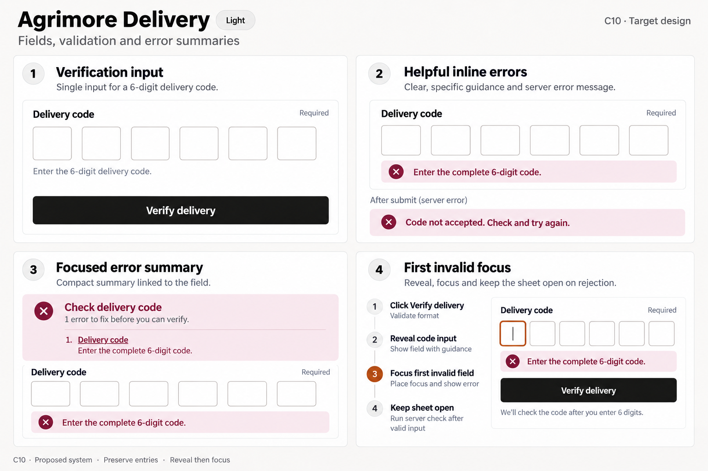
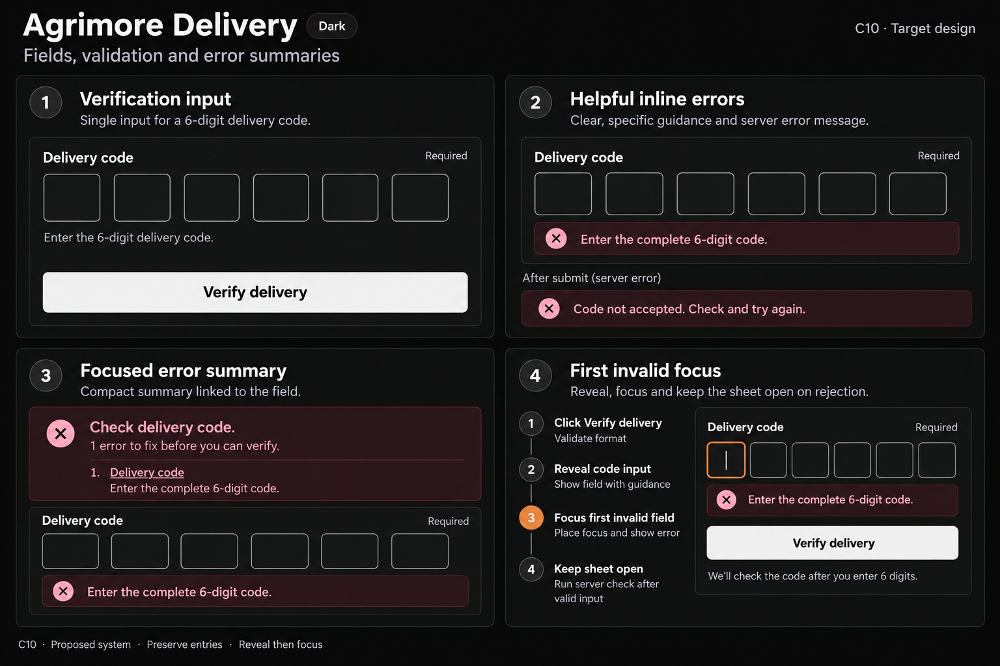
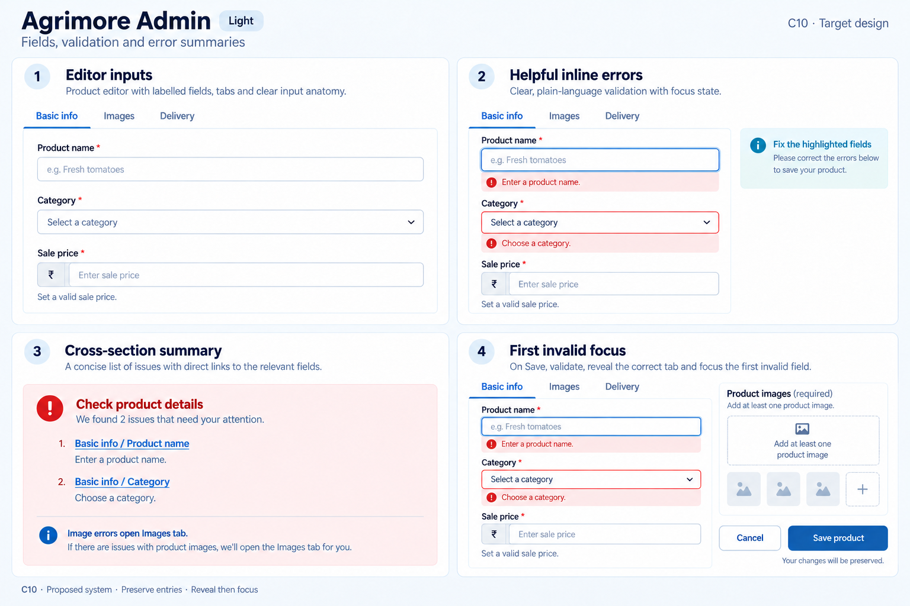
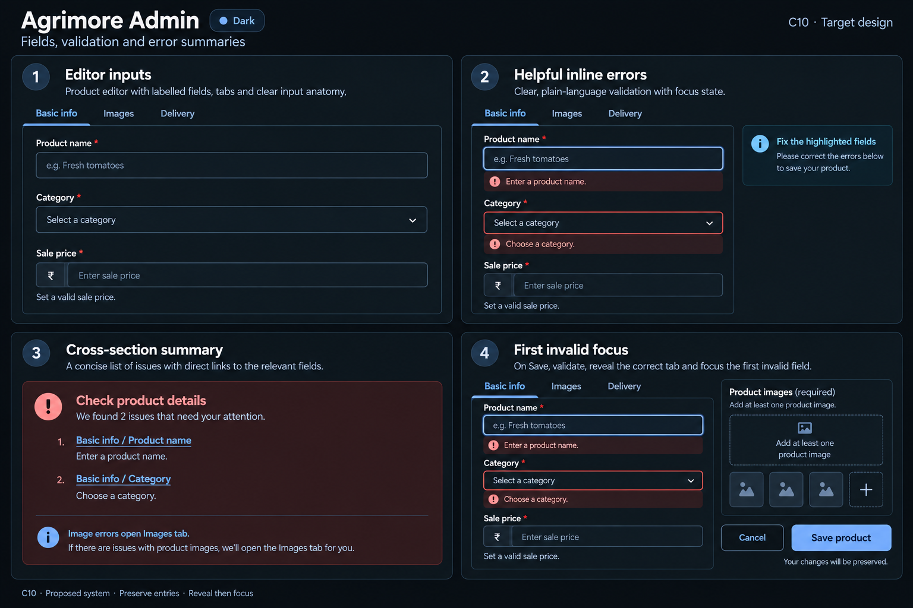

# Agrimore — C10 fields, validation and error summaries

**PROVISIONAL_DIRECTION / TARGET_IMPLEMENTATION · v1 · 2026-10-03.** Ten premium Storybook boards, light and dark for five apps. C01 is the approved identity source.

[Codebase/domain map](FIELDS_VALIDATION_ERROR_SUMMARIES_DOMAIN_MAP_2026-10-03.md) · [Locked C01 identity](COLOR_ROLES_THEME_IDENTITY_LOCK_2026-10-02.md).

Static proposals covering domain input anatomy, helpful errors, matched error summaries and first-invalid focus. Each pair uses its own identity and workflow. No runtime field migration or asset registration. Exact token targets are recorded; raster rendering is approximate. Boards display isolated state specimens and selected error subsets, not complete validated forms. Neutral empty controls elsewhere are anatomy examples, not proof of valid values. Runtime summaries must include every actual failure.

## Agrimore Marketplace

Welcoming address form, clear regional dependencies and generous helper text.

[App notes](../../apps/marketplace/assets/ui-mockups/10-fields-validation-error-summaries/README.md) · [Exact prompts](../../apps/marketplace/assets/ui-mockups/10-fields-validation-error-summaries/prompts.md) · [Manifest](../../apps/marketplace/assets/ui-mockups/10-fields-validation-error-summaries/manifest.json).

### Light

### Dark

## Agrimore Seller

Compact blue-teal product editor with copper section cues, units and draft-aware requirements.

[App notes](../../apps/seller/assets/ui-mockups/10-fields-validation-error-summaries/README.md) · [Exact prompts](../../apps/seller/assets/ui-mockups/10-fields-validation-error-summaries/prompts.md) · [Manifest](../../apps/seller/assets/ui-mockups/10-fields-validation-error-summaries/manifest.json).

### Light

### Dark

## Agrimore Delivery

High-contrast monochrome verification sheet, burgundy error states and burnt-orange focus.

[App notes](../../apps/delivery/assets/ui-mockups/10-fields-validation-error-summaries/README.md) · [Exact prompts](../../apps/delivery/assets/ui-mockups/10-fields-validation-error-summaries/prompts.md) · [Manifest](../../apps/delivery/assets/ui-mockups/10-fields-validation-error-summaries/manifest.json).

### Light

### Dark

## Agrimore Sales Associate

Premium royal-blue payout form with indigo guidance, masked destination and deliberate money hierarchy.

[App notes](../../apps/employee/assets/ui-mockups/10-fields-validation-error-summaries/README.md) · [Exact prompts](../../apps/employee/assets/ui-mockups/10-fields-validation-error-summaries/prompts.md) · [Manifest](../../apps/employee/assets/ui-mockups/10-fields-validation-error-summaries/manifest.json).

### Light

### Dark

## Agrimore Admin

Structured professional-blue editor, compact cyan section cues and tab-aware error routing.

[App notes](../../apps/admin/assets/ui-mockups/10-fields-validation-error-summaries/README.md) · [Exact prompts](../../apps/admin/assets/ui-mockups/10-fields-validation-error-summaries/prompts.md) · [Manifest](../../apps/admin/assets/ui-mockups/10-fields-validation-error-summaries/manifest.json).

### Light

### Dark

