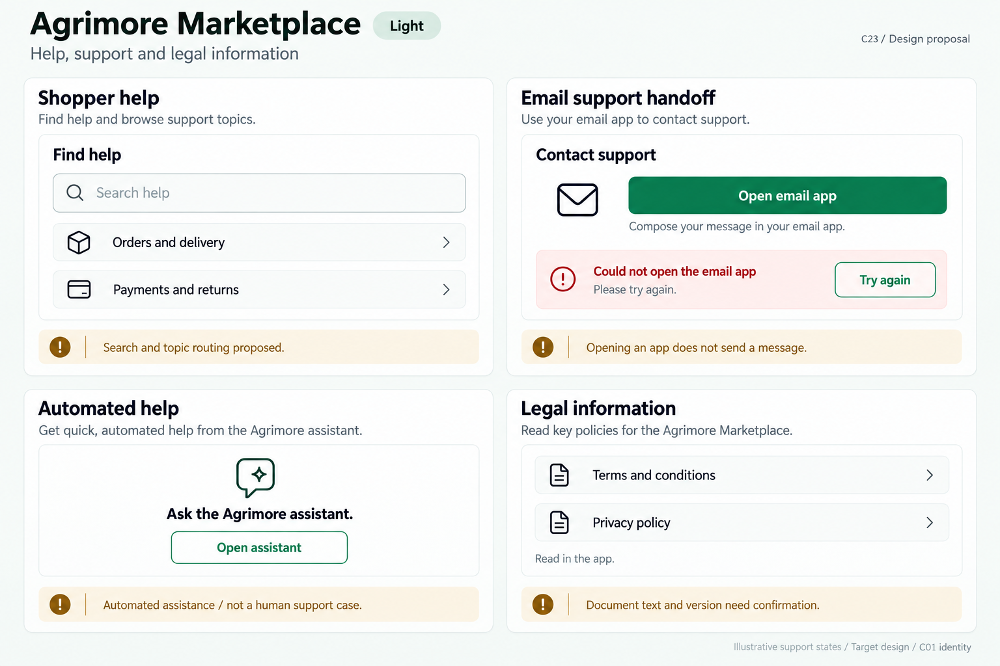
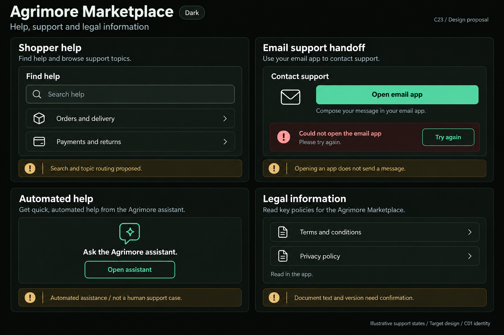
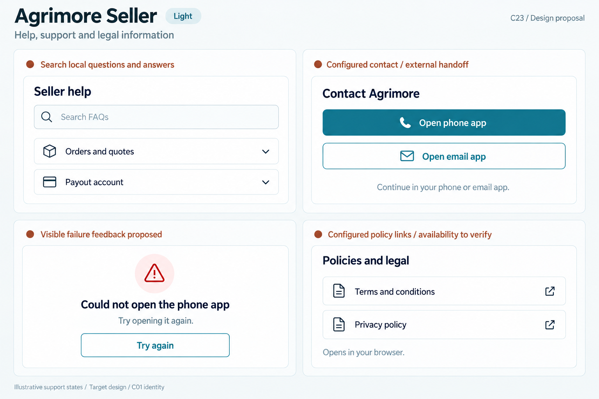
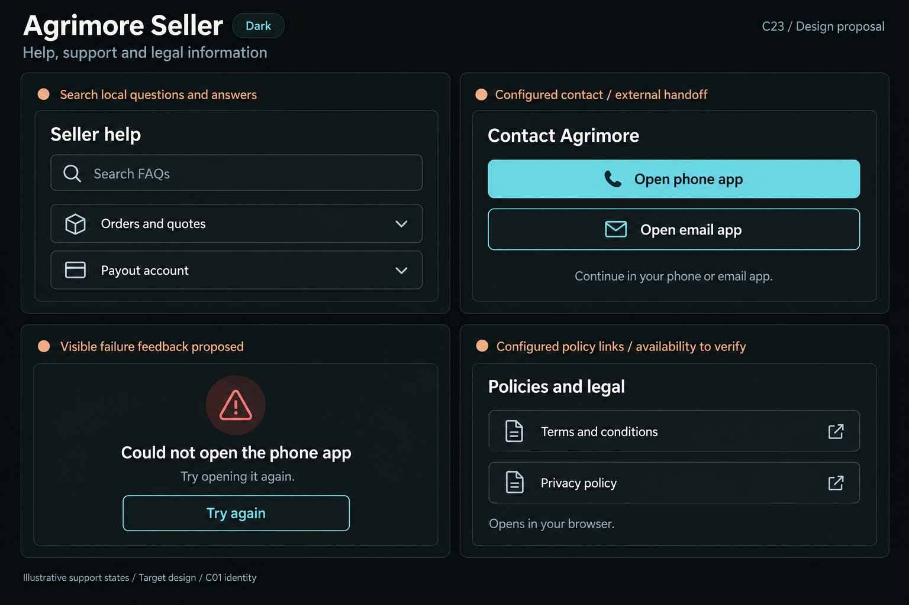
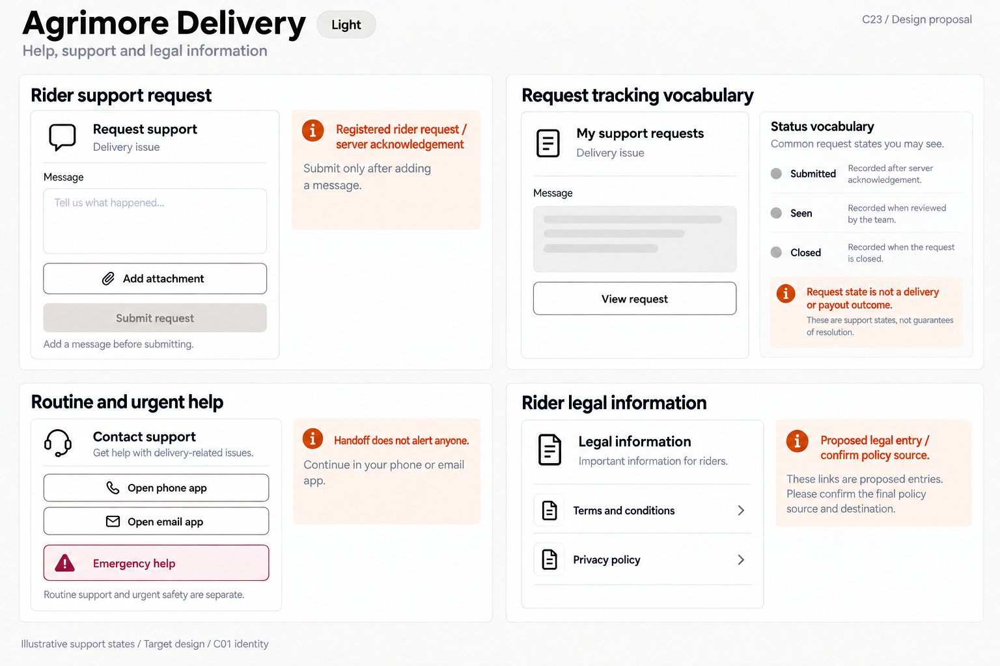
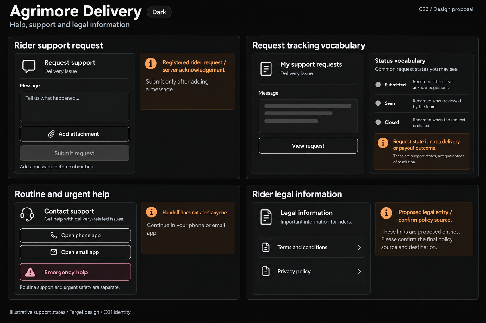
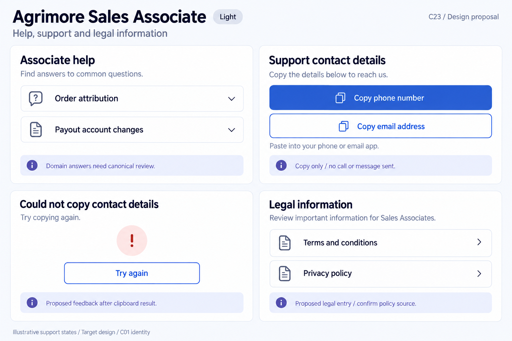
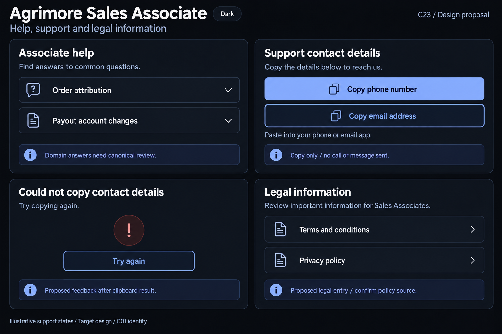
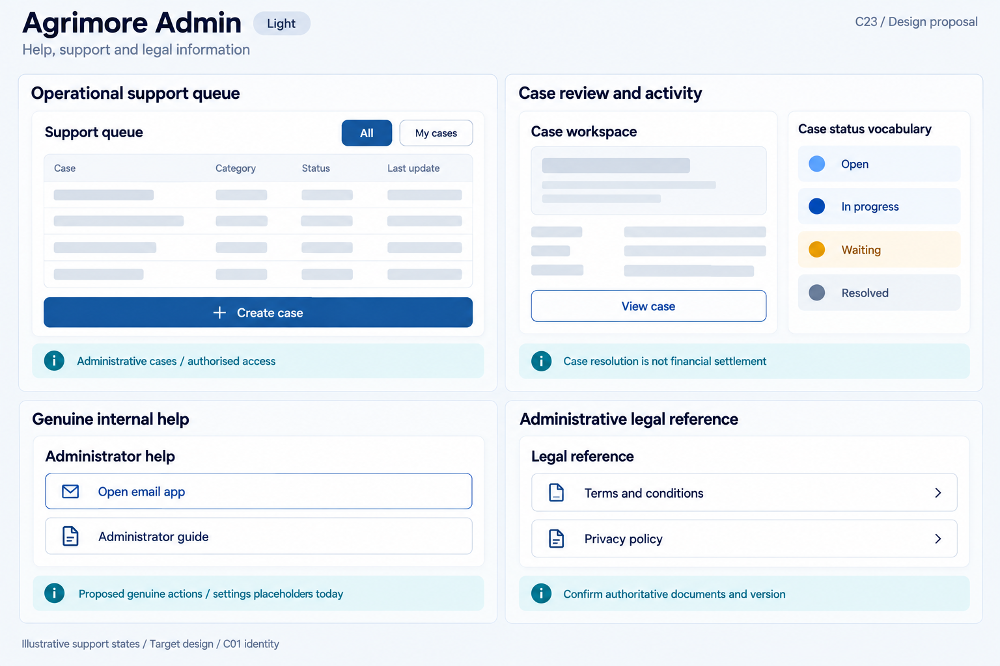
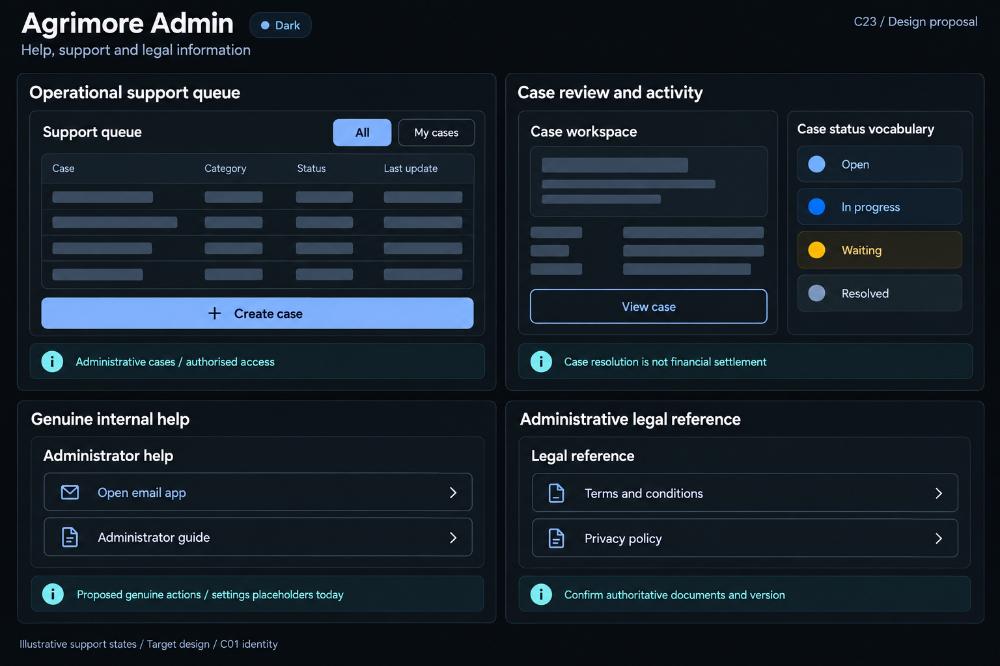

# Agrimore — C23 help, support and legal information

**PROVISIONAL_DIRECTION / TARGET_IMPLEMENTATION · v1 · 2026-10-03.** Ten premium Storybook boards: one light and one dark per app. C01 remains the approved identity reference.

[Codebase and domain map](HELP_SUPPORT_LEGAL_INFORMATION_DOMAIN_MAP_2026-10-03.md) · [C01 approval index](COLOR_ROLES_THEME_IDENTITY_LOCK_2026-10-02.md).

Five domain support systems distinguish self-service help, automated assistance, actual contact handoff, clipboard actions, server requests and administrative cases. Marketplace older help routing is proposed and its assistant is automated; Seller retains FAQ and configured app/browser handoffs; Delivery retains real request tracking and separate safety help; Associate contact actions copy only; Admin operational cases are distinct from placeholder settings help. Legal entries are presentation targets, not approved policy text. These are Storybook proposals, not live screenshots or operations. C01 metadata is inherited; raster values are approximate. No sidebar.

## Agrimore Marketplace

Professional-green shopper help, warm-gold channel/provenance notes and calm natural-stone policy surfaces.

[App notes](../../apps/marketplace/assets/ui-mockups/23-help-support-legal-information/README.md) · [Prompts](../../apps/marketplace/assets/ui-mockups/23-help-support-legal-information/prompts.md) · [Manifest](../../apps/marketplace/assets/ui-mockups/23-help-support-legal-information/manifest.json).

### Light

### Dark

## Agrimore Seller

Compact blue-teal merchant FAQ and contact rows, copper external-handoff notes and cool-neutral policy groups.

[App notes](../../apps/seller/assets/ui-mockups/23-help-support-legal-information/README.md) · [Prompts](../../apps/seller/assets/ui-mockups/23-help-support-legal-information/prompts.md) · [Manifest](../../apps/seller/assets/ui-mockups/23-help-support-legal-information/manifest.json).

### Light

### Dark

## Agrimore Delivery

Field-readable black/white request support, burgundy safety separation, burnt-orange recovery/provenance notes and large clear controls.

[App notes](../../apps/delivery/assets/ui-mockups/23-help-support-legal-information/README.md) · [Prompts](../../apps/delivery/assets/ui-mockups/23-help-support-legal-information/prompts.md) · [Manifest](../../apps/delivery/assets/ui-mockups/23-help-support-legal-information/manifest.json).

### Light

### Dark

## Agrimore Sales Associate

Premium royal-blue associate knowledge/contact cards, indigo clipboard/provenance context and pearl/slate legal surfaces.

[App notes](../../apps/employee/assets/ui-mockups/23-help-support-legal-information/README.md) · [Prompts](../../apps/employee/assets/ui-mockups/23-help-support-legal-information/prompts.md) · [Manifest](../../apps/employee/assets/ui-mockups/23-help-support-legal-information/manifest.json).

### Light

### Dark

## Agrimore Admin

Professional-blue operational support queue and case context, cyan internal-help/legal provenance and steel/slate audit rows.

[App notes](../../apps/admin/assets/ui-mockups/23-help-support-legal-information/README.md) · [Prompts](../../apps/admin/assets/ui-mockups/23-help-support-legal-information/prompts.md) · [Manifest](../../apps/admin/assets/ui-mockups/23-help-support-legal-information/manifest.json).

### Light

### Dark

## Asset integrity check

First post-packaging validation snapshot: **PASS**. Ten 1536 × 1024 PNGs form five light/dark pairs. PNG chunk checksums, copied-output hashes, 11 exact prompt blocks, reference-input hashes, approved C01 token metadata and 91 local document links passed. Exactly 27 new repository files; all 945 earlier design files remained byte-for-byte intact.

Delivery light had one focused copy refinement to remove a misleading phone-handoff explanation and use generic request status definitions; its dark board references that selected refinement. Sales Associate dark was retried after an earlier preview lacked a usable saved artifact; the final successful image and exact prompt are recorded. All ten selected images received visual review.

Snapshot HEAD: f88101beab79e2181013af45e61c0898782b14a0; inventory HEAD: 7285db1207b2fa7219e2866a6c20de6334fc1ce5; branch: agrimore/foundation-f3c-distance-delivery-pricing. No indexed source changes were observed between inventory and packaging. No additional indexed source changes were observed during this first packaging/check snapshot. Platform configuration hashes matched the inventory. This records a point in time, not a guarantee that the other chat or HEAD stops advancing.

Scope: design assets/docs only. Integrity checks and visual review do not certify pixel-exact tokens, runtime rendering, accessibility, security, contact reachability, support availability, message sending, request resolution or legal approval. C23 remains PROVISIONAL_DIRECTION / TARGET_IMPLEMENTATION; C01 remains APPROVED_LOCKED.
