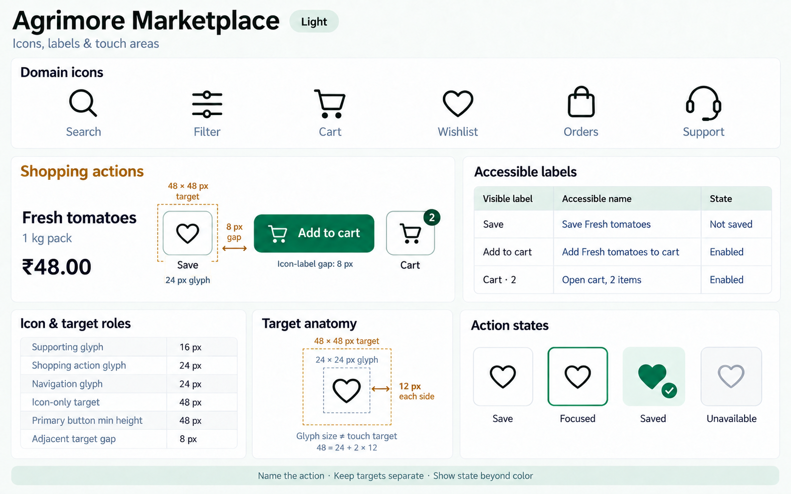
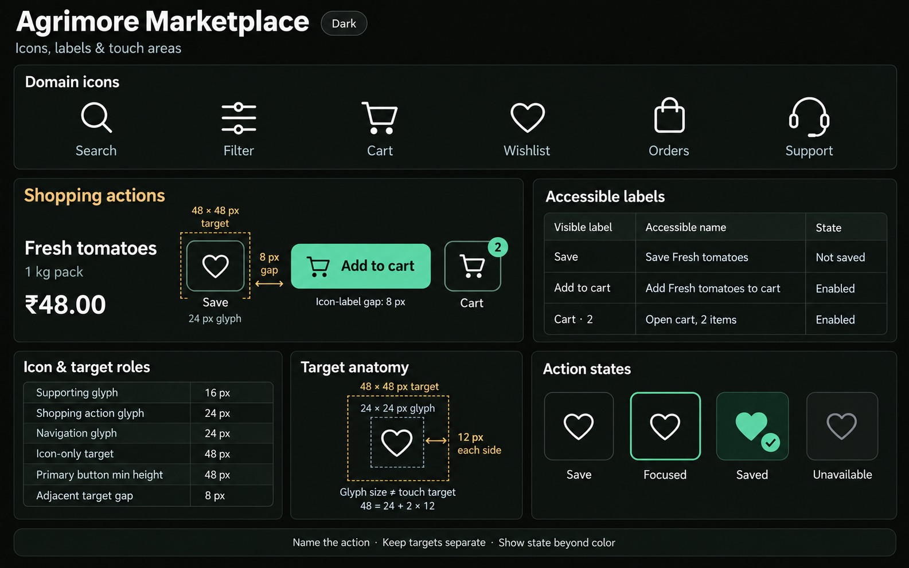
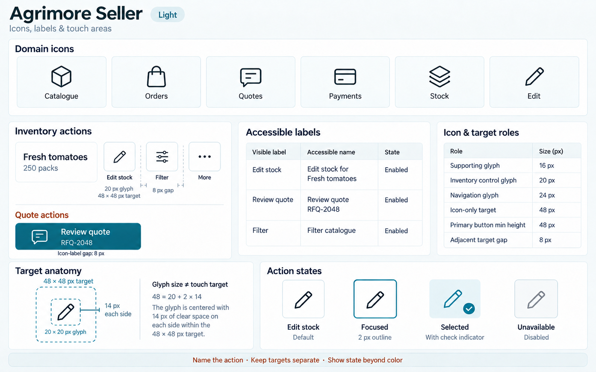
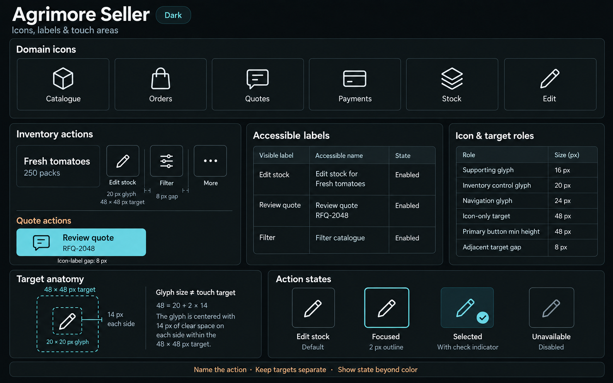
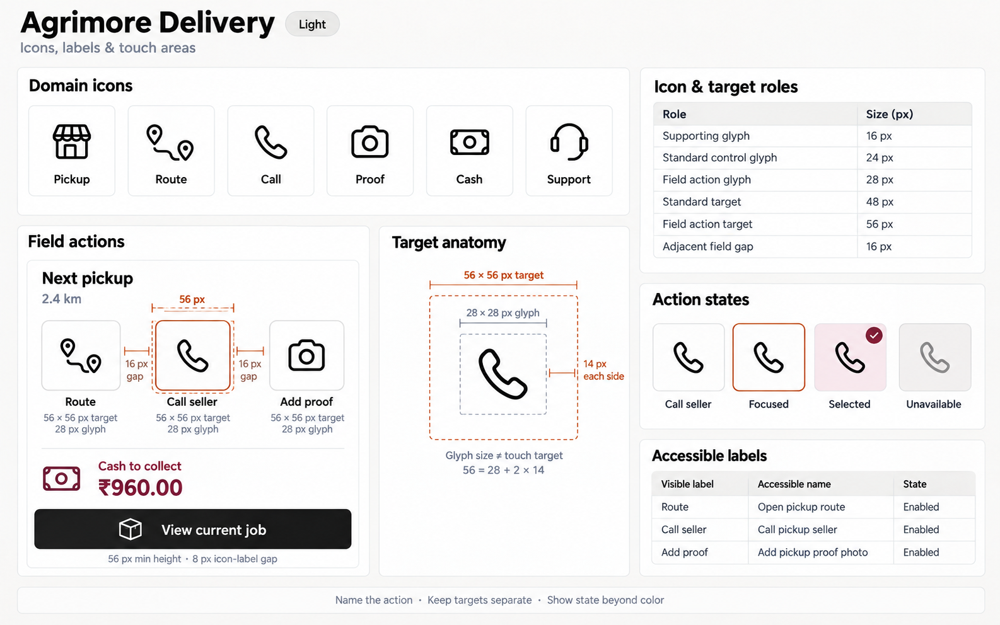
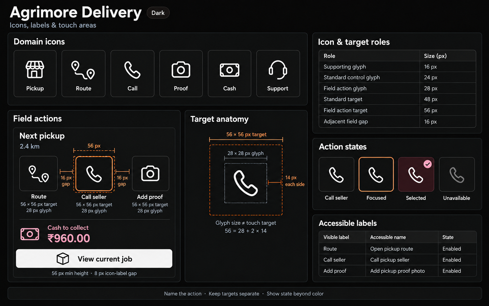
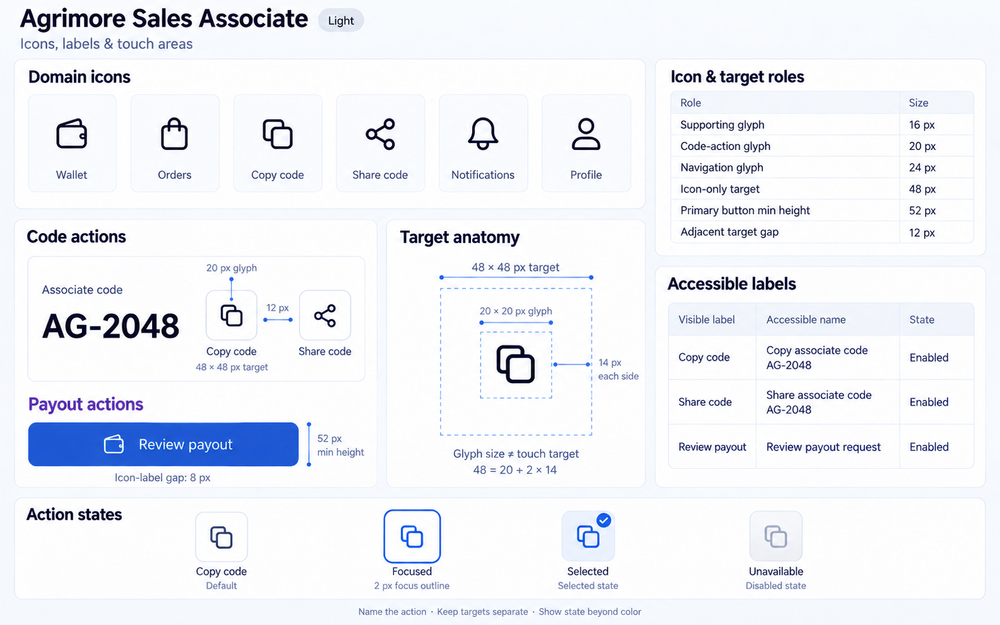
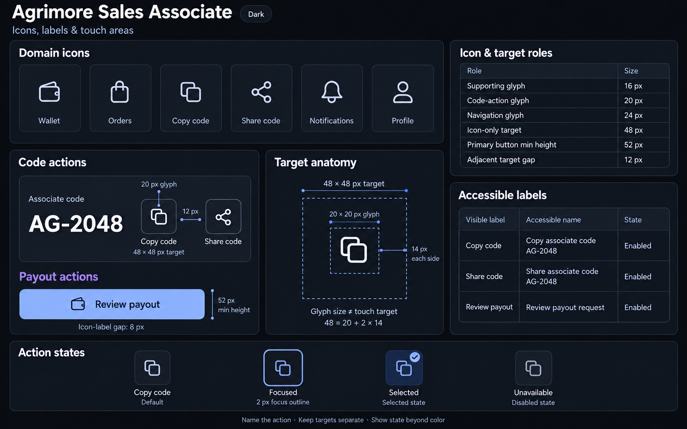
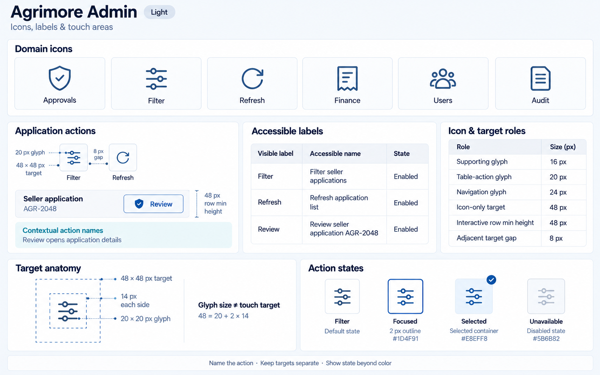
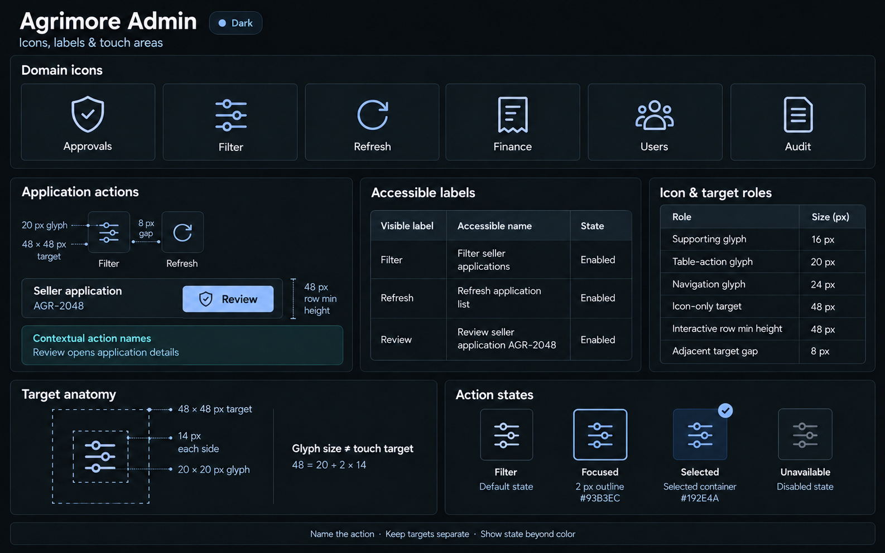

# Agrimore — C04 icons, labels and touch areas

**Ten premium Storybook-style boards: five apps × light/dark.** Generated with built-in image_gen on 2026-10-03 after a fresh static source audit of **815 files / 272,222 lines**, selected component/icon/semantics reads and visual review of all ten approved C01 references.

**Status: PROVISIONAL_DIRECTION / TARGET_IMPLEMENTATION.** C01 palettes and foundations remain owner-approved. C04 icon/target/label mappings are review proposals; runtime UI and accessibility behavior have not been changed by this asset task.

[Codebase domain map and migration observations](ICONS_LABELS_TOUCH_AREAS_DOMAIN_MAP_2026-10-03.md) · [Approved C01 index](COLOR_ROLES_THEME_IDENTITY_LOCK_2026-10-02.md) · [Previous spatial boards](SPACING_SHAPE_BORDERS_ELEVATION_BOARDS_2026-10-03.md)

| App | Domain interaction vocabulary | Anatomy | Adjacent target gap |
| --- | --- | --- | --- |
| Agrimore Marketplace | Search, Filter, Cart, Wishlist, Orders, Support | 24 glyph / 48 target | 8 px |
| Agrimore Seller | Catalogue, Orders, Quotes, Payments, Stock, Edit | 20 glyph / 48 target | 8 px |
| Agrimore Delivery | Pickup, Route, Call, Proof, Cash, Support | 28 glyph / 56 target | 16 px |
| Agrimore Sales Associate | Wallet, Orders, Copy code, Share code, Notifications, Profile | 20 glyph / 48 target | 12 px |
| Agrimore Admin | Approvals, Filter, Refresh, Finance, Users, Audit | 20 glyph / 48 target | 8 px |

Each board shows six domain icons, an interaction specimen, three visible-label/accessible-name mappings with separate state, six icon/target role values, a target anatomy diagram and four action-state examples. Dark boards preserve each app’s light content/composition on its approved near-black skin. No navigation sidebar.

The **48×48 target baseline** follows [Flutter’s accessibility guidance](https://docs.flutter.dev/ui/accessibility). Delivery’s proposed 56 field target/28 glyph and Sales Associate’s existing 52 button height are separate domain roles. Icon-only actions retain the ≥48 baseline. Calculated 14 px centering is not a new spacing-scale token.

The boards visualize proposed labels and target dimensions. They are not screen-reader or hit-test results. Use manifests for exact C01 tokens and C04 numerical mappings; generated raster pixels and package-specific glyph shapes remain illustrative. Localized/large-text layouts, actual accessible names/role/state and focus/navigation behavior require later rendered verification.

## Agrimore Marketplace

Professional green; warm gold and natural stone. 24 px glyph inside 48 px target; adjacent target gap 8 px. App-domain labels include: Save, Add to cart, Cart · 2.

[Asset folder and role map](../../apps/marketplace/assets/ui-mockups/04-icons-labels-touch-areas/README.md) · [Exact prompts](../../apps/marketplace/assets/ui-mockups/04-icons-labels-touch-areas/prompts.md) · [Manifest](../../apps/marketplace/assets/ui-mockups/04-icons-labels-touch-areas/manifest.json)

### Light

### Dark

## Agrimore Seller

Blue-teal; copper and cool neutrals. 20 px glyph inside 48 px target; adjacent target gap 8 px. App-domain labels include: Edit stock, Review quote, Filter.

[Asset folder and role map](../../apps/seller/assets/ui-mockups/04-icons-labels-touch-areas/README.md) · [Exact prompts](../../apps/seller/assets/ui-mockups/04-icons-labels-touch-areas/prompts.md) · [Manifest](../../apps/seller/assets/ui-mockups/04-icons-labels-touch-areas/manifest.json)

### Light

### Dark

## Agrimore Delivery

Black/white; burgundy and burnt orange. 28 px glyph inside 56 px target; adjacent target gap 16 px. App-domain labels include: Route, Call seller, Add proof.

[Asset folder and role map](../../apps/delivery/assets/ui-mockups/04-icons-labels-touch-areas/README.md) · [Exact prompts](../../apps/delivery/assets/ui-mockups/04-icons-labels-touch-areas/prompts.md) · [Manifest](../../apps/delivery/assets/ui-mockups/04-icons-labels-touch-areas/manifest.json)

### Light

### Dark

## Agrimore Sales Associate

Premium royal blue; indigo and pearl/slate. 20 px glyph inside 48 px target; adjacent target gap 12 px. App-domain labels include: Copy code, Share code, Review payout.

[Asset folder and role map](../../apps/employee/assets/ui-mockups/04-icons-labels-touch-areas/README.md) · [Exact prompts](../../apps/employee/assets/ui-mockups/04-icons-labels-touch-areas/prompts.md) · [Manifest](../../apps/employee/assets/ui-mockups/04-icons-labels-touch-areas/manifest.json)

### Light

### Dark

## Agrimore Admin

Professional blue; cyan and steel/slate. 20 px glyph inside 48 px target; adjacent target gap 8 px. App-domain labels include: Filter, Refresh, Review.

[Asset folder and role map](../../apps/admin/assets/ui-mockups/04-icons-labels-touch-areas/README.md) · [Exact prompts](../../apps/admin/assets/ui-mockups/04-icons-labels-touch-areas/prompts.md) · [Manifest](../../apps/admin/assets/ui-mockups/04-icons-labels-touch-areas/manifest.json)

### Light

### Dark

## Asset verification

The selected ten PNGs are saved byte-for-byte in their respective app asset folders, with exact prompts/refinement history and SHA-256 provenance. The packaging validator checks PNG dimensions, source-copy equality, five theme pairs, C01 token inheritance/reference checksums, C04 role/name pairing, target-anatomy arithmetic, prompt hashes and portable document/image links. It does not certify executable accessibility or pixel-exact raster compliance. No runtime, package, localization, shared ledger or branch changes are part of this task.
