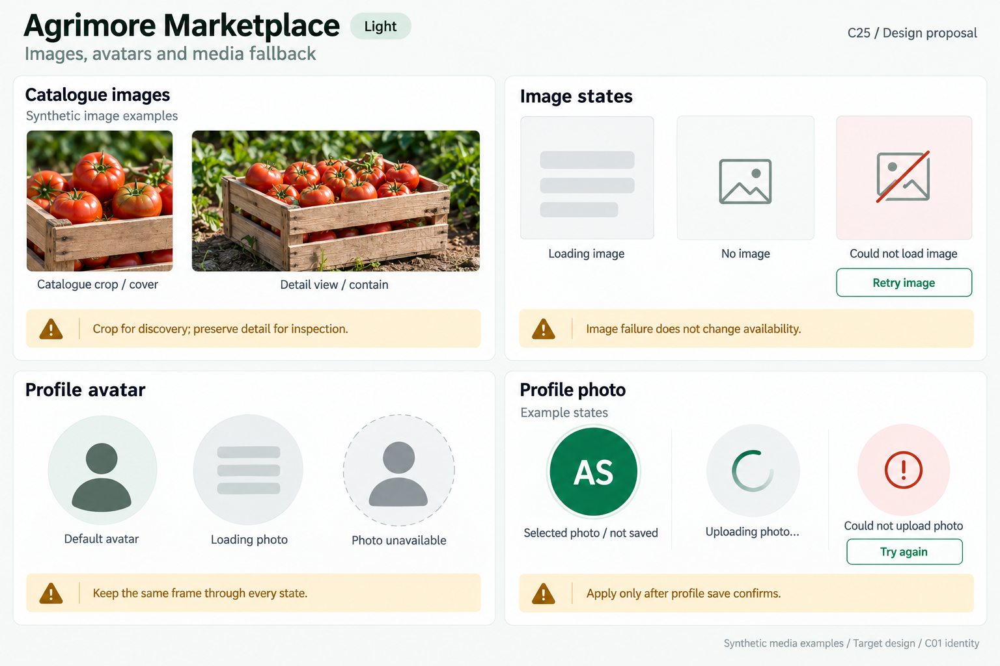
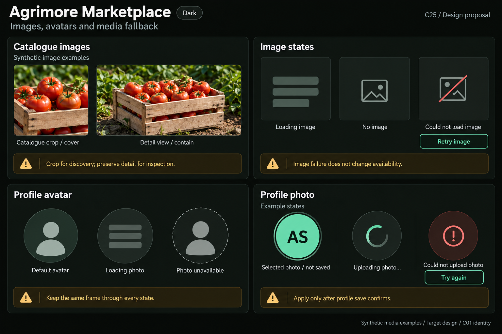
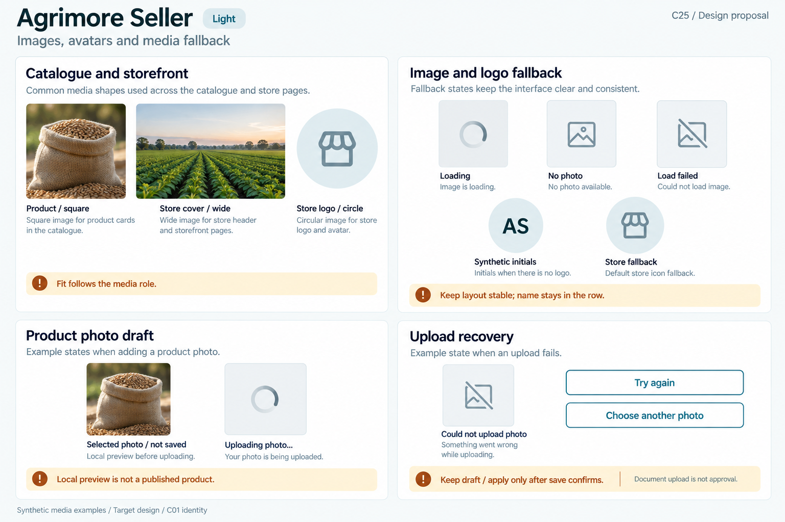
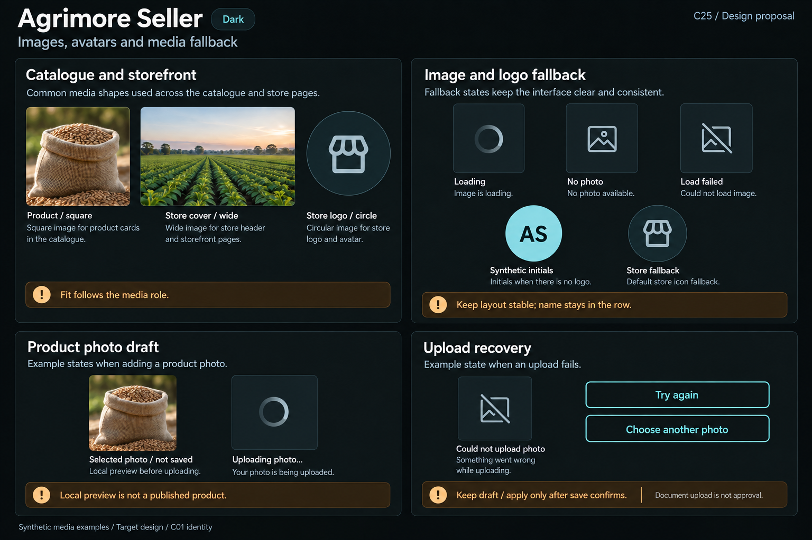
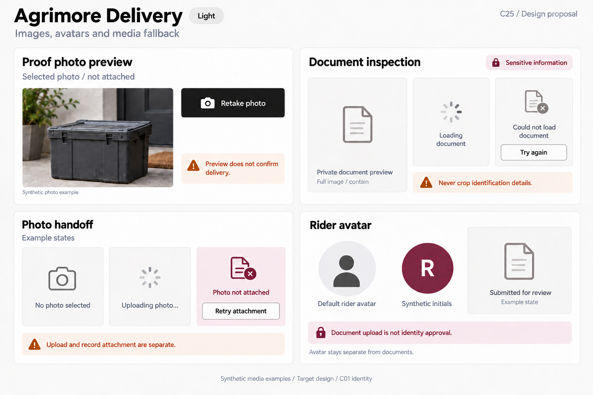
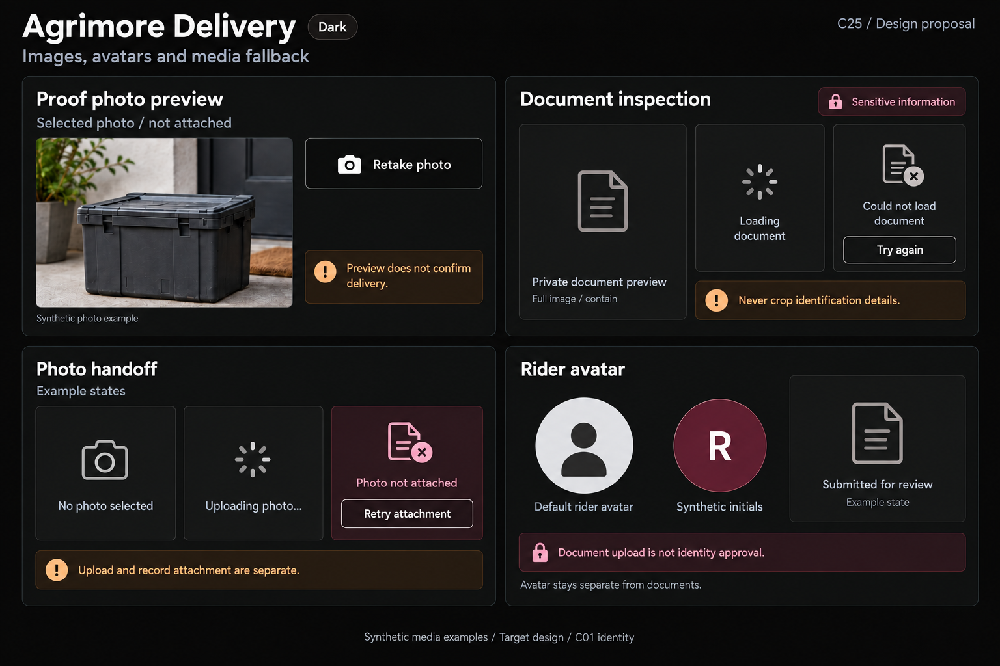
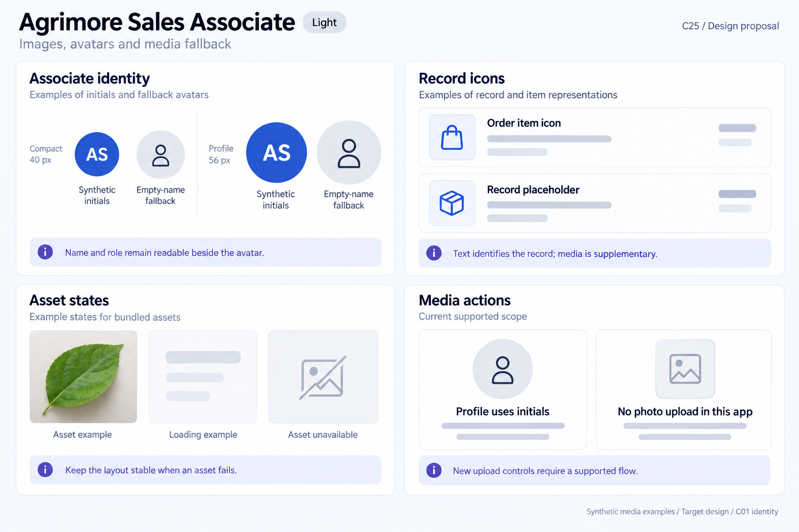
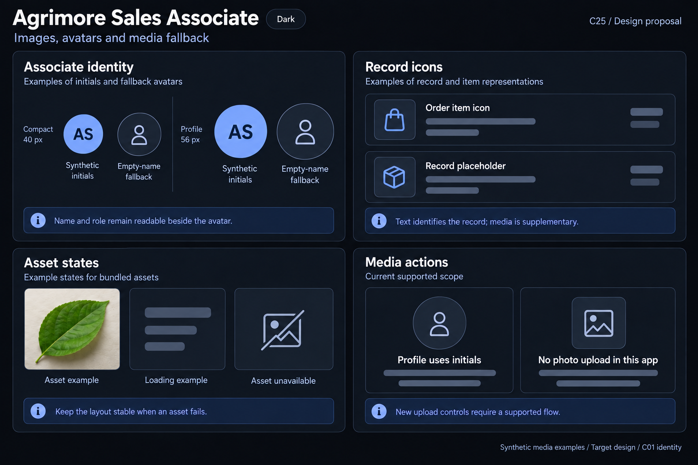
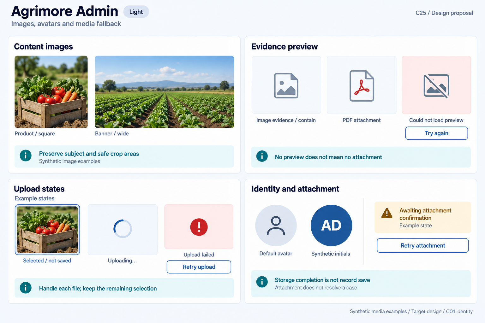
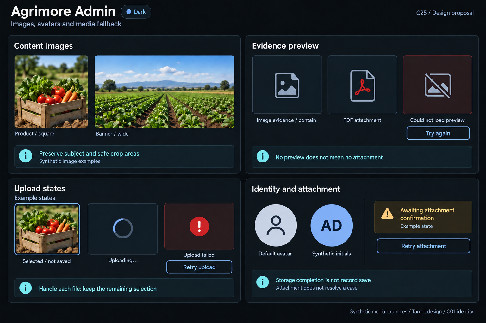

# Agrimore — C25 images, avatars and media fallback

**PROVISIONAL_DIRECTION / TARGET_IMPLEMENTATION · v1 · 2026-10-03.** Ten premium Storybook boards: one light and one dark per app. C01 remains the approved identity reference.

[Codebase and domain map](IMAGES_AVATARS_MEDIA_FALLBACK_DOMAIN_MAP_2026-10-03.md) · [C01 approval index](COLOR_ROLES_THEME_IDENTITY_LOCK_2026-10-02.md).

Five domain media systems reflect actual catalogue, storefront, avatar, document, proof and evidence roles. Loading, no media, failed load, selected preview, uploading and confirmation are separate examples. Sales Associate uploads are absent in current source; its initials and text-first records stay central. C01 metadata is inherited; raster values are approximate. These are design proposals with synthetic media, not runtime screenshots or performed uploads. No sidebar.

## Agrimore Marketplace

Professional-green catalogue frames, warm-gold crop/recovery guidance and natural-stone avatar surfaces.

[App notes](../../apps/marketplace/assets/ui-mockups/25-images-avatars-media-fallback/README.md) · [Prompts](../../apps/marketplace/assets/ui-mockups/25-images-avatars-media-fallback/prompts.md) · [Manifest](../../apps/marketplace/assets/ui-mockups/25-images-avatars-media-fallback/manifest.json).

### Light

### Dark

## Agrimore Seller

Blue-teal catalogue and storefront media, copper upload/draft guidance and cool-neutral fallback frames.

[App notes](../../apps/seller/assets/ui-mockups/25-images-avatars-media-fallback/README.md) · [Prompts](../../apps/seller/assets/ui-mockups/25-images-avatars-media-fallback/prompts.md) · [Manifest](../../apps/seller/assets/ui-mockups/25-images-avatars-media-fallback/manifest.json).

### Light

### Dark

## Agrimore Delivery

Black/white field media, burgundy private-document context and burnt-orange capture/recovery guidance.

[App notes](../../apps/delivery/assets/ui-mockups/25-images-avatars-media-fallback/README.md) · [Prompts](../../apps/delivery/assets/ui-mockups/25-images-avatars-media-fallback/prompts.md) · [Manifest](../../apps/delivery/assets/ui-mockups/25-images-avatars-media-fallback/manifest.json).

### Light

### Dark

## Agrimore Sales Associate

Premium royal-blue initials and record icons, indigo asset-state context with pearl/slate quiet placeholders.

[App notes](../../apps/employee/assets/ui-mockups/25-images-avatars-media-fallback/README.md) · [Prompts](../../apps/employee/assets/ui-mockups/25-images-avatars-media-fallback/prompts.md) · [Manifest](../../apps/employee/assets/ui-mockups/25-images-avatars-media-fallback/manifest.json).

### Light

### Dark

## Agrimore Admin

Professional-blue content thumbnails and dense evidence frames, cyan crop/attachment guidance with steel/slate fallbacks.

[App notes](../../apps/admin/assets/ui-mockups/25-images-avatars-media-fallback/README.md) · [Prompts](../../apps/admin/assets/ui-mockups/25-images-avatars-media-fallback/prompts.md) · [Manifest](../../apps/admin/assets/ui-mockups/25-images-avatars-media-fallback/manifest.json).

### Light

### Dark

## Asset integrity check

First post-packaging validation snapshot: **PASS**. Ten 1536 × 1024 PNGs form five light/dark pairs. PNG chunk checksums, copied-output hashes, 12 exact prompt blocks, reference-input hashes, approved C01 token metadata and 93 local document links passed. Exactly 27 new repository files; all 999 earlier design files remained byte-for-byte intact.

All ten selected images received visual review for media sizing/crop, avatars, loading/missing/failed frames, independent upload/attachment examples and light/dark identity. Delivery light had one focused refinement removing an extraneous placeholder button; Delivery dark references that selected refinement. Admin dark had one focused refinement correcting its initials circle to the locked pale-primary/dark-inverse pair. Photographs/monograms are synthetic; document/evidence samples are blank icons, not real private data.

Snapshot HEAD: 6c676fcc0a7acca85b7798bf9b1e5bc65794c249; inventory HEAD: aed38d713a0c285a75d2cbfcff81a3698ba5dacd; branch: agrimore/foundation-f3c-distance-delivery-pricing. Indexed source changes between inventory and packaging were observed and preserved: apps/marketplace/lib/screens/user/orders/rate_order_screen.dart. No additional indexed source changes were observed during this first packaging/check snapshot. Platform configuration hashes matched the inventory. This records a point in time, not a guarantee that the other chat or HEAD stops advancing.

Scope: design assets/docs only. Integrity checks and visual review do not certify pixel-exact tokens, runtime rendering, accessibility, decoding/upload/attachment behavior, storage policy, privacy or identity approval. C25 remains PROVISIONAL_DIRECTION / TARGET_IMPLEMENTATION; C01 remains APPROVED_LOCKED.
