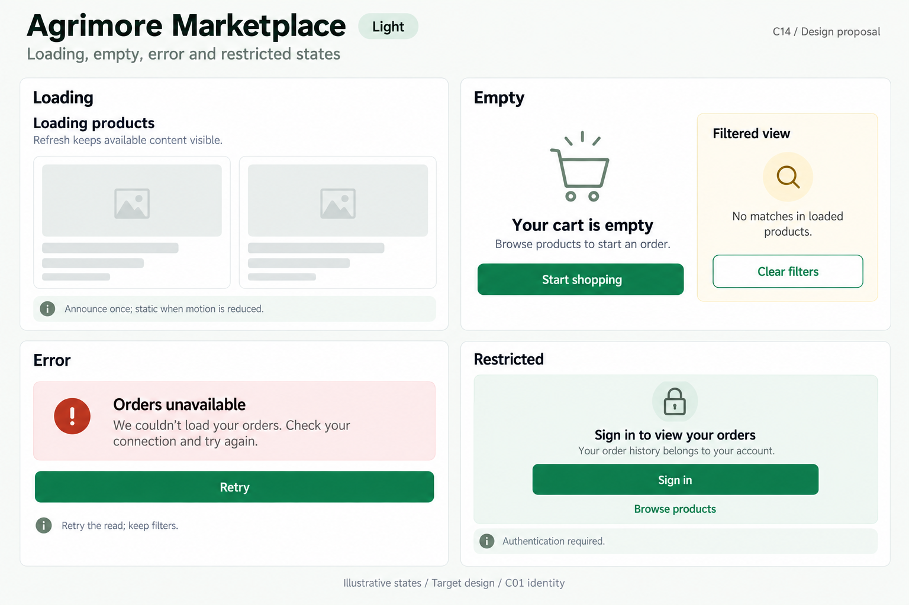
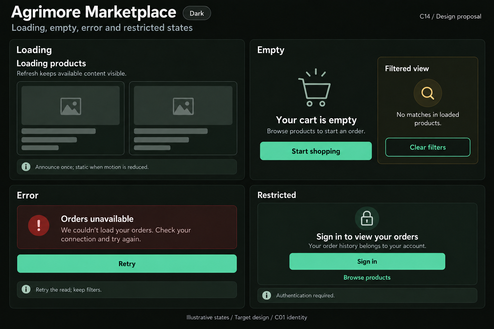
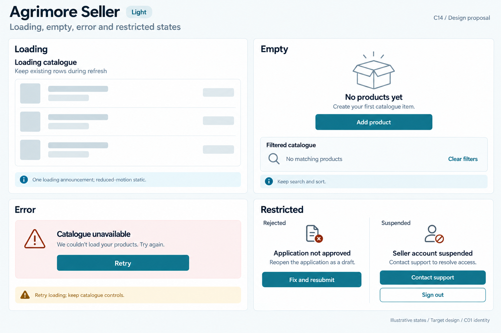
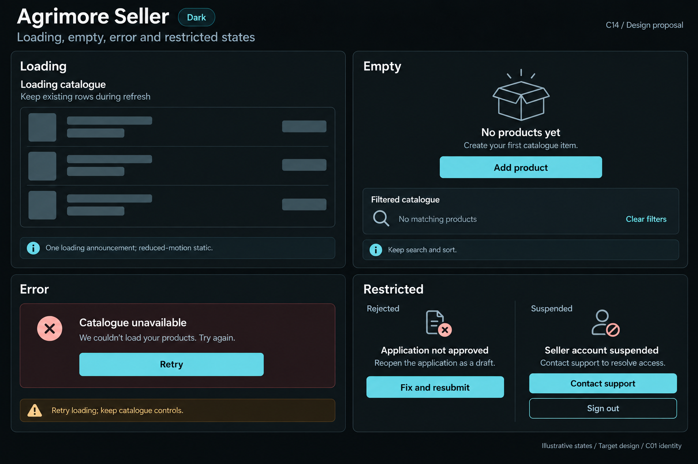
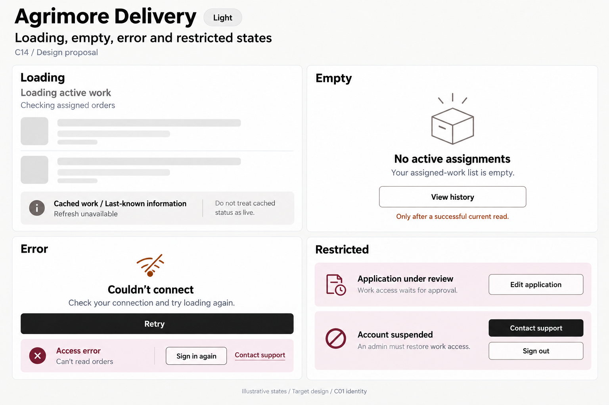
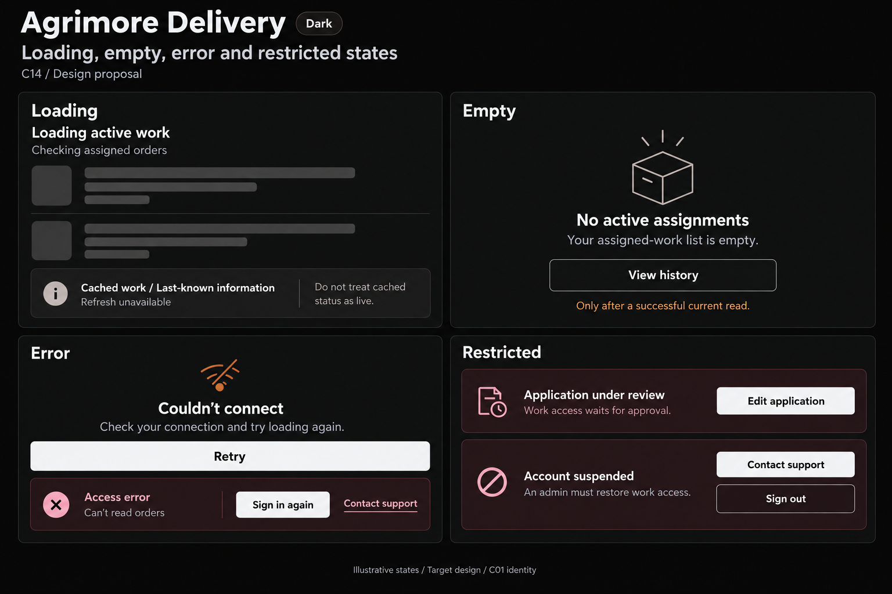
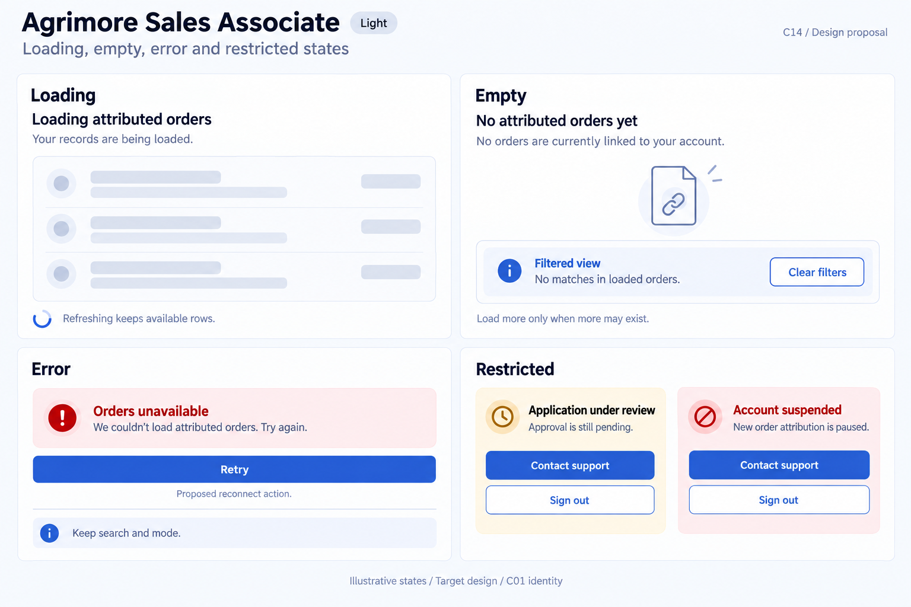
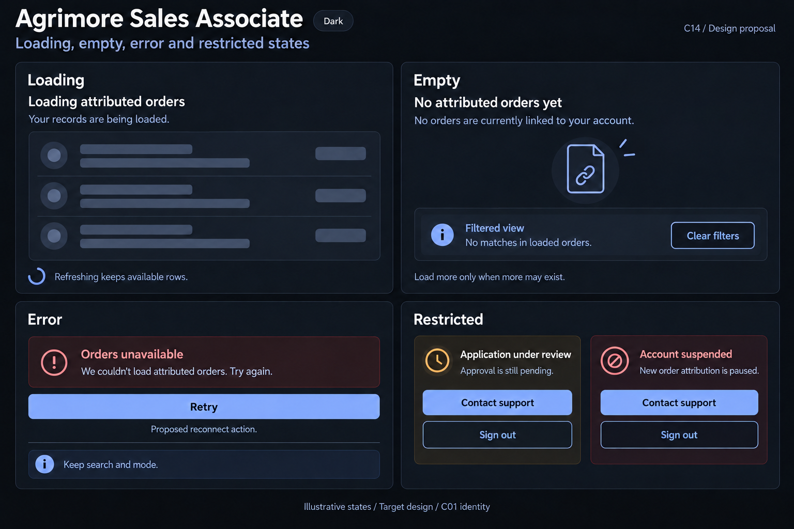
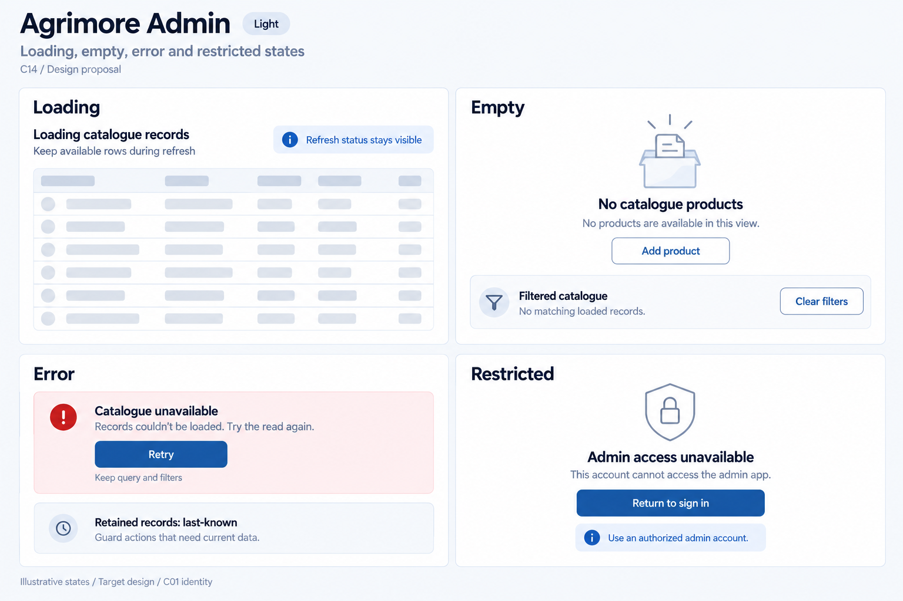
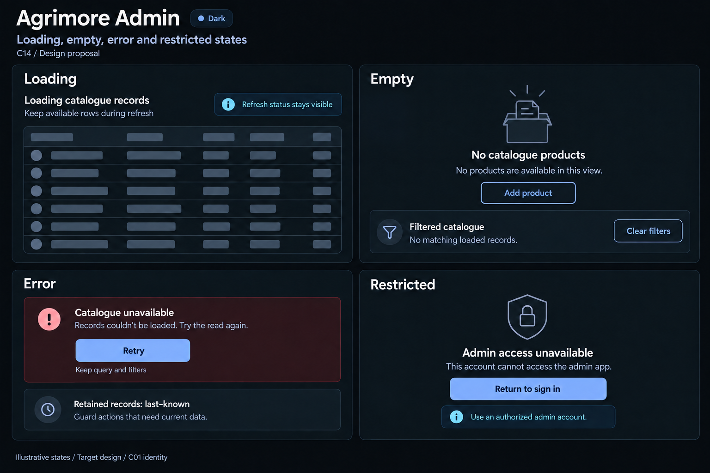

# Agrimore — C14 loading, empty, error and restricted states

**PROVISIONAL_DIRECTION / TARGET_IMPLEMENTATION · v1 · 2026-10-03.** Ten premium Storybook boards: one light and one dark per app. C01 remains the approved identity reference.

[Codebase and domain map](LOADING_EMPTY_ERROR_RESTRICTED_STATES_DOMAIN_MAP_2026-10-03.md) · [C01 approval index](COLOR_ROLES_THEME_IDENTITY_LOCK_2026-10-02.md).

Each app illustrates initial loading, successful emptiness, safe recoverable error and a domain-specific restricted state. Refresh/cache, filtered no-match and reason-specific account actions are distinguished. These are generated design specimens, not implemented widgets or app screenshots. Token metadata is inherited exactly; raster colors, type and geometry remain approximate. Four panels are independent examples. No sidebar.

## Agrimore Marketplace

Spacious professional-green shopping states with natural-stone skeletons, warm-gold guidance and a gentle path back to product discovery.

[App notes](../../apps/marketplace/assets/ui-mockups/14-loading-empty-error-restricted-states/README.md) · [Prompts](../../apps/marketplace/assets/ui-mockups/14-loading-empty-error-restricted-states/prompts.md) · [Manifest](../../apps/marketplace/assets/ui-mockups/14-loading-empty-error-restricted-states/manifest.json).

### Light

### Dark

## Agrimore Seller

Compact blue-teal catalogue operations with cool-neutral loading rows, restrained copper context and clearly different rejected versus suspended account treatments.

[App notes](../../apps/seller/assets/ui-mockups/14-loading-empty-error-restricted-states/README.md) · [Prompts](../../apps/seller/assets/ui-mockups/14-loading-empty-error-restricted-states/prompts.md) · [Manifest](../../apps/seller/assets/ui-mockups/14-loading-empty-error-restricted-states/manifest.json).

### Light

### Dark

## Agrimore Delivery

High-contrast black/white field-use states with large controls, burgundy restrictions, burnt-orange connectivity cues and calm neutral cached-data guidance.

[App notes](../../apps/delivery/assets/ui-mockups/14-loading-empty-error-restricted-states/README.md) · [Prompts](../../apps/delivery/assets/ui-mockups/14-loading-empty-error-restricted-states/prompts.md) · [Manifest](../../apps/delivery/assets/ui-mockups/14-loading-empty-error-restricted-states/manifest.json).

### Light

### Dark

## Agrimore Sales Associate

Premium royal-blue relationship and attributed-order states, pearl/slate surfaces and restrained indigo context, with financial absence never fabricated as zero.

[App notes](../../apps/employee/assets/ui-mockups/14-loading-empty-error-restricted-states/README.md) · [Prompts](../../apps/employee/assets/ui-mockups/14-loading-empty-error-restricted-states/prompts.md) · [Manifest](../../apps/employee/assets/ui-mockups/14-loading-empty-error-restricted-states/manifest.json).

### Light

### Dark

## Agrimore Admin

Dense professional-blue operational states with steel/slate record skeletons, cyan read-scope guidance and precise authorization boundaries.

[App notes](../../apps/admin/assets/ui-mockups/14-loading-empty-error-restricted-states/README.md) · [Prompts](../../apps/admin/assets/ui-mockups/14-loading-empty-error-restricted-states/prompts.md) · [Manifest](../../apps/admin/assets/ui-mockups/14-loading-empty-error-restricted-states/manifest.json).

### Light

### Dark

## Asset delivery checks

**VERIFIED_REPOSITORY_FACT / assets-only integrity PASS.** Ten selected PNGs / five light–dark pairs; 27 new files; 702 earlier design files preserved byte-for-byte. Thirteen exact initial/refinement prompt blocks, reference/output hashes, C01 token metadata and 96 local document links verified. Observed runtime source and platform configuration hashes are unchanged. Three initial dark requests failed before output and succeeded on retry; no-output attempts are recorded in the relevant manifests. This does not change C14’s provisional status or certify runtime/accessibility/pixel accuracy.

