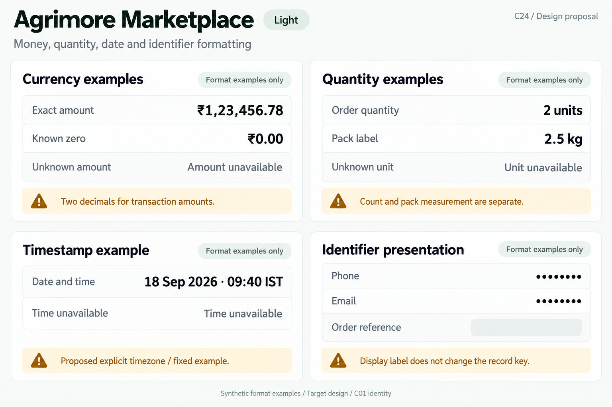
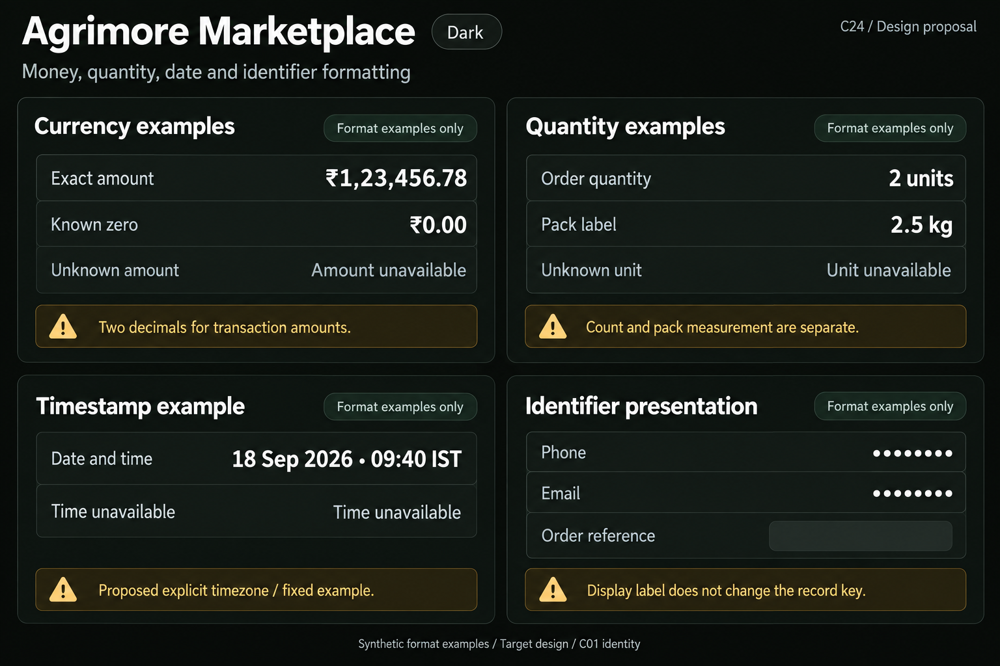
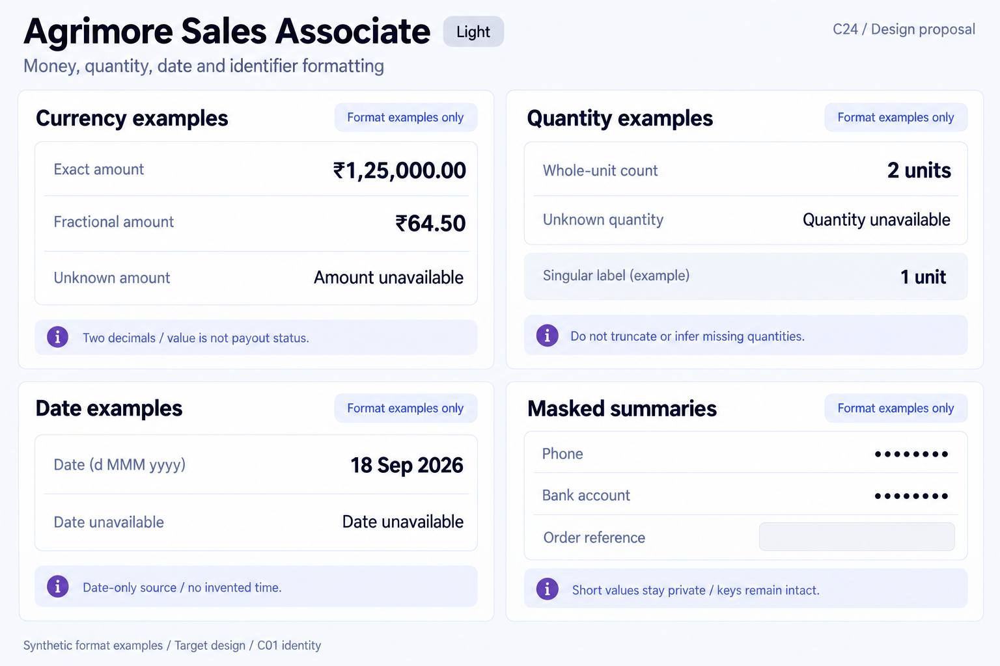
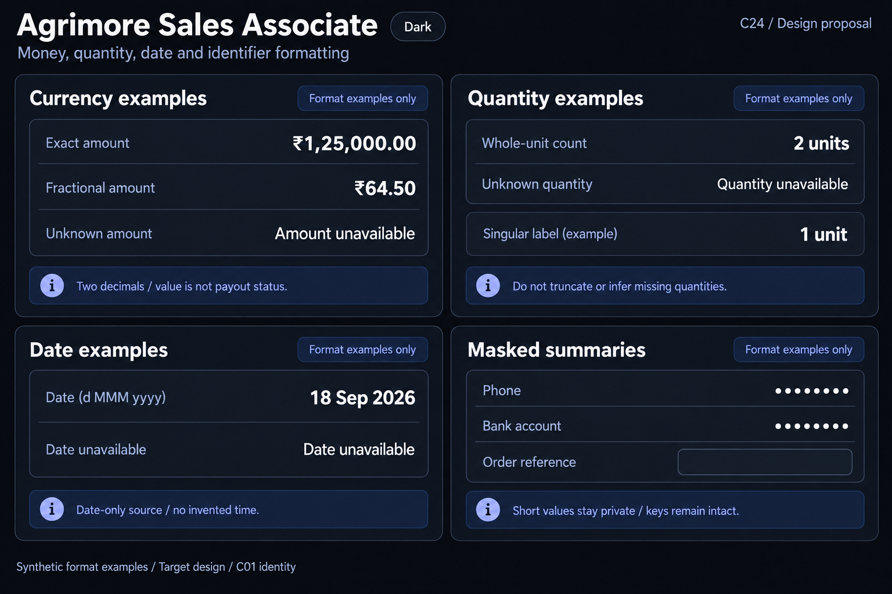
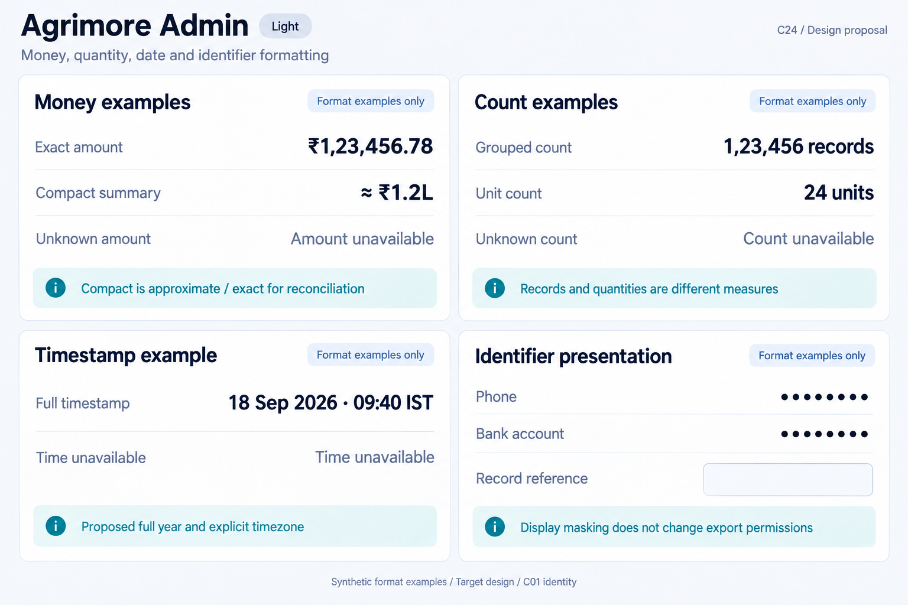
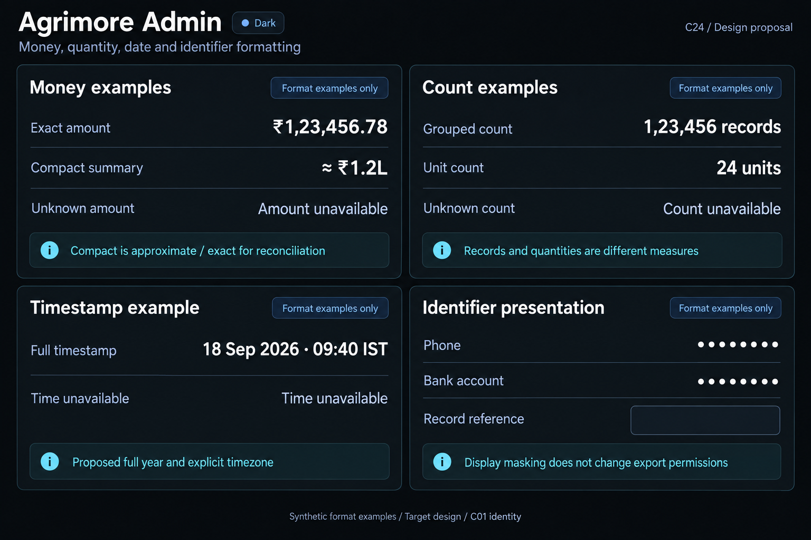

# Agrimore — C24 money, quantity, date and identifier formatting

**PROVISIONAL_DIRECTION / TARGET_IMPLEMENTATION · v1 · 2026-10-03.** Ten premium Storybook boards: one light and one dark per app. C01 remains the approved identity reference.

[Codebase and domain map](MONEY_QUANTITY_DATE_IDENTIFIER_FORMATTING_DOMAIN_MAP_2026-10-03.md) · [C01 approval index](COLOR_ROLES_THEME_IDENTITY_LOCK_2026-10-02.md).

Five domain formatting systems distinguish exact rupee amounts, display/compact summaries, whole-unit counts, measured labels, source dates/timezones and private identifiers. All numeric and date values are explicitly synthetic format examples, not live amounts, stock, metrics or events. Seller/Delivery existing formatter roles are preserved; Marketplace/Admin mixed adoption and Associate missing-value/mask handling are documented. Explicit-zone displays and conservative summary masks remain targets where not implemented. These are Storybook proposals, not screenshots or executed financial operations. C01 metadata is inherited; raster values are approximate. No sidebar.

## Agrimore Marketplace

Professional-green shopper prices/counts, warm-gold format provenance and calm natural-stone units/private summaries.

[App notes](../../apps/marketplace/assets/ui-mockups/24-money-quantity-date-identifier-formatting/README.md) · [Prompts](../../apps/marketplace/assets/ui-mockups/24-money-quantity-date-identifier-formatting/prompts.md) · [Manifest](../../apps/marketplace/assets/ui-mockups/24-money-quantity-date-identifier-formatting/manifest.json).

### Light

### Dark

## Agrimore Seller

Compact blue-teal merchant monetary columns and stock units, copper precision/date provenance and cool-neutral identifier rows.

[App notes](../../apps/seller/assets/ui-mockups/24-money-quantity-date-identifier-formatting/README.md) · [Prompts](../../apps/seller/assets/ui-mockups/24-money-quantity-date-identifier-formatting/prompts.md) · [Manifest](../../apps/seller/assets/ui-mockups/24-money-quantity-date-identifier-formatting/manifest.json).

### Light

### Dark

## Agrimore Delivery

High-contrast black/white statement figures and field units, burgundy identifier context and burnt-orange precision/time guidance.

[App notes](../../apps/delivery/assets/ui-mockups/24-money-quantity-date-identifier-formatting/README.md) · [Prompts](../../apps/delivery/assets/ui-mockups/24-money-quantity-date-identifier-formatting/prompts.md) · [Manifest](../../apps/delivery/assets/ui-mockups/24-money-quantity-date-identifier-formatting/manifest.json).

### Light

### Dark

## Agrimore Sales Associate

Premium royal-blue attributed-order numeric hierarchy, indigo format/date provenance and pearl/slate masked contact/payout summaries.

[App notes](../../apps/employee/assets/ui-mockups/24-money-quantity-date-identifier-formatting/README.md) · [Prompts](../../apps/employee/assets/ui-mockups/24-money-quantity-date-identifier-formatting/prompts.md) · [Manifest](../../apps/employee/assets/ui-mockups/24-money-quantity-date-identifier-formatting/manifest.json).

### Light

### Dark

## Agrimore Admin

Professional-blue operational money/count columns, cyan exact-versus-summary and timestamp context, steel/slate audit/private identifiers.

[App notes](../../apps/admin/assets/ui-mockups/24-money-quantity-date-identifier-formatting/README.md) · [Prompts](../../apps/admin/assets/ui-mockups/24-money-quantity-date-identifier-formatting/prompts.md) · [Manifest](../../apps/admin/assets/ui-mockups/24-money-quantity-date-identifier-formatting/manifest.json).

### Light

### Dark

## Asset integrity check

First post-packaging validation snapshot: **PASS**. Ten 1536 × 1024 PNGs form five light/dark pairs. PNG chunk checksums, copied-output hashes, 10 exact prompt blocks, reference-input hashes, approved C01 token metadata and 91 local document links passed. Exactly 27 new repository files; all 972 earlier design files remained byte-for-byte intact.

All ten selected images received visual review for grouping, decimals, signs, units, dates, approximation labels, masked examples and light/dark identity. Values are synthetic format examples, not actual transactions or personal identifiers.

Snapshot HEAD: a5a8af1f7dc44f8f5a80dad5d01e8668fab8fda2; inventory HEAD: f88101beab79e2181013af45e61c0898782b14a0; branch: agrimore/foundation-f3c-distance-delivery-pricing. Indexed source changes between inventory and packaging were observed and preserved: apps/marketplace/lib/screens/user/orders/live_tracking_screen.dart, apps/marketplace/lib/screens/user/orders/order_details_screen.dart. No additional indexed source changes were observed during this first packaging/check snapshot. Platform configuration hashes matched the inventory. This records a point in time, not a guarantee that the other chat or HEAD stops advancing.

Scope: design assets/docs only. Integrity checks and visual review do not certify pixel-exact tokens, runtime rendering, accessibility, financial arithmetic, locale/timezone conversion or privacy enforcement. C24 remains PROVISIONAL_DIRECTION / TARGET_IMPLEMENTATION; C01 remains APPROVED_LOCKED.
