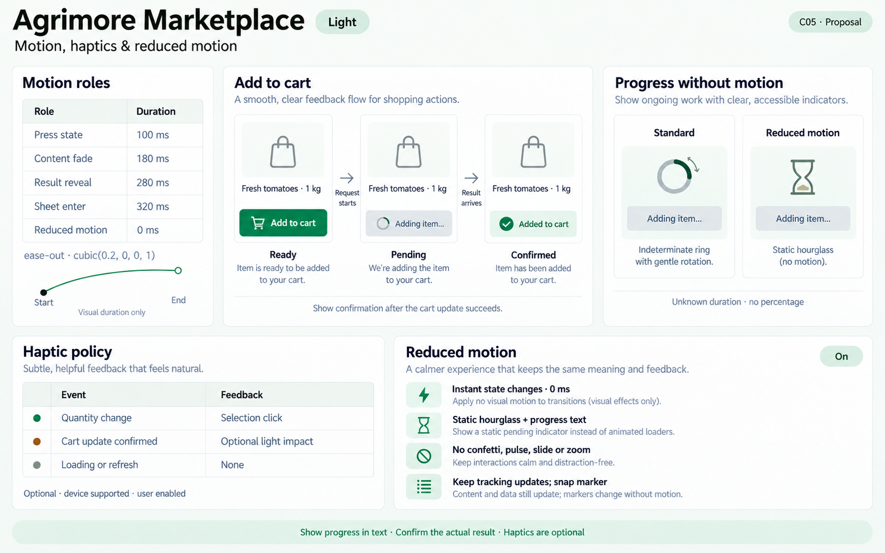
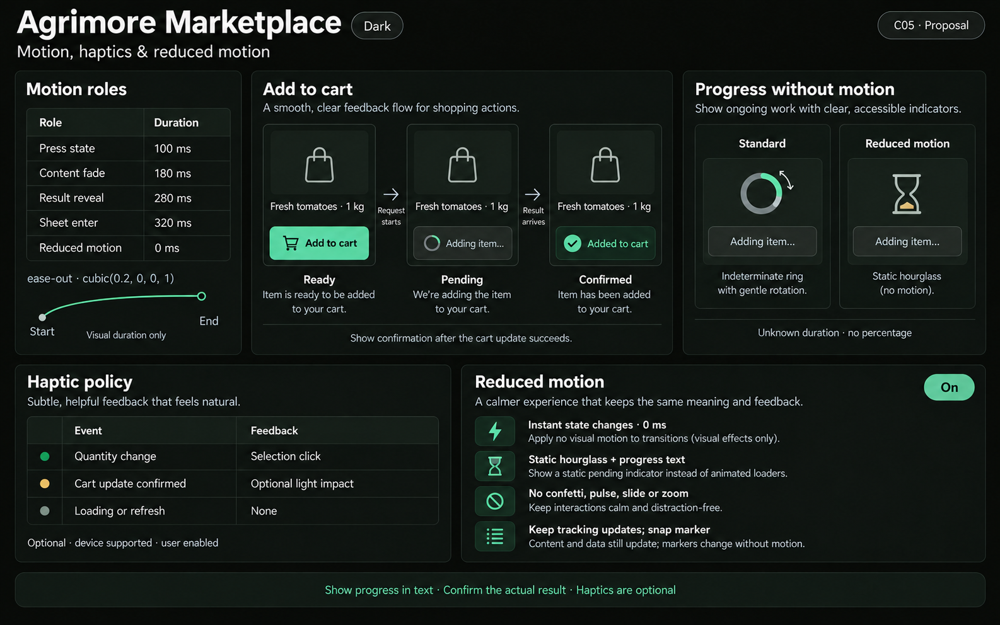
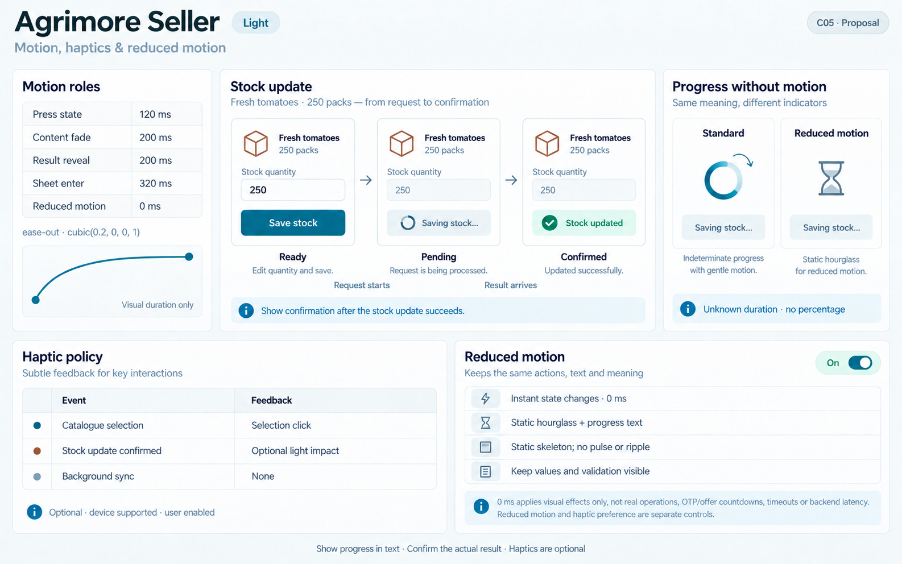
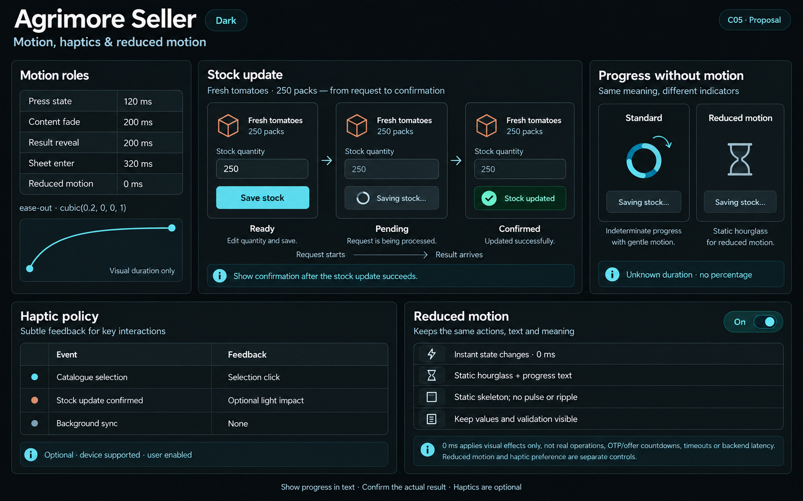
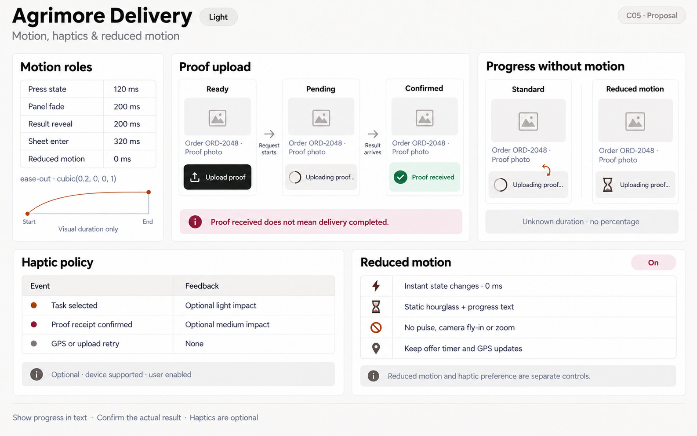
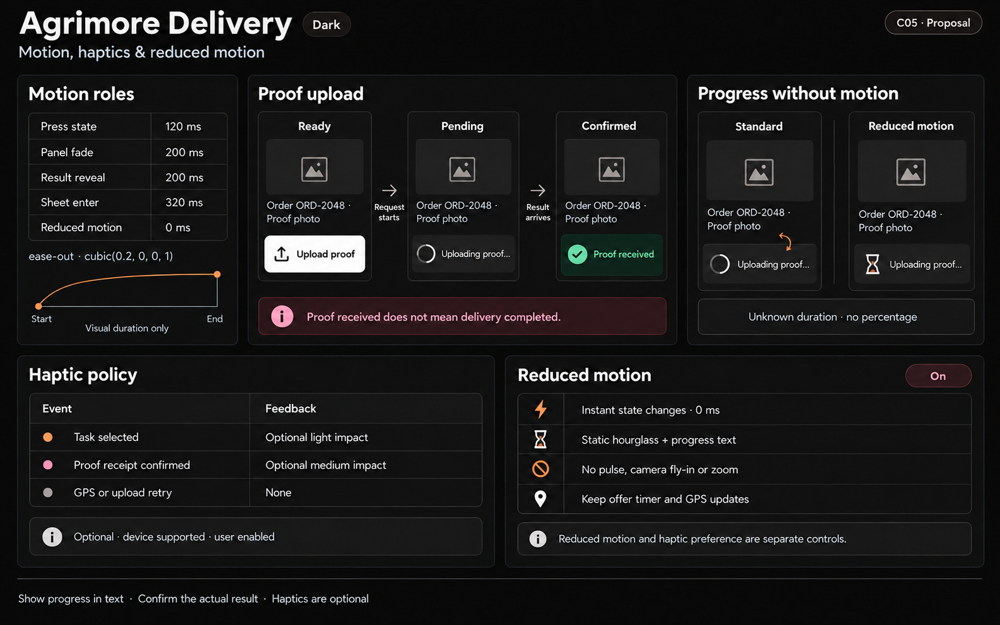
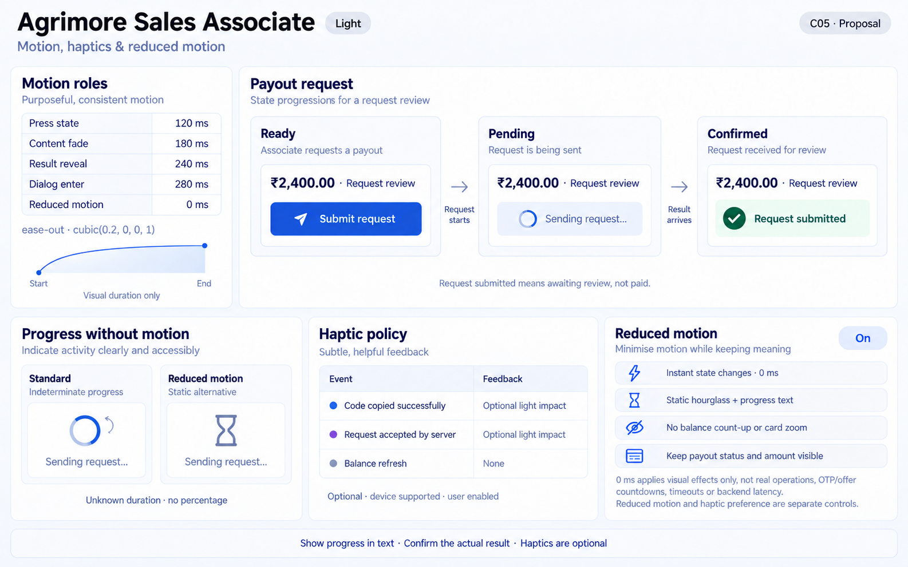
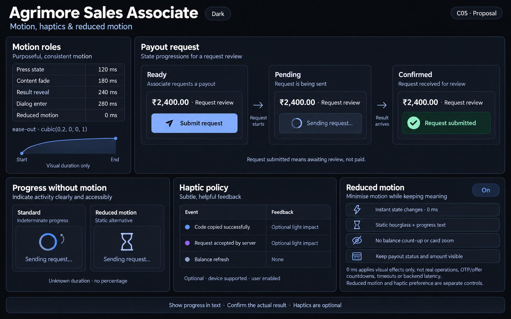
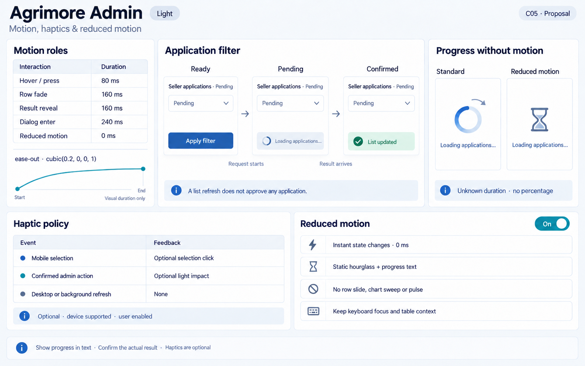
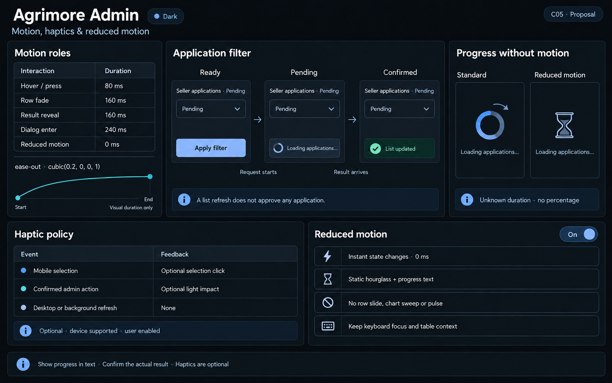

# Agrimore C05 — motion, haptics and reduced motion boards

**PROVISIONAL_DIRECTION / TARGET_IMPLEMENTATION · v1 · 2026-10-03.**

Ten selected premium Storybook-style PNGs: light and dark for each of five apps. Each uses its locked C01 identity with domain-specific state transitions, motion roles, optional haptic events and a static reduced-motion pending alternative. These are still design references, not animation playback or deployed UI.

[Codebase analysis and domain mapping](MOTION_HAPTICS_REDUCED_MOTION_DOMAIN_MAP_2026-10-03.md) · [Approved C01 identity](COLOR_ROLES_THEME_IDENTITY_LOCK_2026-10-02.md).

| App | Identity | Images | Provenance |
| --- | --- | --- | --- |
| Agrimore Marketplace | Professional green; warm gold and natural stone | [Light](../../apps/marketplace/assets/ui-mockups/05-motion-haptics-reduced-motion/agrimore-marketplace-motion-haptics-reduced-motion-light.png) · [Dark](../../apps/marketplace/assets/ui-mockups/05-motion-haptics-reduced-motion/agrimore-marketplace-motion-haptics-reduced-motion-dark.png) | [Prompts](../../apps/marketplace/assets/ui-mockups/05-motion-haptics-reduced-motion/prompts.md) · [Manifest](../../apps/marketplace/assets/ui-mockups/05-motion-haptics-reduced-motion/manifest.json) |
| Agrimore Seller | Blue-teal; copper and cool neutrals | [Light](../../apps/seller/assets/ui-mockups/05-motion-haptics-reduced-motion/agrimore-seller-motion-haptics-reduced-motion-light.png) · [Dark](../../apps/seller/assets/ui-mockups/05-motion-haptics-reduced-motion/agrimore-seller-motion-haptics-reduced-motion-dark.png) | [Prompts](../../apps/seller/assets/ui-mockups/05-motion-haptics-reduced-motion/prompts.md) · [Manifest](../../apps/seller/assets/ui-mockups/05-motion-haptics-reduced-motion/manifest.json) |
| Agrimore Delivery | Black/white; burgundy and burnt orange | [Light](../../apps/delivery/assets/ui-mockups/05-motion-haptics-reduced-motion/agrimore-delivery-motion-haptics-reduced-motion-light.png) · [Dark](../../apps/delivery/assets/ui-mockups/05-motion-haptics-reduced-motion/agrimore-delivery-motion-haptics-reduced-motion-dark.png) | [Prompts](../../apps/delivery/assets/ui-mockups/05-motion-haptics-reduced-motion/prompts.md) · [Manifest](../../apps/delivery/assets/ui-mockups/05-motion-haptics-reduced-motion/manifest.json) |
| Agrimore Sales Associate | Premium royal blue; indigo and pearl/slate | [Light](../../apps/employee/assets/ui-mockups/05-motion-haptics-reduced-motion/agrimore-sales-associate-motion-haptics-reduced-motion-light.png) · [Dark](../../apps/employee/assets/ui-mockups/05-motion-haptics-reduced-motion/agrimore-sales-associate-motion-haptics-reduced-motion-dark.png) | [Prompts](../../apps/employee/assets/ui-mockups/05-motion-haptics-reduced-motion/prompts.md) · [Manifest](../../apps/employee/assets/ui-mockups/05-motion-haptics-reduced-motion/manifest.json) |
| Agrimore Admin | Professional blue; cyan and steel/slate | [Light](../../apps/admin/assets/ui-mockups/05-motion-haptics-reduced-motion/agrimore-admin-motion-haptics-reduced-motion-light.png) · [Dark](../../apps/admin/assets/ui-mockups/05-motion-haptics-reduced-motion/agrimore-admin-motion-haptics-reduced-motion-dark.png) | [Prompts](../../apps/admin/assets/ui-mockups/05-motion-haptics-reduced-motion/prompts.md) · [Manifest](../../apps/admin/assets/ui-mockups/05-motion-haptics-reduced-motion/manifest.json) |

Visual duration does not predict network latency. Unknown duration gets no invented percentage. Payout-request submission, proof receipt and list refresh remain distinct from paid, delivered and approved status. The source map distinguishes current code from proposed behavior.

## Agrimore Marketplace

### Light

### Dark

## Agrimore Seller

### Light

### Dark

## Agrimore Delivery

### Light

### Dark

## Agrimore Sales Associate

### Light

### Dark

## Agrimore Admin

### Light

### Dark

## Review and validation boundary

All ten selected boards and ten approved C01 inputs were visually inspected. Packaging checks cover ten PNGs/five theme pairs, byte-identical source copies, dimensions/checksums, exact prompt recovery, C01 specification inheritance, unchanged approved images and resolving internal links. Source and previously saved design assets are fingerprinted before/after packaging.

Review checked domain/state labels, role numbers, optional haptic policies, standard/static pending alternatives, app identity and dark filled-action text. Raster colors and curve sketches are approximate; manifest hex values and numeric roles are the exact target. No automated OCR, pixel-exact palette, animation timing/playback, device vibration or runtime accessibility testing is claimed.

No runtime/UI migration, asset registration, existing C01–C04 replacement, branch/index/commit or shared-work ledger change is included. C05 awaits owner review before locking.

