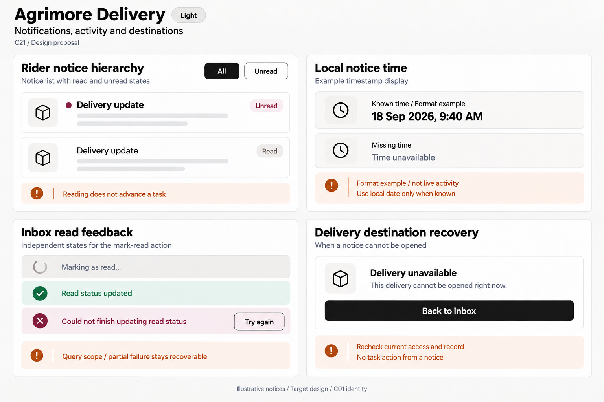
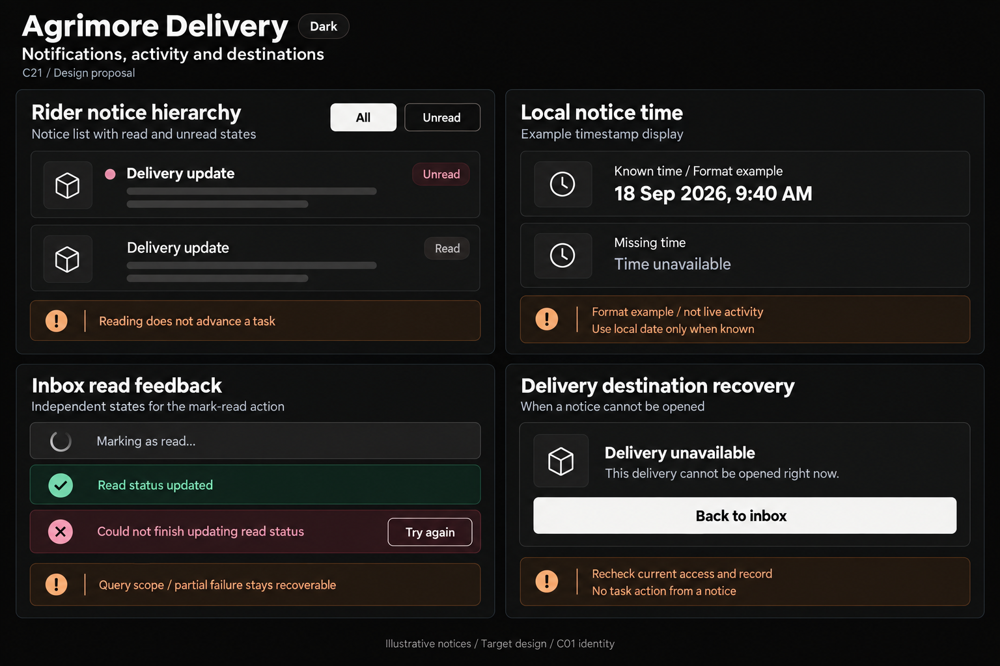
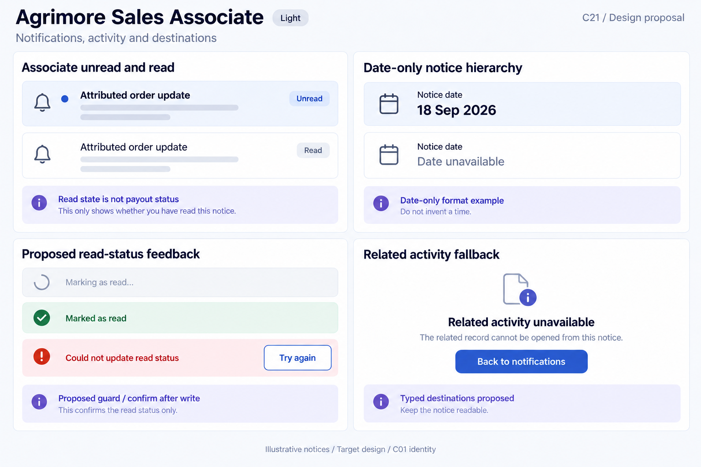
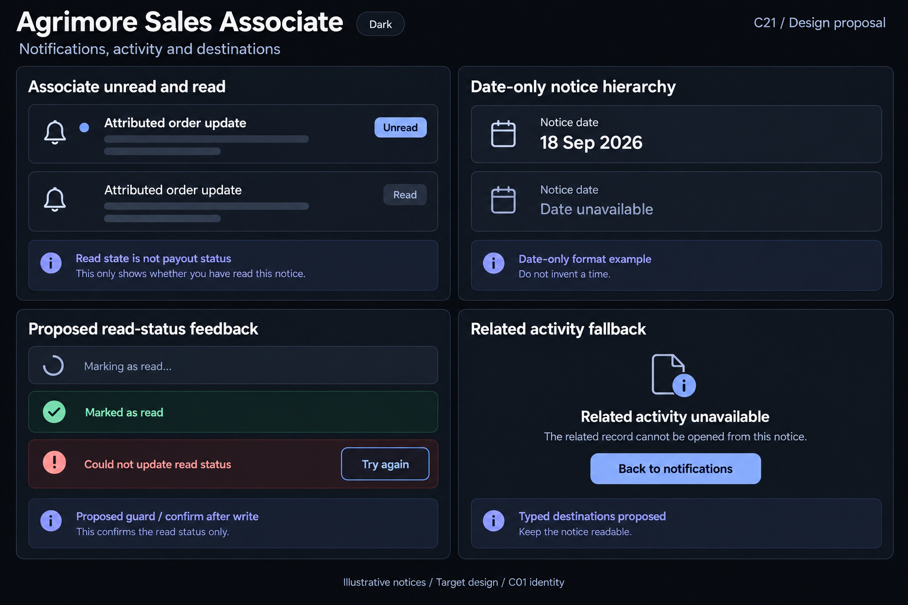
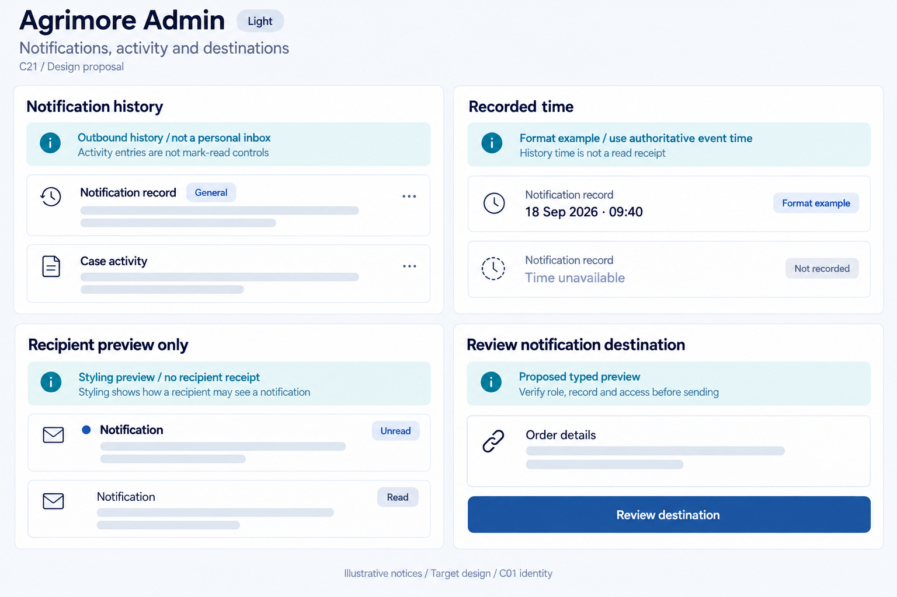
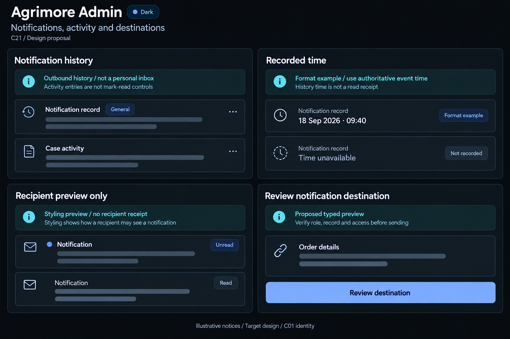

# Agrimore — C21 notifications, activity and destinations

**PROVISIONAL_DIRECTION / TARGET_IMPLEMENTATION · v1 · 2026-10-03.** Ten premium Storybook boards: one light and one dark per app. C01 remains the approved identity reference.

[Codebase and domain map](NOTIFICATIONS_ACTIVITY_DESTINATIONS_DOMAIN_MAP_2026-10-03.md) · [C01 approval index](COLOR_ROLES_THEME_IDENTITY_LOCK_2026-10-02.md).

Five domain notification systems distinguish unread attention, event-time provenance, supported read feedback and safe destinations. Marketplace inbox actions are proposed; Seller scope follows loaded notices; Delivery has typed destinations and a broader mark-all query; Associate schema/destination compatibility needs correction; Admin represents outbound history/activity and an explicitly labelled recipient styling preview. Read state is not a business outcome, push transport success is not a read receipt, and payload links do not grant access. Dates are fixed illustrative format examples, not live activity. These generated boards are target specimens, not running app screenshots or implemented widgets. Exact C01 token metadata is inherited; raster values are approximate. No sidebar.

## Agrimore Marketplace

Professional-green shopper notice rows, warm-gold timestamp/destination guidance, natural-stone surfaces and generous calm notification spacing.

[App notes](../../apps/marketplace/assets/ui-mockups/21-notifications-activity-destinations/README.md) · [Prompts](../../apps/marketplace/assets/ui-mockups/21-notifications-activity-destinations/prompts.md) · [Manifest](../../apps/marketplace/assets/ui-mockups/21-notifications-activity-destinations/manifest.json).

### Light

### Dark

## Agrimore Seller

Compact blue-teal merchant inbox rows, copper chronology/read-scope annotations, cool-neutral grouped records and precise order/quote destinations.

[App notes](../../apps/seller/assets/ui-mockups/21-notifications-activity-destinations/README.md) · [Prompts](../../apps/seller/assets/ui-mockups/21-notifications-activity-destinations/prompts.md) · [Manifest](../../apps/seller/assets/ui-mockups/21-notifications-activity-destinations/manifest.json).

### Light

### Dark

## Agrimore Delivery

High-contrast black/white rider inbox, burgundy attention markers, burnt-orange destination/time guidance and large comfortable field controls.

[App notes](../../apps/delivery/assets/ui-mockups/21-notifications-activity-destinations/README.md) · [Prompts](../../apps/delivery/assets/ui-mockups/21-notifications-activity-destinations/prompts.md) · [Manifest](../../apps/delivery/assets/ui-mockups/21-notifications-activity-destinations/manifest.json).

### Light

### Dark

## Agrimore Sales Associate

Premium royal-blue associate notice rows, indigo read-status/time provenance guidance, pearl/slate surfaces and restrained attributed-activity navigation.

[App notes](../../apps/employee/assets/ui-mockups/21-notifications-activity-destinations/README.md) · [Prompts](../../apps/employee/assets/ui-mockups/21-notifications-activity-destinations/prompts.md) · [Manifest](../../apps/employee/assets/ui-mockups/21-notifications-activity-destinations/manifest.json).

### Light

### Dark

## Agrimore Admin

Professional-blue notification operations/history, cyan destination preview guidance, steel/slate immutable activity rows and restrained operational provenance labels.

[App notes](../../apps/admin/assets/ui-mockups/21-notifications-activity-destinations/README.md) · [Prompts](../../apps/admin/assets/ui-mockups/21-notifications-activity-destinations/prompts.md) · [Manifest](../../apps/admin/assets/ui-mockups/21-notifications-activity-destinations/manifest.json).

### Light

### Dark

## Asset verification — first post-packaging snapshot

PASS: ten PNGs / five light–dark pairs; PNG headers, dimensions and chunk CRCs; selected-output byte hashes; eleven exact prompt blocks covering ten initial generations plus Delivery light timestamp refinement; all input/output provenance hashes; C01 APPROVED_LOCKED reference hashes and token metadata; 88 local document links; exactly 27 declared new repository files. All 891 earlier design files matched their pre-task hashes, including existing C16 and C01–C20.

Static inventory: 818 eligible source files / 272,064 lines at HEAD 066981a885caffbb917c102ef4d14de9fb64c9dc. First post-packaging check observed HEAD 3698e5df739a794d4d86d019451cc483849f2958 on branch agrimore/foundation-f3c-distance-delivery-pricing. That concurrent HEAD advance was preserved. No eligible baseline source hash changes were observed between inventory and packaging or between packaging and that check; ten inspected platform configuration hashes matched. This is a bounded observation, not a claim that the shared checkout will remain unchanged.

All ten selected outputs were reviewed through native image previews for explicit unread/read attention labels, synthetic time/missing-time hierarchy, independent read-update feedback, scope and destination limits, Admin preview-only distinction, app identity and dark inverse labels. Delivery light was refined to separate known-time and missing-time rows, then used as the dark composition reference. Illustrative confirmation applies only to read status, not a live operation or business outcome. No live notification was sent or marked read.

Verification covered assets/docs only. Exact token metadata and image integrity do not certify pixel-exact palette, runtime routing/recovery, security or accessibility. This task wrote its 27 declared files and did not stage, commit, change runtime code, deploy or interrupt another chat.

