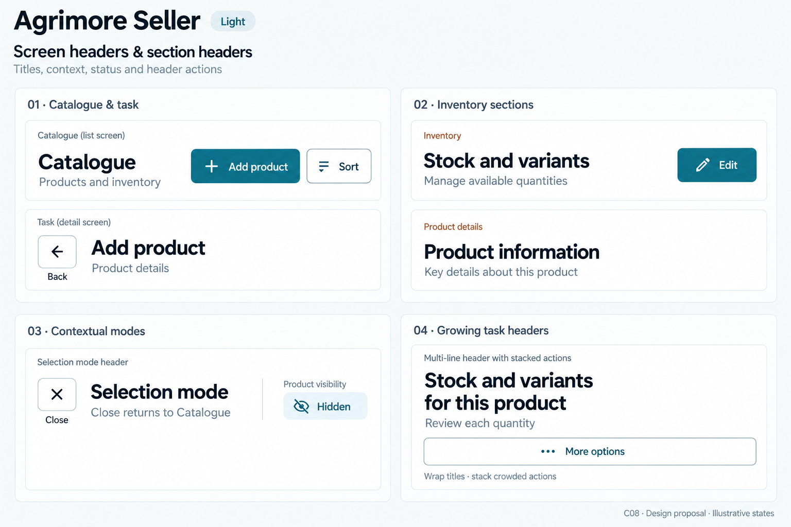
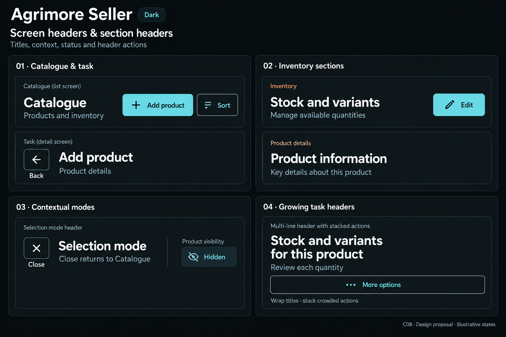
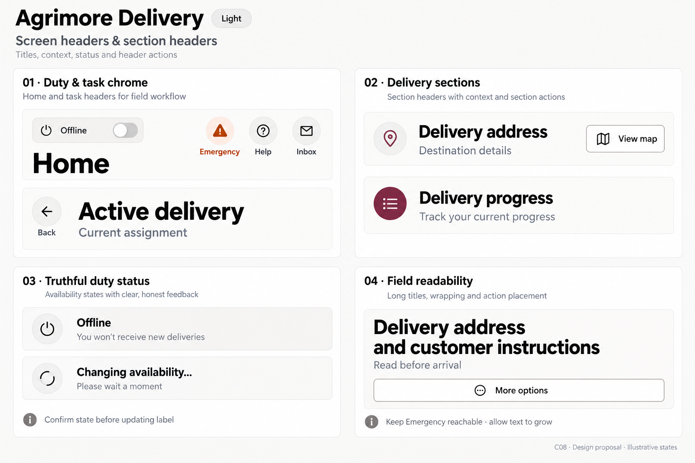
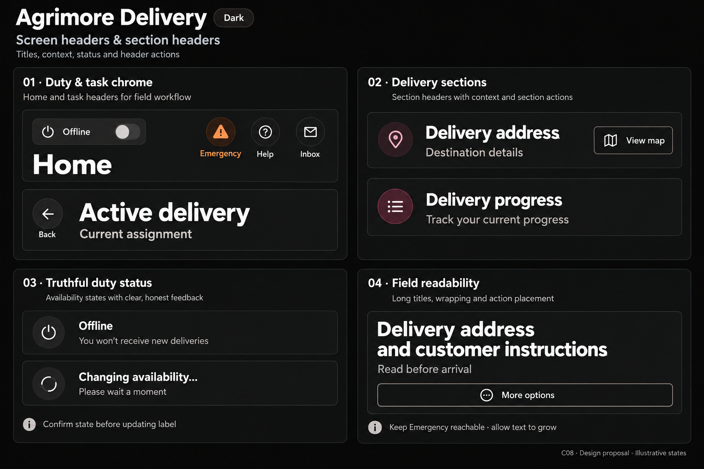
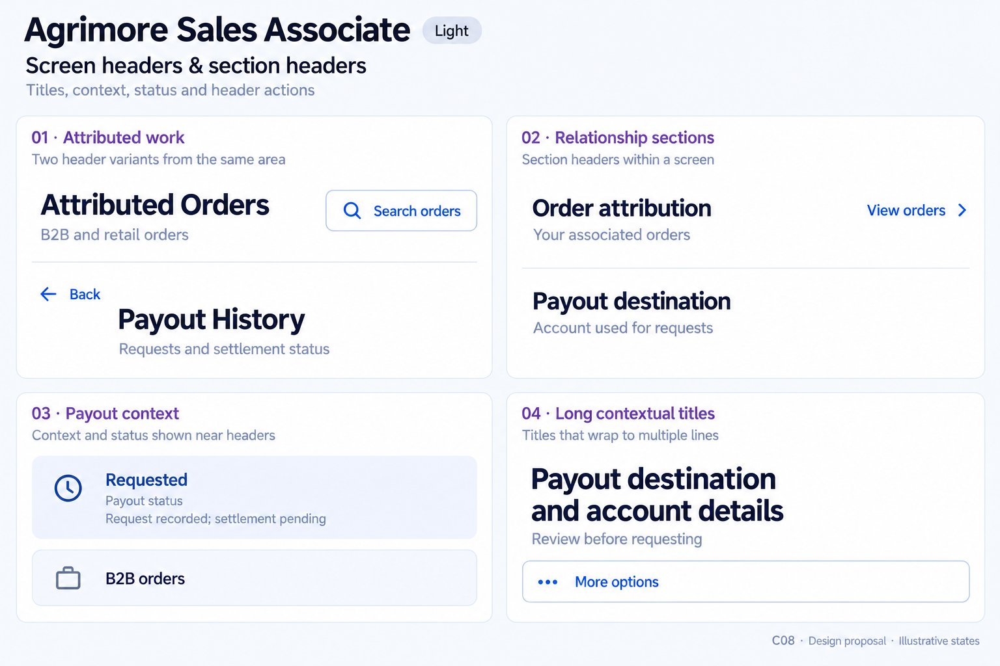
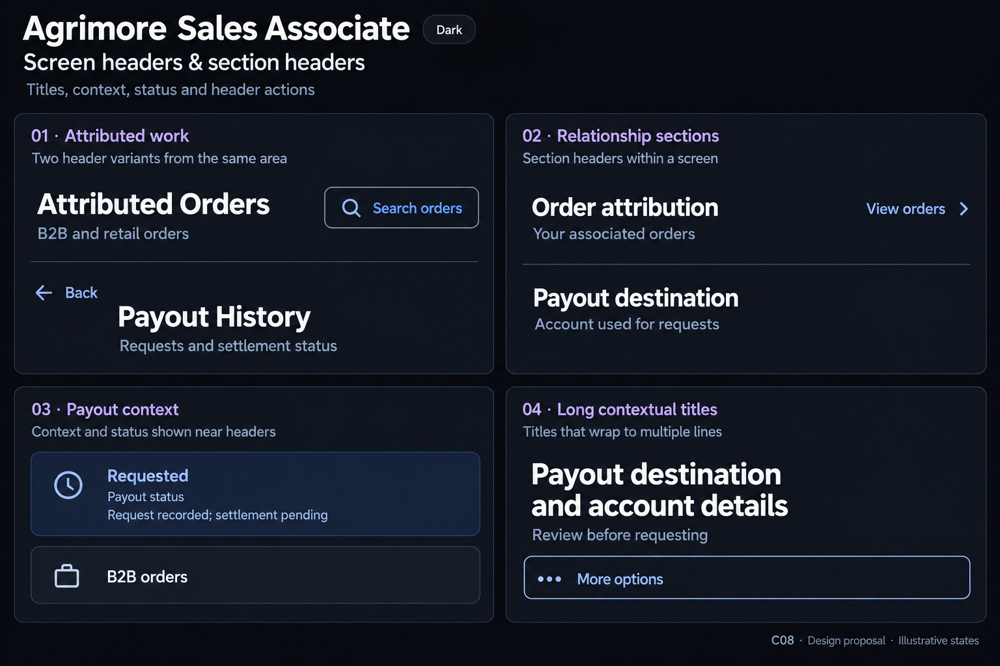

# Agrimore — C08 screen headers and section headers

**PROVISIONAL_DIRECTION / TARGET_IMPLEMENTATION · v1 · 2026-10-03.** Ten Storybook reference boards, five domain-specific systems, light and dark. C01 remains the approved identity source. Static design proposals; no runtime/header migration or asset registration.

[Codebase and domain map](SCREEN_HEADERS_SECTION_HEADERS_DOMAIN_MAP_2026-10-03.md) · [Approved five-app identity](COLOR_ROLES_THEME_IDENTITY_LOCK_2026-10-02.md).

Each pair covers screen titles, subtitles, section hierarchy, contextual status and actions, plus long-title reflow. Status examples are synthetic, not live records or backend confirmation. Color and typography targets are inherited exactly in manifests; image rendering is approximate.

| App | Header character |
| --- | --- |
| Agrimore Marketplace | Calm editorial shopping headers; generous natural-stone breathing room, green text actions, tiny warm-gold non-status overlines. |
| Agrimore Seller | Precise merchant workspace headers; blue-teal action ownership, restrained copper category rules, denser but balanced control rows. |
| Agrimore Delivery | Field-first monochrome, strong legible titles, compact neutral duty chrome, tiny burgundy dividers and burnt-orange emergency emphasis. |
| Agrimore Sales Associate | Refined advisory workspace, premium royal blue with pearl/slate, understated indigo section markers, careful financial status language. |
| Agrimore Admin | Disciplined responsive operations workspace; wide title/action rows, crisp steel borders, blue hierarchy and restrained cyan outlines. |

## Agrimore Marketplace

Calm editorial shopping headers; generous natural-stone breathing room, green text actions, tiny warm-gold non-status overlines.

[App notes](../../apps/marketplace/assets/ui-mockups/08-screen-headers-section-headers/README.md) · [Exact prompts](../../apps/marketplace/assets/ui-mockups/08-screen-headers-section-headers/prompts.md) · [Manifest](../../apps/marketplace/assets/ui-mockups/08-screen-headers-section-headers/manifest.json).

### Light

### Dark

## Agrimore Seller

Precise merchant workspace headers; blue-teal action ownership, restrained copper category rules, denser but balanced control rows.

[App notes](../../apps/seller/assets/ui-mockups/08-screen-headers-section-headers/README.md) · [Exact prompts](../../apps/seller/assets/ui-mockups/08-screen-headers-section-headers/prompts.md) · [Manifest](../../apps/seller/assets/ui-mockups/08-screen-headers-section-headers/manifest.json).

### Light

### Dark

## Agrimore Delivery

Field-first monochrome, strong legible titles, compact neutral duty chrome, tiny burgundy dividers and burnt-orange emergency emphasis.

[App notes](../../apps/delivery/assets/ui-mockups/08-screen-headers-section-headers/README.md) · [Exact prompts](../../apps/delivery/assets/ui-mockups/08-screen-headers-section-headers/prompts.md) · [Manifest](../../apps/delivery/assets/ui-mockups/08-screen-headers-section-headers/manifest.json).

### Light

### Dark

## Agrimore Sales Associate

Refined advisory workspace, premium royal blue with pearl/slate, understated indigo section markers, careful financial status language.

[App notes](../../apps/employee/assets/ui-mockups/08-screen-headers-section-headers/README.md) · [Exact prompts](../../apps/employee/assets/ui-mockups/08-screen-headers-section-headers/prompts.md) · [Manifest](../../apps/employee/assets/ui-mockups/08-screen-headers-section-headers/manifest.json).

### Light

### Dark

## Agrimore Admin

Disciplined responsive operations workspace; wide title/action rows, crisp steel borders, blue hierarchy and restrained cyan outlines.

[App notes](../../apps/admin/assets/ui-mockups/08-screen-headers-section-headers/README.md) · [Exact prompts](../../apps/admin/assets/ui-mockups/08-screen-headers-section-headers/prompts.md) · [Manifest](../../apps/admin/assets/ui-mockups/08-screen-headers-section-headers/manifest.json).

### Light

### Dark

