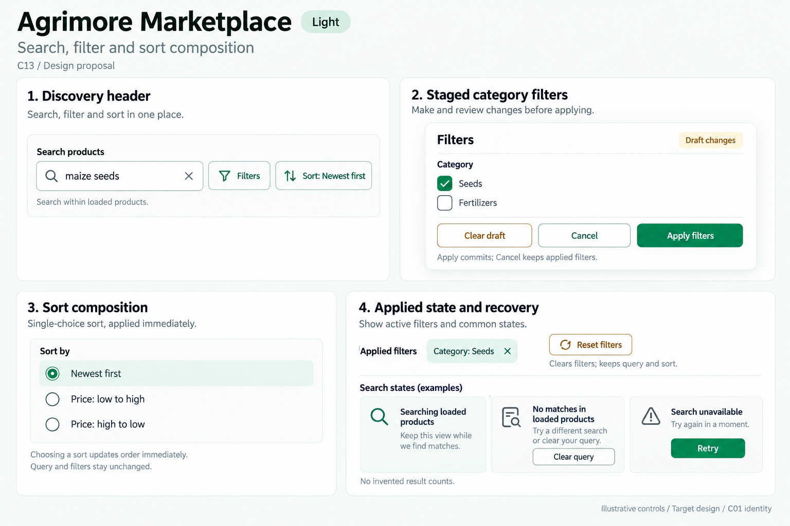
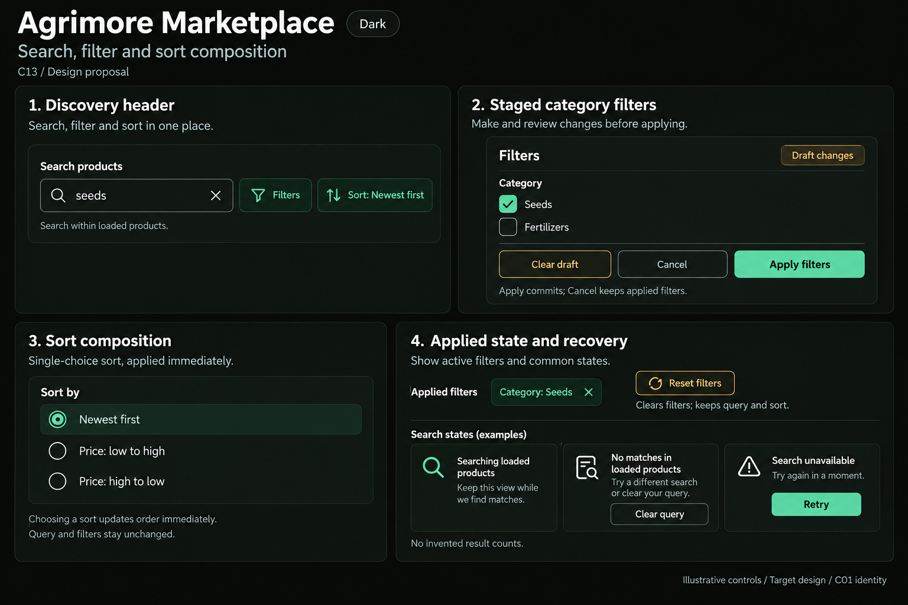

# Agrimore — C13 search, filter and sort composition

**PROVISIONAL_DIRECTION / TARGET_IMPLEMENTATION · v1 · 2026-10-03.** Ten premium Storybook boards: one light and one dark per app. C01 remains the approved identity reference.

[Codebase and domain map](SEARCH_FILTER_SORT_COMPOSITION_DOMAIN_MAP_2026-10-03.md) · [C01 approval index](COLOR_ROLES_THEME_IDENTITY_LOCK_2026-10-02.md).

Static discovery toolbar, applied state, draft/reset, sort and query-feedback proposals. Each app keeps its domain scope and identity. These are image-generated design specimens, not screenshots or implemented widgets. Exact token metadata is inherited; raster colors, type, geometry and legibility are approximate. All example records and statuses are illustrative. No sidebar.

## Agrimore Marketplace

Spacious professional-green product discovery, natural-stone fields and restrained gold scope guidance.

[App notes](../../apps/marketplace/assets/ui-mockups/13-search-filter-sort-composition/README.md) · [Prompts](../../apps/marketplace/assets/ui-mockups/13-search-filter-sort-composition/prompts.md) · [Manifest](../../apps/marketplace/assets/ui-mockups/13-search-filter-sort-composition/manifest.json).

### Light

### Dark

## Agrimore Seller

Compact blue-teal catalogue discovery with copper guidance, cool-neutral inline state and operational sort controls.

[App notes](../../apps/seller/assets/ui-mockups/13-search-filter-sort-composition/README.md) · [Prompts](../../apps/seller/assets/ui-mockups/13-search-filter-sort-composition/prompts.md) · [Manifest](../../apps/seller/assets/ui-mockups/13-search-filter-sort-composition/manifest.json).

### Light

### Dark

## Agrimore Delivery

High-contrast black/white history discovery, burgundy history context and burnt-orange mode/scope guidance; simple controls for field use.

[App notes](../../apps/delivery/assets/ui-mockups/13-search-filter-sort-composition/README.md) · [Prompts](../../apps/delivery/assets/ui-mockups/13-search-filter-sort-composition/prompts.md) · [Manifest](../../apps/delivery/assets/ui-mockups/13-search-filter-sort-composition/manifest.json).

### Light

### Dark

## Agrimore Sales Associate

Premium royal-blue loaded-order discovery, indigo business/retail context and pearl/slate scope cues; relationship and ledger filters remain distinct.

[App notes](../../apps/employee/assets/ui-mockups/13-search-filter-sort-composition/README.md) · [Prompts](../../apps/employee/assets/ui-mockups/13-search-filter-sort-composition/prompts.md) · [Manifest](../../apps/employee/assets/ui-mockups/13-search-filter-sort-composition/manifest.json).

### Light

### Dark

## Agrimore Admin

Professional-blue operational discovery toolbar, cyan context, steel/slate aligned filters and dense wide-to-stacked composition.

[App notes](../../apps/admin/assets/ui-mockups/13-search-filter-sort-composition/README.md) · [Prompts](../../apps/admin/assets/ui-mockups/13-search-filter-sort-composition/prompts.md) · [Manifest](../../apps/admin/assets/ui-mockups/13-search-filter-sort-composition/manifest.json).

### Light

### Dark

