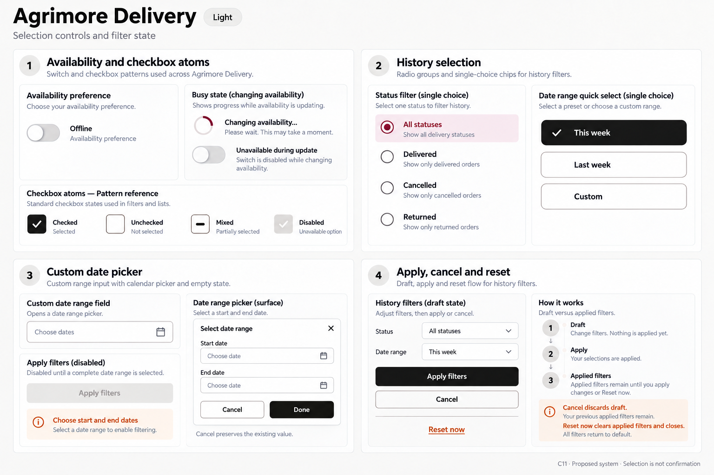
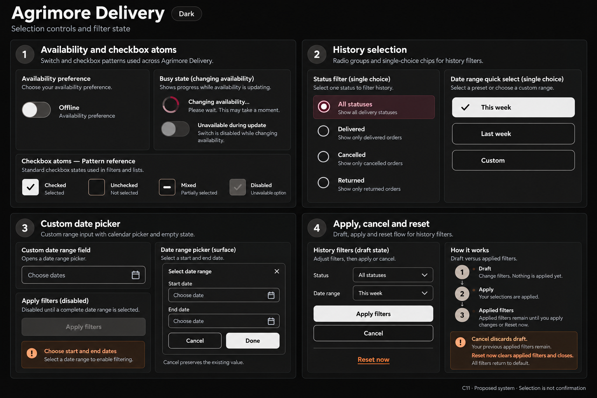

# Agrimore — C11 selection controls and filter state

**PROVISIONAL_DIRECTION / TARGET_IMPLEMENTATION · v1 · 2026-10-03.** Ten premium Storybook boards, light and dark for five apps. C01 is the approved identity source.

[Codebase/domain map](SELECTION_CONTROLS_FILTER_STATE_DOMAIN_MAP_2026-10-03.md) · [Locked C01 identity](COLOR_ROLES_THEME_IDENTITY_LOCK_2026-10-02.md).

Static proposals covering switches, checkbox states, single/multi choice, pickers and draft/applied filter lifecycles. Each pair uses its own identity and workflow. No runtime selection migration or asset registration. Exact token targets are recorded; raster rendering is approximate. Boards display isolated control specimens, not live records or working filter screens. Pattern-reference atoms do not establish new domain features. Control labels and example categories are synthetic; counts are shown only when derivable from displayed selection.

## Agrimore Marketplace

Professional-green shopping filters with warm-gold guidance, spacious category choices and removable applied chips.

[App notes](../../apps/marketplace/assets/ui-mockups/11-selection-controls-filter-state/README.md) · [Exact prompts](../../apps/marketplace/assets/ui-mockups/11-selection-controls-filter-state/prompts.md) · [Manifest](../../apps/marketplace/assets/ui-mockups/11-selection-controls-filter-state/manifest.json).

### Light

### Dark

## Agrimore Seller

Compact blue-teal operational controls with copper section guidance and clear store-status commitments.

[App notes](../../apps/seller/assets/ui-mockups/11-selection-controls-filter-state/README.md) · [Exact prompts](../../apps/seller/assets/ui-mockups/11-selection-controls-filter-state/prompts.md) · [Manifest](../../apps/seller/assets/ui-mockups/11-selection-controls-filter-state/manifest.json).

### Light

### Dark

## Agrimore Delivery

Monochrome field controls, burgundy selected-container cues and burnt-orange focus with a compact history sheet.

[App notes](../../apps/delivery/assets/ui-mockups/11-selection-controls-filter-state/README.md) · [Exact prompts](../../apps/delivery/assets/ui-mockups/11-selection-controls-filter-state/prompts.md) · [Manifest](../../apps/delivery/assets/ui-mockups/11-selection-controls-filter-state/manifest.json).

### Light

### Dark

## Agrimore Sales Associate

Premium royal-blue relationship and payout filters, indigo guidance and restrained pearl/slate control surfaces.

[App notes](../../apps/employee/assets/ui-mockups/11-selection-controls-filter-state/README.md) · [Exact prompts](../../apps/employee/assets/ui-mockups/11-selection-controls-filter-state/prompts.md) · [Manifest](../../apps/employee/assets/ui-mockups/11-selection-controls-filter-state/manifest.json).

### Light

### Dark

## Agrimore Admin

Professional-blue dense review controls with cyan grouping, explicit row selection scope and mixed parent checkboxes.

[App notes](../../apps/admin/assets/ui-mockups/11-selection-controls-filter-state/README.md) · [Exact prompts](../../apps/admin/assets/ui-mockups/11-selection-controls-filter-state/prompts.md) · [Manifest](../../apps/admin/assets/ui-mockups/11-selection-controls-filter-state/manifest.json).

### Light

### Dark

