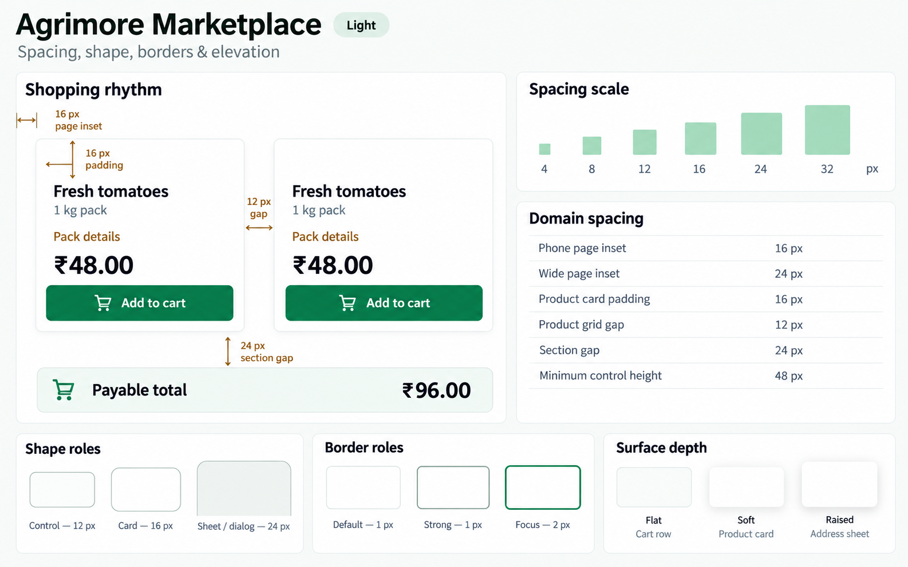
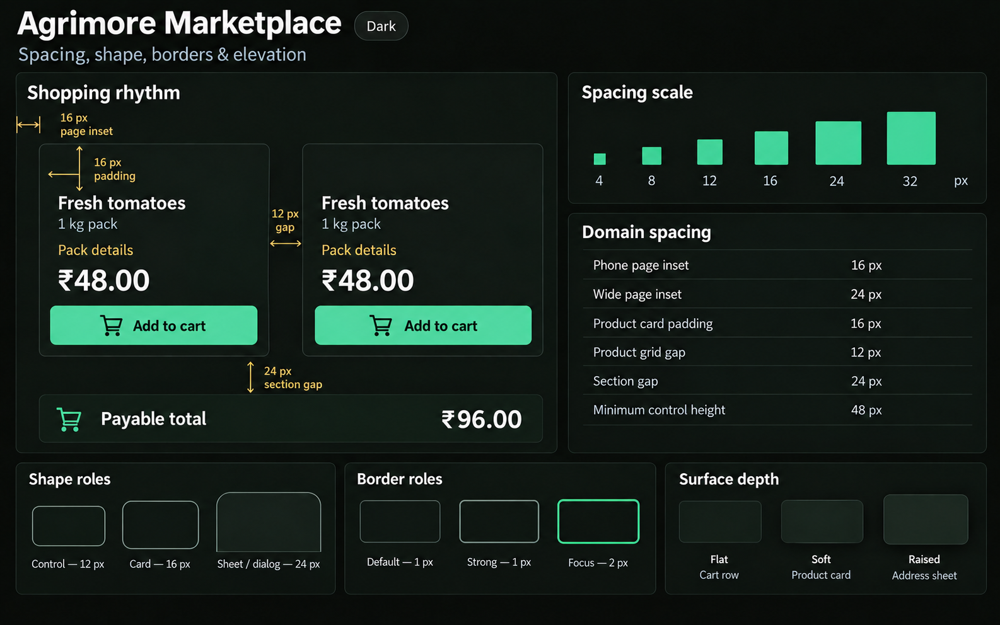
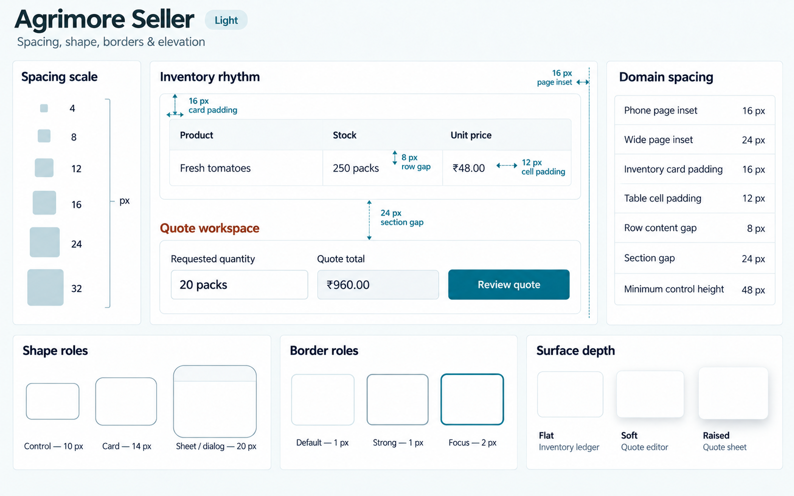
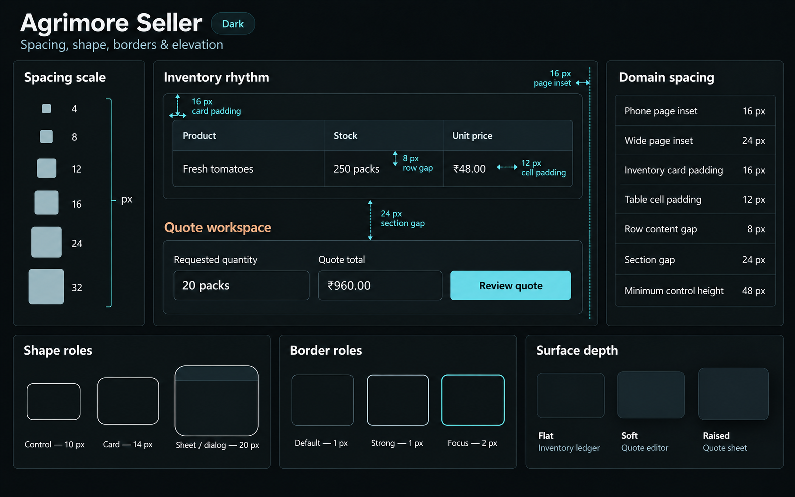
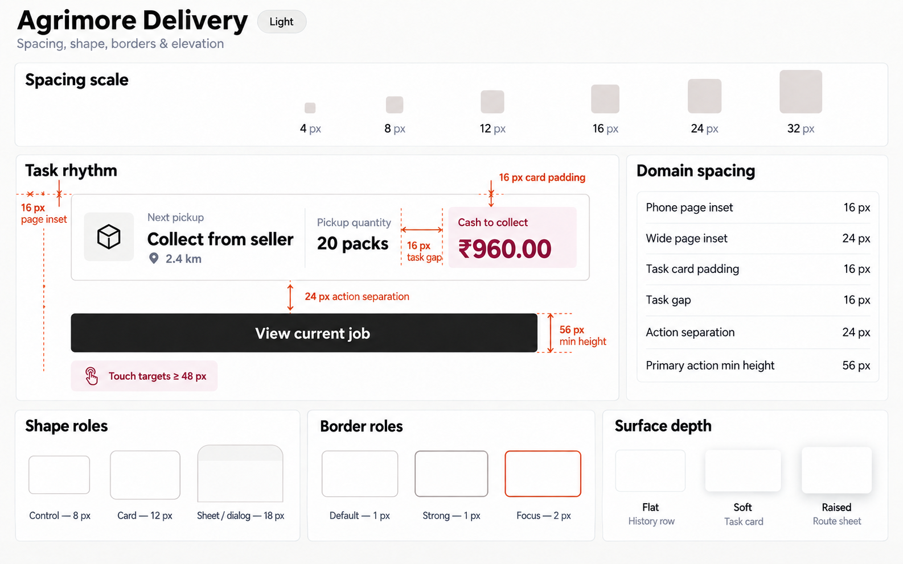
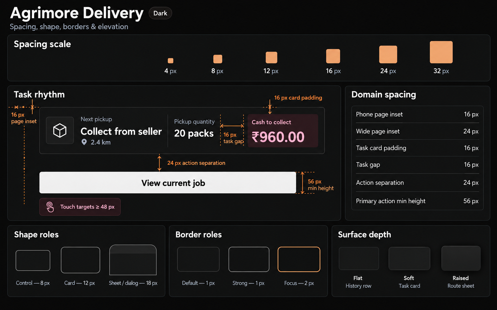
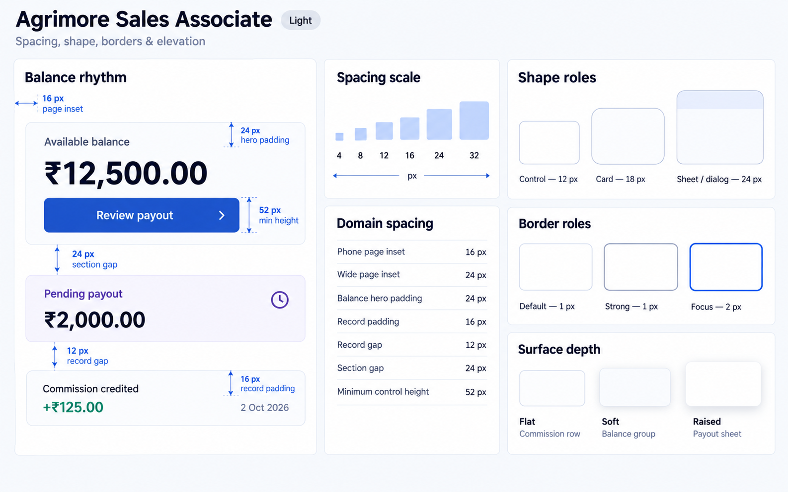
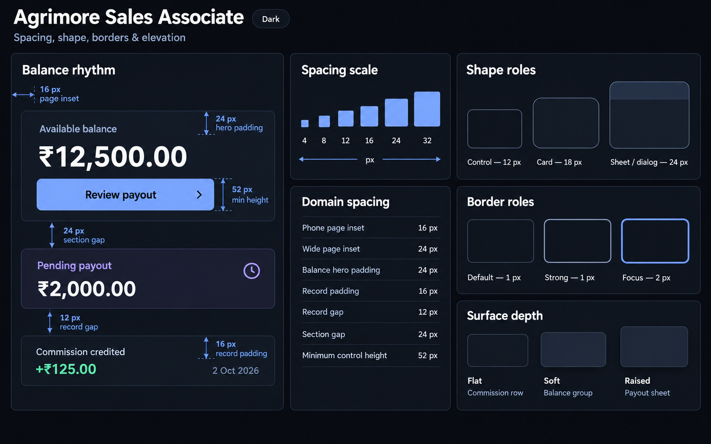
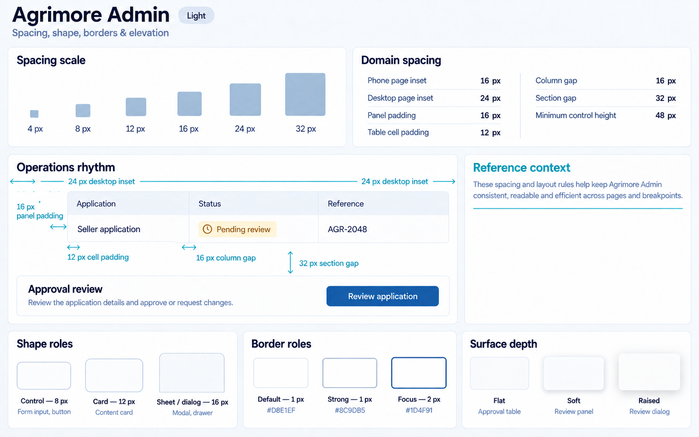
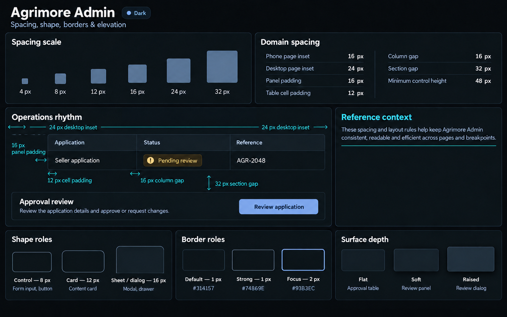

# Agrimore — C03 spacing, shape, borders and elevation

Ten premium Storybook-style boards: **five apps × light/dark**. Created 2026-10-03 with built-in image_gen after a static scan of 815 source files / 271,456 lines and visual review of all ten approved C01 references.

**Status: PROVISIONAL_DIRECTION / TARGET_IMPLEMENTATION.** C01 identities remain owner-approved and unchanged. New domain role mappings are ready for review; C03 is not locked or migrated to runtime.

[Codebase domain map and migration observations](SPACING_SHAPE_BORDERS_ELEVATION_DOMAIN_MAP_2026-10-03.md) · [Approved C01 index](COLOR_ROLES_THEME_IDENTITY_LOCK_2026-10-02.md) · [Previous typography boards](TYPOGRAPHY_NUMBER_HIERARCHY_BOARDS_2026-10-02.md)

| App | Spatial character | Control / card / overlay radius |
| --- | --- | --- |
| Agrimore Marketplace | Airy shopping cards and cart groups | 12 / 16 / 24 px |
| Agrimore Seller | Compact inventory and quote workspace | 10 / 14 / 20 px |
| Agrimore Delivery | Glanceable tasks and separated field actions | 8 / 12 / 18 px |
| Agrimore Sales Associate | Calm balance, commission and payout groups | 12 / 18 / 24 px |
| Agrimore Admin | Dense aligned operations tables and reviews | 8 / 12 / 16 px |

Each board includes the six-step spacing scale, an annotated app-domain specimen, a domain-spacing reference, shape roles, 1/1/2 px border roles and Flat / Soft / Raised surface depth. Each dark board preserves its app’s light composition, with near-black canvas and dark grey tonal depth. There is no navigation sidebar.

Colors, status pairs, core spacing, radius arrays and border widths are inherited in the specifications from each app’s C01 lock. Raster images provide visual direction; exact hex values and logical dimensions are defined by the accompanying manifests, not guaranteed by individual generated pixels. Minimum heights can grow with text. Runtime rendering, accessibility and interactions were not exercised for this asset-only task.

## Agrimore Marketplace

Professional green, warm gold and natural stone. Corner roles: 12 / 16 / 24 px. Flat / Soft / Raised: Cart row / Product card / Address sheet.

[App asset folder](../../apps/marketplace/assets/ui-mockups/03-spacing-shape-borders-elevation/README.md) · [Exact prompts](../../apps/marketplace/assets/ui-mockups/03-spacing-shape-borders-elevation/prompts.md) · [Manifest](../../apps/marketplace/assets/ui-mockups/03-spacing-shape-borders-elevation/manifest.json)

### Light

### Dark

## Agrimore Seller

Blue-teal, copper and cool neutrals. Corner roles: 10 / 14 / 20 px. Flat / Soft / Raised: Inventory ledger / Quote editor / Quote sheet.

[App asset folder](../../apps/seller/assets/ui-mockups/03-spacing-shape-borders-elevation/README.md) · [Exact prompts](../../apps/seller/assets/ui-mockups/03-spacing-shape-borders-elevation/prompts.md) · [Manifest](../../apps/seller/assets/ui-mockups/03-spacing-shape-borders-elevation/manifest.json)

### Light

### Dark

## Agrimore Delivery

Black/white, burgundy and burnt orange. Corner roles: 8 / 12 / 18 px. Flat / Soft / Raised: History row / Task card / Route sheet.

[App asset folder](../../apps/delivery/assets/ui-mockups/03-spacing-shape-borders-elevation/README.md) · [Exact prompts](../../apps/delivery/assets/ui-mockups/03-spacing-shape-borders-elevation/prompts.md) · [Manifest](../../apps/delivery/assets/ui-mockups/03-spacing-shape-borders-elevation/manifest.json)

### Light

### Dark

## Agrimore Sales Associate

Premium royal blue, indigo and pearl/slate. Corner roles: 12 / 18 / 24 px. Flat / Soft / Raised: Commission row / Balance group / Payout sheet.

[App asset folder](../../apps/employee/assets/ui-mockups/03-spacing-shape-borders-elevation/README.md) · [Exact prompts](../../apps/employee/assets/ui-mockups/03-spacing-shape-borders-elevation/prompts.md) · [Manifest](../../apps/employee/assets/ui-mockups/03-spacing-shape-borders-elevation/manifest.json)

### Light

### Dark

## Agrimore Admin

Professional blue, cyan and steel/slate. Corner roles: 8 / 12 / 16 px. Flat / Soft / Raised: Approval table / Review panel / Review dialog.

[App asset folder](../../apps/admin/assets/ui-mockups/03-spacing-shape-borders-elevation/README.md) · [Exact prompts](../../apps/admin/assets/ui-mockups/03-spacing-shape-borders-elevation/prompts.md) · [Manifest](../../apps/admin/assets/ui-mockups/03-spacing-shape-borders-elevation/manifest.json)

### Light

### Dark

## Packaging verification

The selected ten PNGs are copied byte-for-byte into the five app asset folders, with exact initial/refinement prompts and SHA-256 provenance. PNG dimensions, checksums, light/dark pairing, C01 token inheritance, prompt integrity and repository-relative document/image links are checked by the session packaging validator. The ten approved C01 image checksums are rechecked. The active implementation branch is not switched and its runtime files are not edited by this task.
