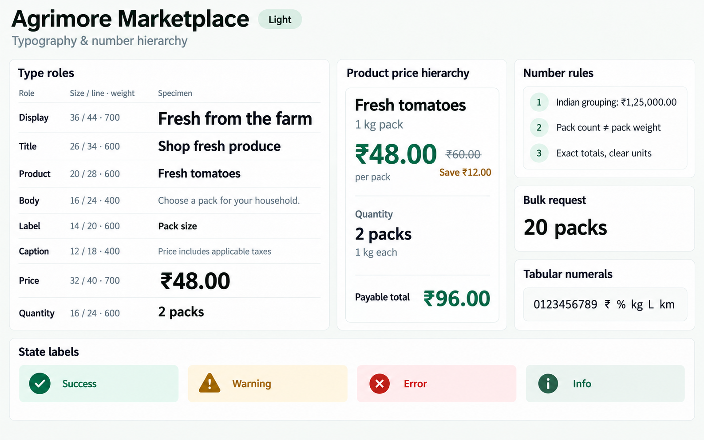
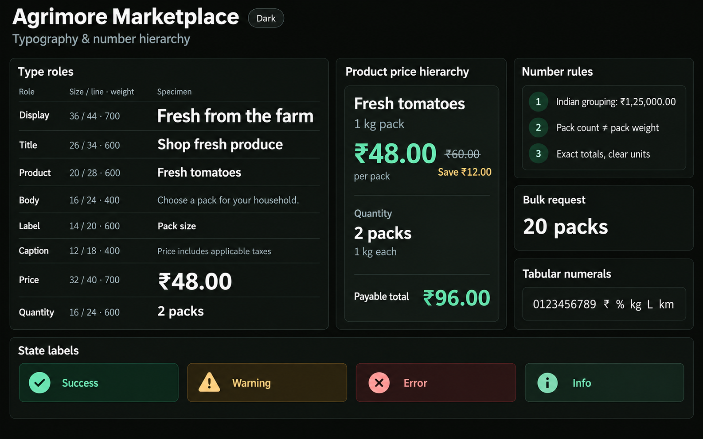
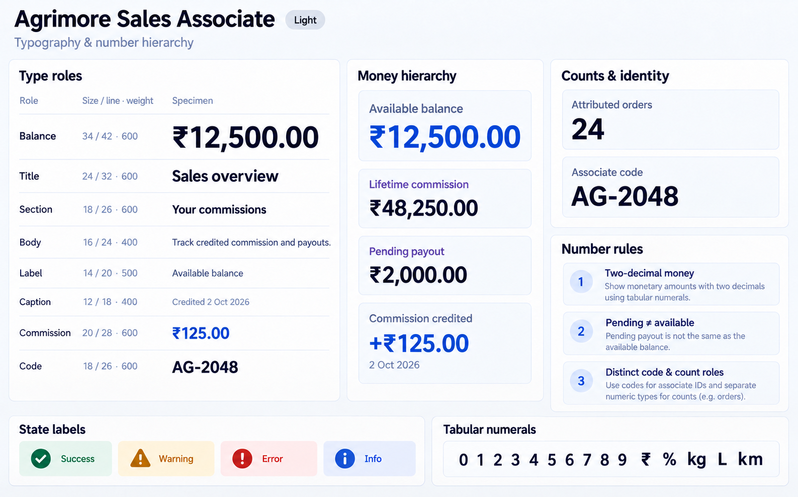
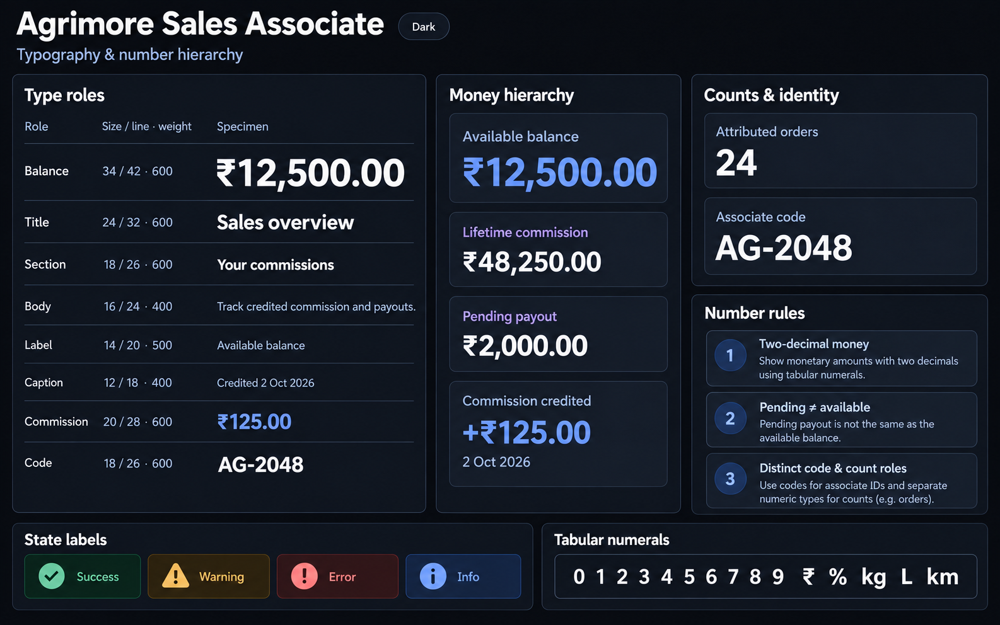
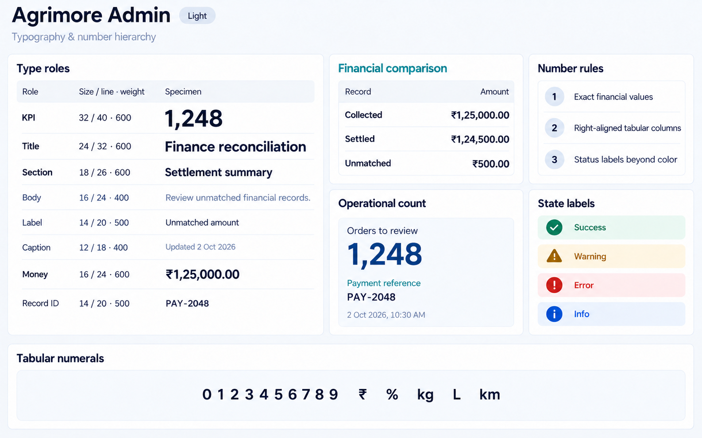
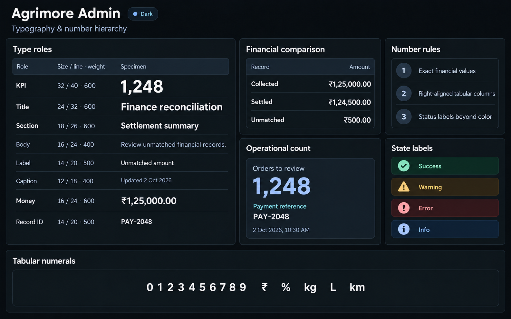

# Agrimore — ten typography and number hierarchy boards

C02 · v1 · Generated 2026-10-02 with built-in `image_gen` · **PROVISIONAL_DIRECTION / TARGET_IMPLEMENTATION**.

These are the ten selected final boards: one light and one dark per app. The source/domain analysis precedes generation in the [domain map](TYPOGRAPHY_NUMBER_HIERARCHY_DOMAIN_MAP_2026-10-02.md). All ten approved [C01 boards](COLOR_ROLES_THEME_IDENTITY_LOCK_2026-10-02.md) were inspected first; their exact palette and status specifications are inherited in the prompts and per-app manifests. The five apps have independent semantic type/number roles, density and domain examples, while retaining each app's approved visual identity.

| App | Reading priority | Final pair | Provenance |
| --- | --- | --- | --- |
| [Agrimore Marketplace](../../apps/marketplace/assets/ui-mockups/02-typography-number-hierarchy/README.md) | Product name → selling price → pack specification → purchase quantity → payable total. | [Light](../../apps/marketplace/assets/ui-mockups/02-typography-number-hierarchy/agrimore-marketplace-typography-number-hierarchy-light.png) · [Dark](../../apps/marketplace/assets/ui-mockups/02-typography-number-hierarchy/agrimore-marketplace-typography-number-hierarchy-dark.png) | [Prompts](../../apps/marketplace/assets/ui-mockups/02-typography-number-hierarchy/prompts.md) |
| [Agrimore Seller](../../apps/seller/assets/ui-mockups/02-typography-number-hierarchy/README.md) | Business revenue → workload → stock quantity → unit price/MOQ → quote or invoice total. | [Light](../../apps/seller/assets/ui-mockups/02-typography-number-hierarchy/agrimore-seller-typography-number-hierarchy-light.png) · [Dark](../../apps/seller/assets/ui-mockups/02-typography-number-hierarchy/agrimore-seller-typography-number-hierarchy-dark.png) | [Prompts](../../apps/seller/assets/ui-mockups/02-typography-number-hierarchy/prompts.md) |
| [Agrimore Delivery](../../apps/delivery/assets/ui-mockups/02-typography-number-hierarchy/README.md) | Offer/task timing → pickup/drop distance and address → cash to collect → item count → reference metadata. | [Light](../../apps/delivery/assets/ui-mockups/02-typography-number-hierarchy/agrimore-delivery-typography-number-hierarchy-light.png) · [Dark](../../apps/delivery/assets/ui-mockups/02-typography-number-hierarchy/agrimore-delivery-typography-number-hierarchy-dark.png) | [Prompts](../../apps/delivery/assets/ui-mockups/02-typography-number-hierarchy/prompts.md) |
| [Agrimore Sales Associate](../../apps/employee/assets/ui-mockups/02-typography-number-hierarchy/README.md) | Available balance → credited commission → payout status → attributed-order count → associate code. | [Light](../../apps/employee/assets/ui-mockups/02-typography-number-hierarchy/agrimore-sales-associate-typography-number-hierarchy-light.png) · [Dark](../../apps/employee/assets/ui-mockups/02-typography-number-hierarchy/agrimore-sales-associate-typography-number-hierarchy-dark.png) | [Prompts](../../apps/employee/assets/ui-mockups/02-typography-number-hierarchy/prompts.md) |
| [Agrimore Admin](../../apps/admin/assets/ui-mockups/02-typography-number-hierarchy/README.md) | Review/exception title → exact financial amount or queue count → status → actor/record identifier → audit timestamp. | [Light](../../apps/admin/assets/ui-mockups/02-typography-number-hierarchy/agrimore-admin-typography-number-hierarchy-light.png) · [Dark](../../apps/admin/assets/ui-mockups/02-typography-number-hierarchy/agrimore-admin-typography-number-hierarchy-dark.png) | [Prompts](../../apps/admin/assets/ui-mockups/02-typography-number-hierarchy/prompts.md) |

Sales Associate lives in `apps/employee`. Every pair is saved under that app's `assets/ui-mockups/02-typography-number-hierarchy/`, with exact original and refinement prompts, SHA-256 checksums and reference provenance. The three earlier accent-refinement drafts are not final deliverables.

The C01 approval stays locked. C02 typography is presented for owner review; generating these images does not approve the new type roles or implement them in the apps. Raster boards illustrate the specification; actual font metrics, scaling and precise token rendering require implementation checks.

## Agrimore Marketplace

### Light

### Dark

## Agrimore Seller

### Light

### Dark

## Agrimore Delivery

### Light

### Dark

## Agrimore Sales Associate

### Light

### Dark

## Agrimore Admin

### Light

### Dark

